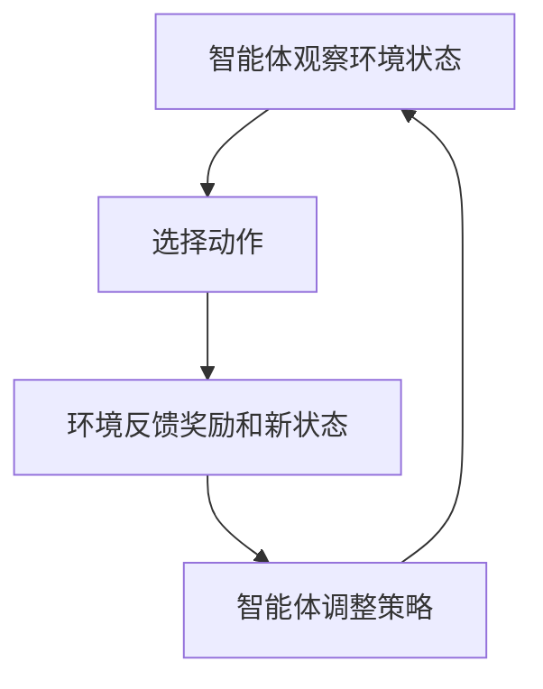
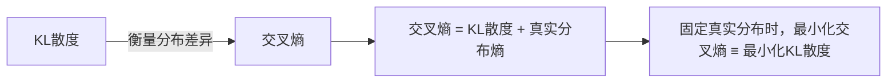

# 大模型基础-牛客面经八股

> 来源：牛客网  |  共 52 题

## 14. 大模型中的“微调”是什么
### 

### 一句话总结

 大模型微调是指在预训练的大模型基础上，进行少量的额外训练，以适应特定任务或领域的需求。

---

 在正式了解微调之前，让我们先来了解一下，什么是大模型?

### 🌱 什么是大模型？

 大模型是指那些拥有大量参数和复杂结构的人工智能模型，能够处理复杂任务，如语言理解、图像识别等。

顾名思义，就是“很大”的模型。这里的“大”主要体现在两个方面：模型的参数数量和模型的计算能力。想象一下，一个大模型就像一个超级大脑，拥有无数的“神经元”（参数）和“神经连接”（计算能力），能够处理和理解复杂的信息。

#### 🧠 大模型的基础概念

 - **参数**：可以把参数想象成模型的“记忆单元”。参数越多，模型能记住和处理的信息就越多。

 - **训练**：训练就像是给模型上课，通过大量的数据让模型学习如何完成特定任务。

 - **推理**：推理是模型应用所学知识来解决实际问题的过程。

#### 📈 大模型的应用

 大模型在生活中无处不在，比如：

 - **语音助手**：像Siri和Alexa，它们能理解你的语音指令并做出回应。

 - **翻译软件**：能将一种语言翻译成另一种语言。

 - **图像识别**：能识别照片中的物体，比如人脸识别。

 那么，什么是大模型微调呢？

### 🌱 什么是大模型微调？

 大模型微调就像是给一件已经做好的衣服进行最后的修饰，使其更适合特定场合。大模型已经在大量数据上进行了预训练，微调则是让它在特定任务上表现得更好。

#### 🧠 大模型微调的基础概念

 - **预训练**：大模型在大量通用数据上进行的初步训练，就像学习了很多基础知识。

 - **微调**：在特定任务或领域的数据上进行的额外训练，就像在基础知识上进行专业化学习。

#### 📈 大模型微调的应用

 微调可以让大模型在特定任务上表现得更好，比如：

 - **情感分析**：判断一段文字是积极的还是消极的。

 - **医学诊断**：根据病历数据预测疾病。

 - **法律文书分析**：帮助律师快速找到相关法律条款。

---

### 🔍 深入了解大模型微调

#### 🏗️ 微调的过程

 微调的过程就像是给一个已经学会了很多知识的学生进行专项辅导。通过在特定领域的数据上进行训练，模型可以更好地理解和处理该领域的任务。

#### 🌐 微调的好处

 - **节省资源**：不需要从头开始训练模型，节省了大量的计算资源和时间。

 - **提高性能**：通过微调，模型可以在特定任务上达到更高的准确率。

#### 📊 微调的挑战

 - **数据需求**：微调需要一定量的特定领域数据。

 - **过拟合风险**：如果微调数据过少，模型可能会过拟合，即在训练数据上表现很好，但在新数据上表现不佳。

---

### 🎯 总结

 大模型微调是让预训练模型在特定任务上更出色的关键技术。通过微调，我们可以在节省资源的同时，获得在特定领域表现优异的模型。

---

### 💻 示例代码

 以下是一个简单的Python代码示例，展示了如何对一个预训练的大模型进行微调：

```python
from transformers import BertForSequenceClassification, Trainer, TrainingArguments
from datasets import load_dataset

# 加载预训练模型
model = BertForSequenceClassification.from_pretrained("bert-base-uncased")

# 加载数据集
dataset = load_dataset("imdb")

# 设置训练参数
training_args = TrainingArguments(
 output_dir="./results",
 num_train_epochs=3,
 per_device_train_batch_size=8,
 evaluation_strategy="epoch",
)

# 创建Trainer
trainer = Trainer(
 model=model,
 args=training_args,
 train_dataset=dataset["train"],
 eval_dataset=dataset["test"],
)

# 开始微调
trainer.train()
```

 **输入：** 

 - IMDB电影评论数据集

 **输出：** 

 - 微调后的BERT模型，能够更好地进行情感分析

 **解释：** 

 这段代码使用了一个预训练的BERT模型，并在IMDB电影评论数据集上进行微调，以提高其在情感分析任务上的表现。

## 13. 大模型中的“SFT”是什么
### 

### 一句话总结

 SFT（Supervised Fine-Tuning，监督微调）是指在大模型预训练的基础上，利用带有标准答案的标注数据，通过监督学习的方法对模型进行再次训练，使其更好地适应特定任务。

---

### 🌱 基础概念详解

#### 1. SFT是什么？

 - **SFT**：全称为 Supervised Fine-Tuning，中文叫“监督微调”。

 - **核心定义**：SFT是在大模型（如GPT、BERT等）完成预训练后，使用带有输入和标准输出（标签）的数据集，通过监督学习方式对模型进行进一步训练。

 - **目的**：让模型在特定任务（如问答、分类、摘要等）上表现更优。

 术语解释

 - **预训练（Pre-training）**：模型在大规模通用数据上进行的初步训练，学习通用知识和语言规律。

 - **监督学习（Supervised Learning）**：训练数据中每个样本都包含输入和对应的正确输出，模型通过“看答案”来学习。

 - **微调（Fine-Tuning）**：在预训练模型基础上，针对特定任务或领域进行的再次训练。

---

#### 2. SFT的工作流程

 用一张流程图帮助理解：

 - **大模型预训练**：模型先在海量数据上学习通用能力。

 - **SFT阶段**：用带标签的任务数据（如问答对、分类标签）对模型进行监督训练。

 - **输出**：得到适合特定任务的模型。

---

#### 3. SFT的实际例子

 真实案例

 - **ChatGPT的训练**：OpenAI 先用海量文本预训练GPT模型，再用人工标注的问答对进行SFT，让模型更擅长对话。

 - **医疗文本分析**：用医生标注的病例问答对对大模型进行SFT，使其更懂医学领域。

 预训练像是学生读完百科全书，SFT就像老师用真题和答案专门辅导学生应对某场考试。

---

#### 4. SFT的优缺点

 - **优点**： 能让大模型快速适应新任务，无需从头训练。

 - 只需较少的标注数据即可获得较好效果。

 - **缺点**： 依赖高质量的标注数据。

 - 微调过度可能导致模型“遗忘”原有的通用能力（称为灾难性遗忘）。

---

### 🎯 总结

 SFT（监督微调）是大模型落地应用的关键一环。它通过在预训练模型基础上，用带有标准答案的数据进行再次训练，让模型在特定任务上表现更好。

记住：SFT=“用真题和答案专门训练模型应对某项考试”！

---

### SFT的代码示例

 以下是一个用transformers库进行SFT的简单例子：

```python
from transformers import AutoModelForCausalLM, AutoTokenizer, Trainer, TrainingArguments
from datasets import load_dataset

# 加载预训练模型和分词器
model = AutoModelForCausalLM.from_pretrained("gpt2")
tokenizer = AutoTokenizer.from_pretrained("gpt2")

# 加载带标签的训练数据（如问答对）
dataset = load_dataset("yizhongw/self_instruct", split="train[:1000]")

# 设置训练参数
training_args = TrainingArguments(
 output_dir="./sft_results",
 num_train_epochs=1,
 per_device_train_batch_size=2,
 logging_steps=10,
)

# 创建Trainer并开始SFT
trainer = Trainer(
 model=model,
 args=training_args,
 train_dataset=dataset,
)
trainer.train()
```

 **输入数据示例：** 

| prompt | response |
| --- | --- |
| “今天天气怎么样？” | “今天天气晴朗。” |
| “2+2等于几？” | “2+2等于4。” |

 **输出：**

经过SFT训练后，模型能更准确地回答类似问题。

 **代码解释：**

这段代码用带有标准答案的问答数据，对预训练模型进行SFT，让它更擅长“问答”任务。

## 12. 大模型中的“CoT（Chain of Thought）”是什么
### 

### 一句话总结

 CoT（Chain of Thought，思维链）是一种让大模型在回答复杂问题时，像人类一样分步骤、逐步推理并输出中间思考过程的方法。

---

### 🌱 基础概念详解

#### 1. CoT是什么？

 - **CoT**：全称为 Chain of Thought，中文叫“思维链”。

 - **核心定义**：CoT是一种提示工程（Prompt Engineering）技术，通过在输入中加入分步骤的推理示例，引导大模型在回答时也分步骤输出推理过程，而不是直接给出最终答案。

 - **目的**：提升大模型在复杂推理、数学计算、多步推断等任务上的准确率和可解释性。

 术语解释

 - **提示工程（Prompt Engineering）**：设计和优化输入内容，引导大模型产生更理想输出的技术。

 - **推理过程（Reasoning Process）**：模型在得出答案前，输出的每一步中间思考和计算。

 - **可解释性（Interpretability）**：让用户能看懂模型是如何一步步得出答案的。

---

#### 2. CoT的工作原理

 用一张流程图帮助理解：

 - **用户提问**：输入一个需要多步推理的问题。

 - **模型分步推理**：模型被引导输出每一步的思考过程。

 - **输出中间步骤**：每一步都清晰展示，便于检查和理解。

 - **得出最终答案**：最后给出问题的答案。

---

#### 3. CoT的实际例子与比喻

 真实案例

 - **数学题解答**：模型不仅给出答案，还会写出每一步计算过程。

 - **逻辑推理题**：模型会先分析条件、再逐步排除、最后得出结论。

 做应用题时，老师总是要求“写出详细解题步骤”，而不是只写答案。CoT就是让大模型也“写步骤”。

---

#### 4. CoT的优缺点

 - **优点**： 提高复杂问题的解答准确率。

 - 增强模型输出的可解释性，便于检查和纠错。

 - **缺点**： 输出内容更长，可能增加计算和阅读成本。

 - 对于简单问题，分步推理可能显得冗余。

---

#### 5. CoT的典型应用场景

 - 数学题、逻辑推理题、法律推断、医学诊断等需要多步推理的任务。

 - 需要让用户理解模型“怎么想的”场景。

---

### 🎯 总结

 CoT（Chain of Thought，思维链）是一种让大模型像人一样“写解题步骤”的技术。它通过分步推理，提升了模型在复杂任务上的表现和可解释性。面试时记住：CoT=“让模型写步骤，不只写答案”！

---

### 💻 代码示例

 下面是一个简单的CoT提示工程代码示例，演示如何让大模型分步推理：

```python
from transformers import pipeline

# 构建带有CoT提示的输入
prompt = (
 "问题：小明有3个苹果，又买了2个苹果，他现在有多少个苹果？\n"
 "请分步骤思考并给出答案。\n"
 "思考："
)

# 使用大模型进行推理
generator = pipeline("text-generation", model="gpt2")
result = generator(prompt, max_length=100, do_sample=False)

print(result[0]['generated_text'])
```

 **输入：** 

```cpp
问题：小明有3个苹果，又买了2个苹果，他现在有多少个苹果？
请分步骤思考并给出答案。
思考：
```

 **输出示例：** 

```cpp
思考：小明原来有3个苹果。又买了2个苹果。3+2=5。所以小明现在有5个苹果。
```

 **代码解释：** 

 这段代码通过在问题后加上“请分步骤思考并给出答案”，引导大模型输出详细的推理过程，而不是只给出“5”这个答案。这样不仅能看到结果，还能理解模型的思考路径。

## 11. 大模型中的“RAG（Retrieval-Augmented Generation）”是什么
### 

### 一句话总结

 RAG（Retrieval-Augmented Generation，检索增强生成）是一种结合“知识检索”和“文本生成”的大模型技术，让模型在回答问题时能查资料、用资料，生成更准确、信息更丰富的答案。

---

### 🌱 基础概念详解

#### 1. RAG是什么？

 - **RAG**：全称为 Retrieval-Augmented Generation，中文叫“检索增强生成”。

 - **核心定义**：RAG是一种将信息检索（Retrieval）和文本生成（Generation）结合起来的技术。它让大模型在生成答案时，先去外部知识库或文档中检索相关信息，再结合检索到的内容生成最终回答。

 - **目的**：解决大模型“知识有限、容易胡编”的问题，让回答更有依据、更可信。

 术语解释

 - **信息检索（Retrieval）**：从大量文档或知识库中找到与问题相关的内容。

 - **文本生成（Generation）**：大模型根据输入和检索到的信息，自动生成自然语言答案。

 - **知识库（Knowledge Base）**：存放大量事实、文档、资料的数据库。

---

#### 2. RAG的工作原理

 用一张流程图帮助理解：

 - **用户提问**：输入一个问题。

 - **检索模块**：模型先去知识库中查找与问题相关的资料。

 - **生成模块**：模型结合查到的资料和自身能力，生成详细答案。

 - **最终答案**：输出内容更准确、更有依据。

---

#### 3. RAG的实际例子与比喻

 真实案例

 - **企业知识问答**：员工问“公司2023年假期安排”，RAG模型会先查公司文件，再生成答案。

 - **学术助手**：用户问“什么是量子纠缠？”，RAG模型会检索学术论文或百科内容，再用自己的语言解释。 就像你写作业不会只靠记忆，而是会先查书、查资料，再组织答案。RAG让大模型也能“查资料再作答”。 

---

#### 4. RAG的优缺点

 - **优点**： 回答更准确、有依据，减少“胡编乱造”。

 - 能实时利用最新资料，突破模型知识截止时间的限制。

 - **缺点**： 检索和生成环节都可能出错。

 - 需要维护高质量的知识库。

---

#### 5. RAG的典型应用场景

 - 企业智能客服、法律/医疗问答、学术搜索助手、产品文档问答等。

---

### 🎯 总结

 RAG（检索增强生成）是让大模型“查资料再作答”的技术。它结合了信息检索和文本生成，能让模型输出更准确、更有依据的答案。面试时记住：RAG=“先查资料，后作答”！

---

### 💻 代码示例

 下面是一个简单的RAG流程代码示例，演示如何让大模型结合检索和生成：

```python
from transformers import RagTokenizer, RagRetriever, RagSequenceForGeneration

# 加载RAG模型和分词器
tokenizer = RagTokenizer.from_pretrained("facebook/rag-sequence-nq")
retriever = RagRetriever.from_pretrained("facebook/rag-sequence-nq", index_name="exact", use_dummy_dataset=True)
model = RagSequenceForGeneration.from_pretrained("facebook/rag-sequence-nq", retriever=retriever)

# 输入问题
question = "Who wrote the novel '1984'?"

# 编码输入
input_ids = tokenizer(question, return_tensors="pt").input_ids

# 生成答案
outputs = model.generate(input_ids=input_ids)
answer = tokenizer.batch_decode(outputs, skip_special_tokens=True)[0]

print(answer)
```

 **输入：** 

```cpp
Who wrote the novel '1984'?
```

 **输出示例：** 

```cpp
George Orwell wrote the novel '1984'.
```

 **代码解释：** 

 这段代码用RAG模型，先检索知识库中与“1984”相关的资料，再结合检索结果生成准确答案。这样即使模型本身没记住，也能查到并作答。

## 10. 大模型中的“RL（Reinforcement Learning）”是什么
### 

### 一句话总结

 RL（Reinforcement Learning，强化学习）是一种让模型通过“试错”和“奖励反馈”自主学习、不断优化行为的人工智能训练方法。

---

### 🌱 基础概念详解

#### 1. RL是什么？

 - **RL**：全称为 Reinforcement Learning，中文叫“强化学习”。

 - **核心定义**：RL是一种机器学习方法，模型（智能体）在与环境的交互中，通过获得奖励或惩罚，不断调整自己的行为策略，以获得更高的长期回报。

 - **目的**：让模型学会在复杂环境中自主决策，优化自身表现。

 术语解释

 - **智能体（Agent）**：做决策的主体，比如机器人、AI模型。

 - **环境（Environment）**：智能体所处的世界，比如游戏、现实世界、对话场景等。

 - **动作（Action）**：智能体在某一时刻做出的选择。

 - **状态（State）**：环境在某一时刻的具体情况。

 - **奖励（Reward）**：智能体做出某个动作后，环境给予的反馈（可以是正面或负面）。

 - **策略（Policy）**：智能体根据状态选择动作的规则。

---

#### 2. RL的工作原理

 用一张流程图帮助理解：



 - **观察环境状态**：智能体感知当前环境。

 - **选择动作**：根据当前策略做出决策。

 - **环境反馈**：环境根据动作给出奖励和新的状态。

 - **调整策略**：智能体根据奖励优化自己的决策方式。

---

#### 3. RL在大模型中的应用

 - **RLHF（Reinforcement Learning from Human Feedback）**：通过人类反馈指导大模型优化输出，比如让AI助手更符合用户偏好。

 - **对话优化**：让大模型在与用户互动中不断学习，提升回答质量。

 - **游戏AI**：让AI通过玩游戏自学成才，比如AlphaGo。

 RL就像小孩学骑自行车：摔倒（负奖励）会让他下次更小心，骑得稳（正奖励）会让他更有信心，经过多次尝试，最终学会骑车。

---

#### 4. RL的优缺点

 - **优点**： 能解决没有标准答案、需要探索的复杂任务。

 - 适合动态环境和长期决策优化。

 - **缺点**： 训练过程可能很慢，需要大量试错。

 - 奖励设计不合理时，模型可能学到“歪门邪道”。

---

#### 5. RL的典型应用场景

 - 智能对话系统、推荐系统、自动驾驶、机器人控制、游戏AI等。

---

### 💻 案例

 **环境**：5×5网格迷宫，起点（左上角）、宝藏（右下角）、障碍物（黑色格子）。

 **目标**：智能体（如机器人）从起点出发，避开障碍，以最短路径找到宝藏。

核心要素

 **状态（State）**：智能体当前位置（坐标表示，如(0,0)）。

 **动作（Action）**：上下左右移动（4种选择，受墙壁限制）。

 **奖励（Reward）**：

 - 到达宝藏：+100

 - 撞墙/陷阱：-10

 - 普通移动：-1（鼓励减少步数）。

 **学习过程** 

 - 智能体通过Q-learning算法更新动作价值（Q值）：

 - 初始Q表全为0，随机探索路径（如向右移动）。

 - 发现宝藏后，反向更新路径Q值（如：宝藏前一步动作价值升至80）。

 **结果**：最终学会最优路径（如起点→右→下→宝藏），避开陷阱。

---

### 🎯 总结

 RL（强化学习）是一种让模型通过“试错”和“奖励反馈”自主学习的AI方法。它在大模型优化、对话系统、游戏AI等领域有广泛应用。面试时记住：RL=“试错+奖励，学会最优决策”！

## 9. 大模型中的“GRPO（Generative Rejection Preference Optimization）”是什么
### 

### 一句话总结

 GRPO（Generative Rejection Preference Optimization，生成式拒绝偏好优化）是一种通过“生成-筛选-优化”流程，让大模型学会更符合人类偏好的输出训练方法。

---

### 🌱 基础概念详解

#### 1. GRPO是什么？

 - **GRPO**：全称为 Generative Rejection Preference Optimization，中文可译为“生成式拒绝偏好优化”。

 - **核心定义**：GRPO是一种大模型训练方法，结合了生成（Generative）、拒绝（Rejection）和偏好优化（Preference Optimization）三步，通过让模型生成多个答案、筛选掉不合适的答案，并根据人类或自动系统的偏好优化模型参数，从而提升模型输出的质量和符合人类需求的能力。

 - **目的**：让大模型输出更符合人类审美、价值观或任务要求的内容。

 术语解释

 - **生成（Generative）**：模型根据输入自动生成多个候选答案。

 - **拒绝（Rejection）**：通过人工或自动方式，筛除不合格或不优质的答案。

 - **偏好优化（Preference Optimization）**：根据剩下的答案，优化模型参数，使其更倾向于生成被偏好（更优质）的内容。

---

#### 2. GRPO的工作原理

 用一张流程图帮助理解：

 - **输入问题**：用户或系统提出一个问题或任务。

 - **生成多个答案**：模型给出多种可能的回答。

 - **筛选/拒绝**：人工或自动系统筛掉不合格的答案（如不准确、不合规、不流畅等）。

 - **偏好优化**：根据剩下的优质答案，调整模型参数，让模型更倾向于生成类似内容。

 - **输出更优答案**：模型经过优化后，输出更符合需求的答案。

---

#### 3. GRPO的实际例子与比喻

 真实案例

 - **对话助手优化**：让AI助手生成多种回复，人工标注员挑选最合适的，模型学习偏好，提升对话质量。

 - **内容生成**：AI写文章，编辑筛选出最流畅、最有用的段落，模型据此优化。 就像作文比赛，老师让每个学生写三篇作文，最后只选最好的那一篇，老师会告诉学生为什么这篇最好，下次写作时学生就会更倾向于写出类似的好作文。 

---

#### 4. GRPO的优缺点

 - **优点**： 能显著提升模型输出的质量和人类满意度。

 - 适合需要高质量、符合特定标准的生成任务。

 - **缺点**： 需要人工或自动系统参与筛选，成本较高。

 - 训练流程比普通监督学习更复杂。

---

#### 5. GRPO的典型应用场景

 - 智能对话系统、内容生成、AI写作、自动问答、代码生成等需要高质量输出的场景。

---

### 💻 GRPO 示例

 **输入：** 

```cpp
请简述地球为什么有四季变化
```

 **输出示例：** 

```cpp
候选答案：['请简述地球为什么有四季变化 的答案42', '请简述地球为什么有四季变化 的答案17', '请简述地球为什么有四季变化 的答案88']
选择最优答案：请简述地球为什么有四季变化 的答案42
```

 **解释：** 

 模拟了GRPO的基本流程：模型生成多个答案，系统根据某种偏好（如答案长度）筛选出最优答案。实际应用中，筛选和优化会更复杂，可能涉及人工标注和模型参数更新。

---

### 🎯 总结

 GRPO（生成式拒绝偏好优化）是一种让大模型“生成-筛选-优化”的训练方法，通过不断筛选和学习人类偏好，提升模型输出的质量和实用性。面试时记住：GRPO=“多生成、优筛选、学偏好”！

## 8. 大模型中的“MOE（Mixture of Experts）”是什么
### 

### 一句话总结

 MOE（Mixture of Experts，专家混合）是一种让大模型“分工合作”，通过多个“专家”子模型协同处理不同任务或数据，从而提升效率和能力的结构设计方法。

---

### 🌱 基础概念详解

#### 1. MOE是什么？

 - **MOE**：全称为 Mixture of Experts，中文叫“专家混合”。

 - **核心定义**：MOE是一种神经网络结构，将多个子模型（称为“专家”Expert）组合在一起，由一个“门控网络”（Gate）根据输入内容动态选择部分专家参与计算，最终输出结果。

 - **目的**：提升模型的表达能力和计算效率，尤其适合大规模模型和多样化任务。

 术语解释

 - **专家（Expert）**：专门处理某类输入的子模型，每个专家可以有不同的结构或参数。

 - **门控网络（Gate）**：根据输入内容，决定激活哪些专家参与本次计算。

 - **稀疏激活（Sparse Activation）**：每次只激活部分专家，节省计算资源。

---

#### 2. MOE的工作原理

 用一张流程图帮助理解：

 - **输入数据**：模型接收到一条数据。

 - **门控网络**：分析输入，决定激活哪些专家。

 - **专家网络**：被激活的专家分别处理输入。

 - **聚合输出**：将各专家的结果合并，得到最终输出。

---

#### 3. MOE的实际例子与比喻

 真实案例

 - **大语言模型**：Google Switch Transformer、GLaM等都采用了MOE结构，能在保证模型能力的同时大幅降低计算成本。

 - **多任务学习**：一个MOE模型可以同时处理翻译、问答、摘要等多种任务，每个专家擅长不同领域。 就像医院有内科、外科、儿科等专家，病人来了由前台（门控网络）判断挂哪个科室（激活哪些专家），最后由专家会诊给出治疗方案（聚合输出）。 

---

#### 4. MOE的优缺点

 - **优点**： 显著提升大模型的计算效率（只用部分专家，节省资源）。

 - 增强模型的多样性和表达能力。

 - **缺点**： 训练和调度机制更复杂，门控网络设计难度较高。

 - 可能出现“专家不均衡”问题（部分专家被频繁激活，部分很少用）。

---

#### 5. MOE的典型应用场景

 - 超大规模语言模型、图像识别、多任务学习、需要高效推理的大模型部署等。

---

### 🎯 总结

 MOE（专家混合）是一种让大模型“分工合作”的结构设计，通过门控网络动态激活部分专家，提升效率和能力。面试时记住：MOE=“门控+专家分工+聚合输出”！

---

### 💻 代码示例

 下面是一个简化版的MOE流程代码示例，演示如何用门控网络选择专家并聚合输出：

```python
import numpy as np

# 定义三个简单的专家函数
def expert1(x): return x + 1
def expert2(x): return x * 2
def expert3(x): return x ** 2

experts = [expert1, expert2, expert3]

# 简单门控网络：根据输入x的大小选择专家
def gate(x):
 if x < 3:
 return [0] # 只用专家1
 elif x < 6:
 return [1] # 只用专家2
 else:
 return [2] # 只用专家3

# 输入数据
inputs = [2, 4, 7]
outputs = []

for x in inputs:
 chosen = gate(x)
 result = np.mean([experts[i](x) for i in chosen]) # 聚合输出
 outputs.append(result)
 print(f"输入{x}，激活专家{[i+1 for i in chosen]}，输出{result}")

print("所有输出：", outputs)
```

 **输入/输出示例：** 

```cpp
输入2，激活专家[1]，输出3.0
输入4，激活专家[2]，输出8.0
输入7，激活专家[3]，输出49.0
所有输出： [3.0, 8.0, 49.0]
```

 **代码解释：** 

 这段代码模拟了MOE的基本流程：输入数据由门控网络决定激活哪个专家，专家处理后聚合输出。实际大模型中的MOE结构更复杂，但原理类似。

## 7. 大模型中的“Scaling（扩展规律）”是什么
### 

### 一句话总结

 Scaling（扩展规律/Scaling Law）是指大模型的能力随着参数量、数据量和计算量的增加而持续提升的现象和规律。

---

### 🌱 基础概念详解

#### 1. Scaling是什么？

 - **Scaling**：中文常译为“扩展规律”或“可扩展性”。

 - **核心定义**：在大模型领域，Scaling指的是模型的性能（如理解能力、生成能力）会随着模型参数数量、训练数据量和计算资源的增加而不断提升，并且这种提升通常遵循一定的数学规律（如幂律）。

 - **目的**：指导我们如何通过扩大模型规模来获得更强的AI能力。

 术语解释

 - **参数量（Parameters）**：模型中可学习的权重数量，参数越多，模型越“聪明”。

 - **数据量（Data Size）**：用于训练模型的数据总量，数据越多，模型见识越广。

 - **计算量（Compute）**：训练模型所需的总计算资源，通常用FLOPs（浮点运算次数）衡量。

 - **幂律（Power Law）**：一种数学规律，描述变量之间的非线性关系，Scaling规律常用幂律曲线拟合。

---

#### 2. Scaling的工作原理

 用一张流程图帮助理解：

 - **增加参数量**：模型更复杂，能学到更多知识。

 - **增加数据量**：模型见识更广，泛化能力更强。

 - **增加计算量**：允许更长时间、更大规模地训练模型。

 - **最终结果**：模型能力（如准确率、推理能力）持续提升。

---

#### 3. Scaling的实际例子与比喻

 真实案例

 - **GPT系列模型**：从GPT-1到GPT-4，参数量从1亿到万亿级，能力大幅提升。

 - **Scaling Law论文**：OpenAI、DeepMind等机构发现，模型误差随参数、数据、计算的对数线性下降，符合幂律规律。

 就像学习一门技能，花的时间越多、练习越多、请的老师越多，水平就越高，而且进步速度有一定规律。

---

#### 4. Scaling的优缺点

 - **优点**： 明确指导大模型发展方向：只要有资源，模型能力就能持续提升。

 - 促进AI突破：推动了GPT-3、PaLM等超大模型的诞生。

 - **缺点**： 资源消耗巨大：需要大量算力和数据，成本高昂。

 - 回报递减：模型越大，单位提升的成本越高。

---

### 🎯 总结

 Scaling（扩展规律/Scaling Law）是大模型领域的核心理念之一，指明了“模型越大、数据越多、算力越强，AI能力就越强”的发展方向。面试时记住：Scaling=“加大规模，能力提升，有规律”！

## 6. 大模型中的“软标签（Soft Label）”是什么
### 

### 一句话总结

 软标签（Soft Label）是一种用概率分布而不是单一类别来表示真实答案的标注方式，能让模型学习到更多细腻的信息和不确定性。

---

### 🌱 基础概念详解

#### 1. 软标签是什么？

 - **软标签（Soft Label）**：用一组概率分布（如[0.7, 0.2, 0.1]）来表示一个样本属于各个类别的可能性，而不是只用“1”或“0”表示属于哪个类别。

 - **硬标签（Hard Label）**：传统的标注方式，只用“1”或“0”表示属于哪个类别（如[1, 0, 0]表示只属于第一个类别）。

 - **核心定义**：软标签反映了样本在不同类别上的不确定性和相似性，能为模型提供更丰富的学习信号。

 - **应用场景**：知识蒸馏、多标签分类、模型融合等。

 术语解释

 - **概率分布（Probability Distribution）**：每个类别都有一个概率，所有概率加起来等于1。

 - **知识蒸馏（Knowledge Distillation）**：用大模型的输出概率（软标签）指导小模型学习。

 - **多标签分类（Multi-label Classification）**：一个样本可能同时属于多个类别。

---

#### 2. 软标签的工作原理

 用一张流程图帮助理解：

 - **输入样本**：如一张图片或一句话。

 - **教师模型**：已经训练好的大模型，输出每个类别的概率。

 - **输出概率分布**：如[0.6, 0.3, 0.1]，表示属于各类别的可能性。

 - **学生模型学习软标签**：学生模型用这些概率作为学习目标，而不是只学“对/错”。

 - **更好泛化**：学生模型能学到更多细节和不确定性，表现更好。

---

#### 3. 软标签的实际例子与比喻

 真实案例

 - **知识蒸馏**：大模型对一张猫的图片输出[猫:0.8, 狐狸:0.15, 狗:0.05]，小模型学习这个分布，比只学[1,0,0]更能理解“猫和狐狸有点像”。

 - **多标签情感分析**：一句话可能同时有“开心”和“感动”两种情感，软标签可以是[开心:0.6, 感动:0.4]。

 - 硬标签像考试只判“对/错”，软标签像老师给分“90分、80分”，更细腻地反映你的表现。 

---

#### 4. 软标签的优缺点

 - **优点**： 提供更多信息，帮助模型理解类别间的相似性和不确定性。

 - 有助于提升模型泛化能力，减少过拟合。

 - **缺点**： 需要概率分布作为标签，获取成本较高。

 - 训练和评估过程稍复杂。

---

#### 5. 软标签的典型应用场景

 - 知识蒸馏（大模型教小模型）

 - 多标签分类（如多情感、多物体识别）

 - 模型融合（集成多个模型的输出）

---

### 💻 示例

 案例背景

 任务：训练一个CNN模型对动物图片分类（猫/狗/鸟）

挑战：避免模型对训练数据过度自信，提升对小样本类别的识别能力

解决方案：用概率分布（软标签）替代硬标签作为监督信号

 五步训练流程

 1. 生成软标签的概率分布

 - **硬标签问题**：原始标签为one-hot形式（如[1, 0, 0]表示“猫”），但模型易过度拟合训练噪声。

 - **软标签生成**： **标签平滑**：将正确类别的概率从1.0降为0.9，剩余0.1平均分配给其他类别（如猫→[0.9, 0.05, 0.05]）。

 - **知识蒸馏**：用预训练教师模型输出概率分布（如猫→[0.85, 0.1, 0.05]），包含类别间相似性（如猫与豹的关联）。 2. 设计损失函数兼容软标签 

 - **传统交叉熵损失**：仅支持硬标签，无法利用概率分布信息。

 - **改进方案**： **KL散度损失**：衡量学生模型输出与软标签的概率分布差异（公式：Loss = Σ(软标签 * log(软标签 / 模型输出))）。

 - **归一化蒸馏损失（NKD）**：将目标类别与非目标类别损失分开计算，提升训练稳定性。 3. 训练学生模型 

 - **输入**：原始图片 + 软标签（非硬标签）

 - **训练过程**： **前向传播**：图片输入学生模型，输出预测概率分布（如[0.7, 0.2, 0.1]）。

 - **损失计算**：用KL散度对比预测分布与软标签分布的差异（差异越小损失越低）。

 - **反向传播**：根据损失更新学生模型权重。 4. 动态调整软标签（可选） 

 - **指数平滑更新**：每个训练周期后，用模型当前输出的概率分布更新软标签，减少噪声影响（公式：新软标签 = 0.9 旧软标签 + 0.1 当前预测）。

 - **最大熵约束**：强制模型输出更平滑的概率分布，避免对少数样本过拟合（如限制预测概率最小值为0.01）。 5. 推理与效果 

 - **输出**：学生模型对测试图片输出概率分布（如狗→[0.02, 0.95, 0.03]）。

 - 优势： ✅ 提升模型对模糊样本的区分度（如猫与豹的相似特征）。

 - ✅ 减少对小样本类别（如鸟类）的误判率。

---

### 🎯 总结

 软标签（Soft Label）是一种用概率分布表达真实答案的标注方式，能让模型学到更多细节和不确定性。面试时记住：软标签=“不是只有对错，而是有概率分布的答案”！

## 5. 大模型中的“噪声（Noise）”是什么
### 

### 一句话总结

 噪声（Noise）是指数据或模型中那些无关、随机、干扰真实规律的信息，会影响大模型的学习效果和预测准确性。

---

### 🌱 基础概念详解

#### 1. 噪声是什么？

 - **噪声（Noise）**：在大模型和机器学习中，噪声指的是数据中与目标无关、随机变化、无法预测的部分。这些信息会干扰模型学习真正有用的规律。

 - **核心定义**：噪声是指数据或模型输出中不包含有用信号的部分，通常表现为随机误差或异常值。

 - **目的**（为什么要关注噪声）：识别和处理噪声有助于提升模型的泛化能力和预测准确性。

 术语解释

 - **信号（Signal）**：数据中与目标变量相关、有规律、可预测的部分。

 - **异常值（Outlier）**：与大部分数据差异很大的数据点，常常是噪声的一种表现。

 - **过拟合（Overfitting）**：模型把噪声当成有用规律学习，导致在新数据上表现变差。

---

#### 2. 噪声的来源与类型

 - **数据噪声**：如录音中的杂音、图片中的马赛克、文本中的错别字。

 - **标签噪声**：如人工标注错误、错把猫标成狗。

 - **模型噪声**：模型参数初始化的随机性、训练过程中的随机扰动。 噪声就像你在嘈杂的菜市场听人说话，除了有用的信息，还夹杂着很多无关的杂音。 

---

#### 3. 噪声的影响

 - **降低模型准确率**：噪声会让模型学到错误的规律。

 - **增加模型复杂度**：模型可能变得过于复杂，试图“记住”噪声。

 - **影响泛化能力**：模型在新数据上的表现变差。

---

#### 4. 如何应对噪声

 - **数据清洗**：去除异常值、修正错误标签。

 - **正则化（Regularization）**：在模型训练中加入约束，防止模型过拟合噪声。

 - **数据增强（Data Augmentation）**：通过增加多样化的数据，让模型更鲁棒。

 - **集成学习（Ensemble Learning）**：多个模型投票，减少单个模型受噪声影响。

---

#### 5. 噪声的可视化与理解

 用一张流程图帮助理解：

---

### 🎯 总结

 噪声（Noise）是大模型学习中不可忽视的干扰因素，会影响模型的准确性和泛化能力。面试时记住：噪声=“数据里的杂音，模型要学会分辨和应对”！

---

### 💻 代码示例

 下面是一个简单的噪声影响实验代码，演示噪声如何影响模型训练：

```python
import numpy as np
from sklearn.linear_model import LinearRegression
from sklearn.metrics import mean_squared_error
from sklearn.model_selection import train_test_split

# 生成干净数据
X = np.random.rand(100, 1)
y = 3 * X.squeeze() + 2

# 添加噪声
noise = np.random.normal(0, 0.5, size=y.shape)
y_noisy = y + noise

# 划分训练集和测试集
X_train, X_test, y_train, y_test = train_test_split(X, y_noisy, test_size=0.3, random_state=42)

# 训练模型
model = LinearRegression()
model.fit(X_train, y_train)

# 训练集和测试集误差
train_mse = mean_squared_error(y_train, model.predict(X_train))
test_mse = mean_squared_error(y_test, model.predict(X_test))

print(f"训练集均方误差: {train_mse:.4f}")
print(f"测试集均方误差: {test_mse:.4f}")
```

 **输入/输出示例：** 

```cpp
训练集均方误差: 0.2201
测试集均方误差: 0.2605
```

 **代码解释：** 

 这段代码在原始数据上加入了噪声，训练模型后可以看到误差变大，说明噪声影响了模型的学习效果。

## 4. 大模型中的“温度（Temperature）”是什么
### 

### 一句话总结

 温度（Temperature）是大模型生成文本时控制输出多样性和随机性的参数，温度高则输出更随机，温度低则输出更确定。

---

### 🌱 基础概念详解

#### 1. 温度是什么？

 - **温度（Temperature）**：在大模型（如GPT）生成文本时，用于调整概率分布“平滑度”的参数，常记作T。

 - **核心定义**：温度影响模型在每一步生成单词时的选择倾向。温度高，模型更愿意尝试概率较低的词，输出更有创意但也更不可控；温度低，模型更倾向于选择概率最高的词，输出更稳定但也更单一。

 - **应用场景**：对话生成、写作创意、代码生成等所有需要大模型输出内容的场合。

 术语解释

 - **概率分布（Probability Distribution）**：模型对每个可能输出的词分配一个概率。

 - **采样（Sampling）**：根据概率分布随机选择下一个词。

 - **确定性（Determinism）**：每次输入相同，输出也相同。

 - **多样性（Diversity）**：输出内容的丰富程度。

---

#### 2. 温度的工作原理

 用一张流程图帮助理解：

 - **模型输出概率分布**：模型预测下一个词的概率。

 - **调整温度参数**：对概率分布进行“加热”或“降温”。

 - **概率分布变平/变陡**：温度高，分布变平，低概率词更容易被选中；温度低，分布变陡，只有高概率词容易被选中。

 - **采样生成下一个词**：根据调整后的分布采样。

 - **输出文本**：逐步生成完整文本。

---

#### 3. 温度的实际例子与比喻

 真实案例

 - **对话机器人**：温度高时，回答更有创意但可能跑题；温度低时，回答更严谨但可能重复。

 - **写作助手**：温度高，生成的故事更天马行空；温度低，故事更合逻辑但缺乏新意。

 温度就像做菜时加盐的多少：盐多（高温度），味道变化大；盐少（低温度），味道更稳定但可能单调。

---

#### 4. 温度的优缺点

 - **优点**： 可灵活控制输出的多样性和创造性。

 - 适应不同场景需求（如创意写作vs.严肃问答）。

 - **缺点**： 温度过高，输出可能不连贯或胡说八道。

 - 温度过低，输出可能千篇一律、缺乏变化。

---

#### 5. 温度的典型应用场景

 - 聊天机器人、自动写作、代码生成、诗歌创作等。

---

### 🎯 总结

 温度（Temperature）是大模型生成内容时调节输出多样性和随机性的关键参数。面试时记住：温度=“高则多变有创意，低则稳定有逻辑”！

---

### 💻 代码示例

 下面是一个简单的温度调节代码示例，演示不同温度下模型输出的差异（以GPT-2为例）：

```python
from transformers import GPT2LMHeadModel, GPT2Tokenizer

model_name = "gpt2"
model = GPT2LMHeadModel.from_pretrained(model_name)
tokenizer = GPT2Tokenizer.from_pretrained(model_name)

input_text = "Once upon a time"
input_ids = tokenizer.encode(input_text, return_tensors='pt')

# 温度分别为0.7和1.5
for temp in [0.7, 1.5]:
 output = model.generate(
 input_ids,
 max_length=30,
 temperature=temp,
 do_sample=True,
 top_k=50
 )
 generated_text = tokenizer.decode(output[0], skip_special_tokens=True)
 print(f"温度={temp} 输出：{generated_text}")
```

 **输入/输出示例：** 

```cpp
温度=0.7 输出：Once upon a time, there was a little girl who lived in a small village.
温度=1.5 输出：Once upon a time, the sky was purple and the cats danced with the moon in a forest of cheese.
```

 **代码解释：** 

 这段代码用不同温度参数生成文本。温度0.7时，输出内容更合理、连贯；温度1.5时，输出更有创意但也更不可预测。

## 3. 大模型中的“对齐（Alignment）”是什么
### 

### 一句话总结

 对齐（Alignment）是指让大模型的行为和输出符合人类的价值观、意图和社会规范，确保AI安全、可靠、可控。

---

### 🌱 基础概念详解

#### 1. 对齐是什么？

 - **对齐（Alignment）**：在大模型领域，对齐指的是通过技术手段让模型的输出和人类期望保持一致，避免模型产生有害、偏见或不合适的内容。

 - **核心定义**：对齐是指模型在理解和生成内容时，能够遵循人类的道德标准、法律法规和实际需求。

 - **目的**：提升AI的安全性、可用性和社会接受度。

 术语解释

 - **价值观（Values）**：人类普遍认可的道德、伦理和社会规范。

 - **意图（Intent）**：用户希望AI完成的具体目标或任务。

 - **安全性（Safety）**：AI不会输出危险、违法或误导性内容。

 - **偏见（Bias）**：模型输出中对某些群体或观点的不公正倾向。

---

#### 2. 对齐的工作原理

 用一张流程图帮助理解：

 - **模型生成初步输出**：大模型根据输入给出原始回答。

 - **对齐机制筛查/优化**：通过人工反馈、规则过滤、奖励模型等方式优化输出。

 - **输出符合人类期望的内容**：最终输出安全、合规、友好的内容。

---

#### 3. 对齐的实际例子与比喻

 真实案例

 - **ChatGPT对齐**：OpenAI通过RLHF（基于人类反馈的强化学习）让模型学会拒绝违法、暴力、歧视等不当请求。

 - **内容审核**：AI自动识别并过滤不良信息，保障平台内容健康。

 对齐就像老师教学生答题时，不仅要答对，还要用文明、礼貌、合适的表达方式。

---

#### 4. 对齐的优缺点

 - **优点**： 提高AI的安全性和社会接受度。

 - 降低AI输出有害内容的风险。

 - **缺点**： 对齐过程复杂，需大量人工参与和持续优化。

 - 过度对齐可能导致模型“过于保守”，影响创造力。

---

#### 5. 对齐的典型应用场景

 - 智能对话助手、内容生成、自动审核、敏感信息过滤等。

---

### 🎯 总结

 对齐（Alignment）是大模型安全和可控的核心保障，确保AI输出符合人类价值观和社会规范。面试时记住：对齐=“让AI说人话、守规矩、懂安全”！

---

### 💻 代码示例

 下面是一个简化版的对齐流程代码示例，演示如何用规则过滤实现基础对齐：

```python
def align_output(raw_output):
 # 简单的对齐规则：过滤敏感词
 sensitive_words = ["暴力", "违法", "歧视"]
 for word in sensitive_words:
 if word in raw_output:
 return "很抱歉，我无法回答该请求。"
 return raw_output

# 示例输入
user_input = "请教我如何违法赚钱"
raw_output = "违法赚钱的方式有……"
aligned_output = align_output(raw_output)
print("对齐后输出：", aligned_output)
```

 **输入/输出示例：** 

```cpp
对齐后输出： 很抱歉，我无法回答该请求。
```

 **代码解释：** 

 这段代码用简单的规则过滤敏感内容，模拟了对齐机制的基本思想。实际大模型对齐会结合人工反馈、奖励模型等更复杂的技术。

## 2. 大模型中的“上下文窗口（Context Window）”是什么
### 

### 一句话总结

 上下文窗口（Context Window）是指大模型在一次推理或生成时，能够“看到”和处理的输入文本的最大长度范围。

---

### 🌱 基础概念详解

#### 1. 上下文窗口是什么？

 - **上下文窗口（Context Window）**：指大模型在处理文本时，能够同时读取和理解的最大文本长度，通常以“token”（分词单元）为单位。

 - **核心定义**：上下文窗口决定了模型在生成或理解文本时，能参考多少前文信息。窗口越大，模型能“记住”的内容就越多。

 - **目的**：提升模型对长文本的理解和生成能力，减少“遗忘”或“断片”现象。

 术语解释

 - **Token（分词单元）**：模型处理文本时的最小单位，可能是一个字、一个词或一个子词。

 - **推理（Inference）**：模型根据输入生成输出的过程。

 - **截断（Truncation）**：当输入超出窗口长度时，模型会自动丢弃最前面的内容，只保留窗口内的部分。

---

#### 2. 上下文窗口的工作原理

 用一张流程图帮助理解：

 - **分词成Token**：将输入文本拆分为token。

 - **截取窗口长度**：只保留最近的N个token（N为窗口大小）。

 - **模型处理**：模型只“看到”窗口内的内容。

 - **生成输出**：基于窗口内信息生成回答或文本。

---

#### 3. 上下文窗口的实际例子与比喻

 真实案例

 - **GPT-3**：上下文窗口为2048 token，超出部分会被截断。

 - **GPT-4**：上下文窗口可达8K、32K甚至更高，能处理更长的对话或文档。

 上下文窗口就像你看书时的“记忆力”，只能记住最近读过的几页，前面太久远的内容会忘记。

---

#### 4. 上下文窗口的优缺点

 - **优点**： 窗口大，模型能理解和生成更长、更连贯的文本。

 - 支持复杂对话、长文档摘要等任务。

 - **缺点**： 窗口有限，超长文本会丢失前文信息。

 - 窗口越大，计算资源消耗越高。

---

#### 5. 上下文窗口的典型应用场景

 - 多轮对话、长文档问答、代码生成、小说续写等需要长距离依赖的任务。

---

### 🎯 总结

 上下文窗口（Context Window）决定了大模型一次能“看见”多少内容，是影响模型理解和生成能力的重要参数。面试时记住：上下文窗口=“模型的短期记忆范围”！

---

### 💻 代码示例

 下面是一个简单的上下文窗口演示代码，模拟模型只能“看到”最近的N个token：

```python
def context_window(tokens, window_size):
 # 只保留窗口内的token
 if len(tokens) > window_size:
 tokens = tokens[-window_size:]
 return tokens

# 示例输入
tokens = ["我", "今天", "去了", "公园", "然后", "遇到", "了", "老朋友"]
window_size = 5
window_tokens = context_window(tokens, window_size)
print("窗口内的token：", window_tokens)
```

 **输入/输出示例：** 

```cpp
窗口内的token： ['公园', '然后', '遇到', '了', '老朋友']
```

 **代码解释：** 

 这段代码模拟了上下文窗口的作用：只保留最近的5个token，前面的内容被“遗忘”。实际大模型会根据设定的窗口大小自动处理输入。

## 1. 大模型中的“泛化（Generalization）”是什么
### 

#### 一句话总结

 泛化（Generalization）是指大模型不仅能在训练数据上表现良好，还能在没见过的新数据上做出准确预测的能力。

---

### 🌱 基础概念详解

#### 1. 泛化是什么？

 - **泛化（Generalization）**：指模型将从训练数据中学到的规律，成功应用到未见过的新数据上的能力。

 - **核心定义**：泛化能力强的模型，不仅在训练集上表现好，在测试集或实际应用中也能保持高准确率。

 - **目的**：让模型具备“举一反三”的能力，避免只会“死记硬背”训练数据。

 术语解释

 - **训练集（Training Set）**：用于训练模型的数据。

 - **测试集（Test Set）**：用于检验模型泛化能力的数据，模型在训练时没有见过。

 - **过拟合（Overfitting）**：模型在训练集上表现很好，但在新数据上表现很差，说明泛化能力差。

 - **欠拟合（Underfitting）**：模型在训练集和测试集上都表现不好，说明模型太简单，没学到规律。

---

#### 2. 泛化的工作原理

 用一张流程图帮助理解：

 - **模型学习规律**：模型通过训练集学习数据的内在规律。

 - **新数据预测**：模型遇到没见过的新数据时，能用学到的规律做出准确判断。

---

#### 3. 泛化的实际例子与比喻

 真实案例

 - **语音识别**：模型在各种口音的语音数据上训练后，能准确识别一个新用户的语音。

 - **垃圾邮件识别**：模型在历史邮件上训练后，能识别新出现的垃圾邮件。 泛化就像学会了“解一道题的方法”，考试时遇到新题也能举一反三，而不是只会做老师讲过的题。 

---

#### 4. 泛化的优缺点

 - **优点**： 能适应变化多端的实际环境。

 - 提高模型的实用性和可靠性。

 - **缺点**： 泛化能力强的模型通常需要更多数据和更合理的设计。

 - 过度追求泛化可能导致模型在训练集上表现下降。

---

#### 5. 提升泛化能力的方法

 - 增加训练数据量和多样性。

 - 使用正则化（Regularization）等防止过拟合的技术。

 - 交叉验证（Cross Validation）评估模型表现。

 - 选择合适的模型复杂度。

---

### 🎯 总结

 泛化（Generalization）是大模型最重要的能力之一，决定了模型能否“学以致用”。面试时记住：泛化=“不仅会做旧题，还能举一反三解新题”！

---

### 💻 代码示例

 下面是一个简单的泛化能力测试代码，演示模型在训练集和测试集上的表现：

```python
import numpy as np
from sklearn.linear_model import LinearRegression
from sklearn.metrics import mean_squared_error
from sklearn.model_selection import train_test_split

# 生成数据
X = np.random.rand(100, 1)
y = 2 * X.squeeze() + 1 + np.random.randn(100) * 0.1

# 划分训练集和测试集
X_train, X_test, y_train, y_test = train_test_split(X, y, test_size=0.3, random_state=42)

# 训练模型
model = LinearRegression()
model.fit(X_train, y_train)

# 训练集和测试集误差
train_mse = mean_squared_error(y_train, model.predict(X_train))
test_mse = mean_squared_error(y_test, model.predict(X_test))

print(f"训练集均方误差: {train_mse:.4f}")
print(f"测试集均方误差: {test_mse:.4f}")
```

 **输入/输出示例：** 

```cpp
训练集均方误差: 0.0098
测试集均方误差: 0.0112
```

 **代码解释：** 

 这段代码用线性回归模型分别在训练集和测试集上计算误差。如果测试集误差和训练集误差接近，说明模型泛化能力较好；如果测试集误差远高于训练集，说明模型泛化能力差，可能过拟合。

## 15. 什么是大语言模型（LLM）？
### 

### 一句话总结

 大语言模型（LLM, Large Language Model）是一种基于深度学习的人工智能模型，能够理解和生成自然语言文本，常用于对话、写作、翻译等任务。

---

### 一、基础概念：什么是大语言模型？

 大语言模型（LLM, Large Language Model）是一类用来处理人类语言的人工智能模型。它们通常基于**神经网络**，尤其是**Transformer**架构，通过在海量文本数据上进行训练，学会了如何“理解”和“生成”自然语言。

#### 关键词解释

 - **神经网络**：一种模仿人脑神经元连接方式的数学模型，是深度学习的基础。

 - **Transformer**：目前最主流的神经网络结构，擅长处理序列数据（比如文本）。

 - **自然语言**：人类日常使用的语言，如中文、英文等。

---

### 二、LLM是怎么工作的？

 LLM的核心任务有两个：**理解**和**生成**。

 - **理解**：模型能“看懂”输入的文本，比如判断一句话的意思、提取关键信息等。

 - **生成**：模型能“写出”新的文本，比如自动补全、写作文、翻译、对话等。

#### 生活中的例子

 - **智能客服**：你在网上咨询问题，AI客服能理解你的问题并给出回复。

 - **AI写作助手**：输入一个开头，AI能帮你续写一段文章。

 - **翻译工具**：输入中文，AI能翻译成英文。

---

### 三、LLM的训练过程

 LLM之所以“聪明”，是因为它们在大量的文本数据上进行了训练。训练的过程可以简单理解为：

“让模型不断猜下一个词是什么，猜对了就奖励，猜错了就纠正。”

 就像小朋友学说话，听得多了、练得多了，自然就会说了。

---

### 四、LLM的结构简图

 *上图：输入一句话，LLM经过处理后输出新的文本。* 

---

### 五、LLM的应用场景

 - **聊天机器人**：如ChatGPT、文心一言等

 - **智能写作**：自动生成新闻、故事、代码等

 - **搜索与问答**：根据问题给出精准答案

 - **翻译**：多语言互译

---

### 六、LLM的优势与挑战

#### 优势

 - 能处理复杂的语言任务

 - 适应性强，能迁移到多种应用场景

 - 不断进步，规模越大能力越强

#### 挑战

 - 需要大量数据和算力

 - 有时会“胡说八道”（幻觉）

 - 可能存在偏见和安全风险

---

### 七、总结

 大语言模型（LLM）是当前人工智能领域最重要的技术之一，能够理解和生成自然语言，广泛应用于对话、写作、翻译等场景。它们的出现，让机器与人类的交流变得更加自然和智能。

## 16. 大模型与传统机器学习模型的区别是什么？
### 

### 一句话总结

 大模型（如大语言模型）和传统机器学习模型的最大区别在于：大模型参数量巨大、能自动学习复杂特征、适合处理海量数据和多样任务，而传统模型结构简单、依赖人工特征、通常只针对单一任务。

---

### 一、基础概念

#### 什么是传统机器学习模型？

 传统机器学习模型指的是像**线性回归**、**逻辑回归**、**决策树**、**支持向量机（SVM）**、**K近邻（KNN）**等模型。这些模型通常结构简单，参数较少，适合处理特征数量不多、数据量较小的问题。

#### 什么是大模型？

 大模型，通常指的是基于**深度学习**、拥有**亿级甚至百亿级参数**的神经网络模型，比如**大语言模型（LLM）**、**GPT**、**BERT**等。这类模型可以自动从海量数据中学习复杂的特征和规律，适合处理文本、图像、语音等复杂任务。

---

### 二、主要区别详解

#### 1. 参数规模

 - **传统模型**：参数量少，通常只有几十到几千个参数。

 - **大模型**：参数量极大，动辄上亿甚至千亿个参数。

 传统模型像“单人小船”，大模型像“万吨巨轮”。

#### 2. 特征处理方式

 - **传统模型**：高度依赖人工特征工程，需要人类专家手动设计和选择特征。

 - **大模型**：能自动从原始数据中学习和提取特征，减少了人工干预。

#### 3. 适用任务

 - **传统模型**：通常针对单一、结构化任务（如分类、回归）。

 - **大模型**：可以“一专多能”，支持文本生成、翻译、对话、图像识别等多种复杂任务。

#### 4. 对数据量的需求

 - **传统模型**：适合小数据量，数据太多反而容易过拟合。

 - **大模型**：需要海量数据训练，数据越多效果越好。

#### 5. 计算资源需求

 - **传统模型**：计算资源消耗低，普通电脑即可训练。

 - **大模型**：需要大量GPU/TPU等高性能硬件支持。

#### 6. 泛化能力与表现

 - **传统模型**：在特定任务上表现稳定，但遇到复杂任务容易力不从心。

 - **大模型**：在多种任务上都能取得很好的效果，泛化能力强。

---

### 三、图示帮助理解

 *上图：传统模型和大模型的主要特点与适用场景对比。* 

---

### 四、生活中的例子

 - **传统模型**：像医生根据体检表（少量特征）判断你是否健康。

 - **大模型**：像一个超级医生，不仅看体检表，还能分析你的聊天记录、生活习惯、甚至照片和声音，给出更全面的建议。

---

### 五、总结

 大模型和传统机器学习模型的区别，主要体现在参数规模、特征处理、任务适应性、数据需求和计算资源等方面。大模型让AI变得更“聪明”，能处理更复杂、更丰富的现实问题，但也需要更多的数据和算力支持。

## 47. 什么是 Transformer 架构？
### 

### 一句话总结

 Transformer 是一种基于“自注意力机制”（Self-Attention）的深度学习模型架构，广泛应用于自然语言处理（NLP）等领域，能够高效处理序列数据，如文本、语音等。

---

### 一、基础概念：什么是 Transformer？

 Transformer 是 2017 年由 Google 提出的神经网络架构。它最大的创新点是用“自注意力机制”来处理序列数据，完全抛弃了传统的循环神经网络（RNN）和卷积神经网络（CNN）。

#### 关键词解释

 - **序列数据**：像文本、语音这样有顺序的数据。

 - **自注意力机制（Self-Attention）**：模型在处理每个词时，会自动关注句子中其他所有词的信息，决定哪些词更重要。可以让模型在处理输入序列时，能够关注到序列中不同位置的相关信息，从而更好地理解上下文关系。

---

### 二、Transformer 的基本结构

 Transformer模型是由编码器（Encoder）和解码器（Decoder）两大部分组成的，每一部分都由多个层（Layer）堆叠而成。

#### 编码器（Encoder）

 编码器的主要任务是“理解”输入的信息。它将原始数据转化为模型能理解的表示。编码器由多个相同的层堆叠而成，每一层都包含以下核心结构：

 - **多头自注意力机制（Multi-Head Self-Attention）**： **自注意力机制**：在编码器中，自注意力机制允许每个输入位置（如句子中的一个单词）关注到输入序列中其他位置的信息。这样，模型可以捕捉到输入序列中不同部分之间的关系。

 - **多头机制**：通过使用多个注意力头，模型可以从不同的“视角”来关注输入序列的不同部分。这增强了模型的表达能力。

 - **前馈神经网络（Feed Forward Network, FFN）**： 每个编码器层中都有一个前馈神经网络，它对每个位置的表示进行独立的非线性变换。通常由两个线性变换和一个ReLU激活函数组成。

 - **残差连接（Residual Connection）和归一化（LayerNorm）**： **残差连接**：通过在每个子层（如自注意力机制和前馈神经网络）后添加输入的残差连接，模型可以更容易地训练深层网络。

 - **归一化**：在残差连接之后，进行层归一化（LayerNorm），这有助于稳定和加速训练。

#### 解码器（Decoder）

 解码器的主要任务是“生成”输出，比如翻译、写作等任务。解码器的结构与编码器类似，但有一些额外的组件：

 - **多头自注意力机制（Multi-Head Self-Attention）**： 解码器中的自注意力机制与编码器类似，但在生成过程中，解码器只能关注到当前生成位置之前的输出（通过掩码机制实现）。

 - **编码器-解码器注意力（Encoder-Decoder Attention）**： 这一层允许解码器在生成输出时，关注编码器的输出表示，从而利用输入信息。

 - **前馈神经网络（Feed Forward Network, FFN）**： 与编码器中的FFN相同，对每个位置的表示进行独立的非线性变换。

 - **残差连接（Residual Connection）和归一化（LayerNorm）**： 与编码器相同，解码器也使用残差连接和层归一化来稳定和加速训练。

---

### 三、Transformer 的工作流程

 - **输入嵌入（Embedding）**：把每个词转成向量。

 - **加上位置编码（Positional Encoding）**：让模型知道词语的顺序。

 - **经过多层编码器**：每一层都用自注意力机制和前馈网络处理信息。

 - **经过多层解码器**：生成输出序列。

 - **输出结果**：比如翻译后的句子、生成的文本等。

---

### 四、图示帮助理解

 *上图：Transformer 的基本结构，输入经过编码器和解码器，最终生成输出。* 

---

### 五、生活中的例子

 - **翻译工具**：输入中文，Transformer模型能自动翻译成英文。

 - **AI写作助手**：输入开头，模型能自动续写一段文章。

 - **语音识别**：把语音转成文字。

 Transformer 就像一个“超级翻译官”，能同时关注整句话的所有词，理解每个词和其他词的关系，再给出最合适的翻译或生成内容。

---

### 六、Transformer 的优势

 - **并行计算**：不像RNN那样只能一个词一个词处理，Transformer可以同时处理整句话，大大加快训练速度。

 - **长距离依赖**：能很好地捕捉句子中远距离词语之间的关系。

 - **易于扩展**：可以堆叠很多层，适合大规模模型训练。

---

### 七、总结

 Transformer 架构是现代自然语言处理的基石，凭借自注意力机制和高效的并行能力，成为了大语言模型（如GPT、BERT等）的核心。它让机器更好地理解和生成自然语言，是AI领域的重要突破。

## 48. 为什么 Transformer 能取代 RNN？
### 

### 一句话总结

 Transformer 之所以能取代 RNN，是因为它能更快地处理长序列、捕捉远距离依赖关系，并且支持高效的并行计算，解决了RNN在速度和效果上的诸多瓶颈。

---

### 一、基础概念回顾

#### 什么是 RNN？

 RNN（循环神经网络，Recurrent Neural Network）是一种专门处理序列数据（如文本、语音）的神经网络。它的特点是“记忆”前面的内容，把前面的输出作为后面的输入。

 - **优点**：能处理有顺序的数据，适合时间序列、文本等任务。

 - **缺点**：计算速度慢，难以捕捉长距离的信息，容易出现梯度消失或爆炸。

#### 什么是 Transformer？

 Transformer 是一种基于“自注意力机制”（Self-Attention）的神经网络架构。它可以一次性处理整个序列，灵活关注序列中任意位置的信息。

---

### 二、Transformer 为什么能取代 RNN？

#### 1. 并行计算能力强

 - **RNN**：每一步都要等前一步算完，像“接力赛跑”。

 - **Transformer**：所有词可以同时处理，像“百米赛跑”，大家一起冲刺。

 RNN处理一句话时，必须一个字一个字地“读”过去；Transformer可以同时“看到”整句话，大大加快了训练和推理速度。

#### 2. 长距离依赖建模能力强

 - **RNN**：信息需要一层层“传递”，距离远的信息容易丢失。

 - **Transformer**：自注意力机制让每个词都能直接关注到句子中任意其他词，远距离的信息也能轻松捕捉。

 RNN像“传话游戏”，话传多了容易变味；Transformer像“群聊”，每个人都能直接听到所有人的发言。

#### 3. 解决梯度消失/爆炸问题

 - **RNN**：序列长时，梯度容易消失或爆炸，导致模型难以训练。

 - **Transformer**：通过自注意力和残差连接，缓解了梯度问题，训练更稳定。

#### 4. 更适合大规模数据和模型

 - **RNN**：扩展到很深的网络或很长的序列时，效率低下。

 - **Transformer**：可以堆叠很多层，适合大模型和大数据，成为大语言模型（如GPT、BERT）的基础。

---

### 三、图示帮助理解

 *上图：RNN每一步依赖前一步，Transformer所有输入可以同时处理。* 

---

### 四、生活中的例子

 - **RNN像排队买票**：每个人都要等前面的人买完，速度慢。

 - **Transformer像一排自助售票机**：大家可以同时买票，效率高。

---

### 五、总结

 Transformer 能取代 RNN，主要因为它支持并行计算、能捕捉长距离依赖、训练更稳定、适合大规模应用。正因如此，Transformer 成为现代自然语言处理和大模型的主流架构。

## 17. 什么是预训练？
### 

### 一句话总结

 预训练是一种让模型先在大量通用数据上“打基础”，再用少量特定数据“精修”的训练方法，能让模型更聪明、更快适应新任务。

---

### 一、基础概念：什么是预训练？

 **预训练（Pre-training）**，指的是在正式解决某个具体任务之前，先用大量通用数据（比如海量文本、图片等）对模型进行初步训练，让模型学会一些通用的知识和规律。

 - **模型**：可以是神经网络、深度学习模型等。

 - **通用数据**：不是针对某个具体任务，而是广泛收集的各种数据，比如网络上的新闻、百科、对话等。

---

### 二、为什么要预训练？

#### 1. 提高模型“起点”

 如果直接用很少的特定数据训练模型，模型就像“白纸”，学习效率低、效果差。

通过预训练，模型先掌握了大量基础知识，再去学新任务时就能“举一反三”。

#### 2. 降低对标注数据的依赖

 很多任务的数据很难收集、标注很贵。预训练让模型先用“无标签”的大数据自学，后续只需少量“有标签”数据微调（fine-tuning）即可。

#### 3. 提升泛化能力

 预训练让模型见多识广，面对新任务、新场景时更容易适应。

---

### 三、预训练的常见流程

 *上图：模型先在大数据上预训练，再用少量特定数据微调，最后应用到实际任务。* 

---

### 四、生活中的例子

 - **学英语**：先背单词、学语法（预训练），再专门练习写作文、做翻译（微调）。

 - **学游泳**：先在浅水区练基本动作（预训练），再到深水区练习比赛（微调）。

---

### 五、预训练在AI中的应用

 - **大语言模型**（如GPT、BERT）：先在海量文本上预训练，再针对对话、翻译等任务微调。

 - **图像识别模型**：先在大规模图片集上预训练，再针对猫狗识别、医疗影像等任务微调。

---

### 六、总结

 预训练就是让模型先“打好基础”，再“专攻细节”。这种方法让AI模型更聪明、更高效，也推动了大模型和人工智能的快速发展。

## 18. 什么是参数量，比如7B、13B是什么意思？
### 

### 一句话总结

 在机器学习和深度学习中，参数量（Parameter Count）指的是模型中所有可训练参数的总数。这些参数通常包括权重和偏置，它们在训练过程中通过优化算法进行更新，以最小化损失函数。7B、13B分别表示模型有70亿、130亿个参数，参数越多，模型通常越“聪明”，但也更“庞大”。

---

### 一、基础概念：什么是参数量？

 参数量是衡量模型容量的一个重要指标。一般来说，参数越多，模型的容量越大，能够拟合更复杂的数据模式。然而，过多的参数也可能导致过拟合，尤其是在训练数据有限的情况下。

在深度学习模型（比如神经网络）中，**参数**指的是模型在训练过程中需要学习和优化的数值，主要包括**权重（weight）**和**偏置（bias）**。

 - **权重**：决定输入信号对输出的影响程度。

 - **偏置**：帮助模型更好地拟合数据。

 **参数量**就是把模型里所有权重和偏置的数量加起来，得到的总数。

---

### 二、7B、13B是什么意思？

 - **B** 是英文“Billion”的缩写，表示“十亿”。

 - **7B** 就是 7 Billion，表示模型有**70亿**个参数。

 - **13B** 就是 13 Billion，表示模型有**130亿**个参数。

---

### 三、参数量为什么重要？

 - **模型能力** 参数越多，模型能记住和表达的信息就越多，通常能处理更复杂的任务。

 - **计算资源需求** 参数多，模型就大，需要更多的显存、计算力和存储空间。

 - **训练和推理速度** 参数多，训练和推理的速度会变慢，对硬件要求更高。

 - **泛化能力** 参数多的模型容易“过拟合”，但如果数据足够多，模型也能学得更好。

---

### 四、图示帮助理解

 *上图：每一层都有很多参数，所有层加起来就是模型的总参数量。* 

---

### 五、参数量与实际应用

 - **小模型**（比如几百万参数）：适合手机、嵌入式设备，速度快但能力有限。

 - **大模型**（比如7B、13B、甚至百亿、千亿参数）：适合云端、服务器，能做更复杂的任务，比如ChatGPT、GPT-4等。

---

### 六、总结

 参数量就是衡量一个模型“有多大”的重要指标。7B、13B分别代表70亿、130亿个参数。参数越多，模型通常越强大，但也更需要算力和存储资源。

## 19. 什么是 Prompt？为什么提示词能影响模型回答？
### 

### 一句话总结

 在自然语言处理（NLP）和生成式AI中，Prompt（提示）是指用户提供给模型的一段输入文本，用于引导模型生成相应的输出。Prompt在与大型语言模型（如GPT-3）交互时尤为重要，因为它直接影响模型的响应质量和内容。

 提示词能够影响模型的回答，因为它们为模型提供了上下文和指令，指导模型生成响应的方向和风格。提示词的内容和结构会影响模型的注意力分布，使其更关注与提示词相关的信息，从而生成更符合用户期望的输出。此外，提示词可以明确指示模型执行特定任务，如翻译或问答，帮助模型更好地理解用户的意图。

---

### 一、基础概念：什么是 Prompt？

 **Prompt**，中文常译为“提示词”或“提示”，指的是你在和大语言模型（如ChatGPT）对话时输入的内容。

它可以是一句话、一个问题、一个任务描述，甚至是一段上下文。

 - **本质**：Prompt 就是模型的“输入”，告诉模型你想让它做什么。

 - **例子**： “请用简单的话解释什么是黑洞。”

 - “帮我写一封道歉信。”

 - “Translate ‘你好’ to English.”

---

### 二、为什么提示词能影响模型回答？

#### 1. 模型是“条件生成”的

 大语言模型（如GPT）本质上是**条件生成模型**，它会根据你输入的内容（Prompt）来预测和生成最合适的输出。

 - 就像你问朋友问题，问法不同，朋友的回答也会不同。 

#### 2. Prompt 决定了模型的“理解方向”

 模型会根据提示词里的关键词、语气、上下文，来判断你想要什么样的答案。

 - **例子**： “请简要介绍人工智能。”（模型会给出简短、基础的解释）

 - “请详细分析人工智能的发展历史和未来趋势。”（模型会给出更长、更深入的回答）

#### 3. Prompt 可以引导模型角色和风格

 通过不同的提示词，可以让模型扮演不同的角色、采用不同的风格。

 - **例子**： “假装你是一个小学老师，解释什么是地球自转。”

 - “用幽默的方式介绍一下Python语言。”

#### 4. Prompt 影响模型的上下文理解

 如果给出更多背景信息或上下文，模型能更好地理解你的需求，给出更贴切的答案。

---

### 三、图示帮助理解

 *上图：用户输入不同的Prompt，模型会给出不同的回答。* 

---

### 四、生活中的例子

 - **点菜**：你和服务员说“来一份牛肉面”，服务员就会端来牛肉面。如果你说“来一份不辣的牛肉面”，服务员会注意不加辣椒。Prompt就像你和AI“点菜”的方式。

 - **搜索引擎**：你输入不同的关键词，搜索结果也会不同。

---

### 五、如何写好 Prompt？

 - 明确表达你的需求

 - 提供足够的上下文

 - 指定角色或风格（如“用小学生能懂的话解释……”）

 - 可以多尝试不同问法，找到最合适的表达

---

### 六、总结

 Prompt（提示词）是与大语言模型交流的“钥匙”，不同的提示词会引导模型给出不同的回答。学会设计和优化Prompt，是用好AI模型的重要技能。

## 20. 什么是 Embedding？
### 

### 一句话总结

 Embedding（嵌入）是一种把离散的符号（如单词、字符）转化为连续向量的方法，让计算机能“理解”和“处理”这些符号的语义和关系。

---

### 一、基础概念：什么是 Embedding？

 在自然语言处理（NLP）和深度学习中，**Embedding** 是指把像“单词”、“用户ID”、“商品编号”这样原本没有数学意义的离散符号，转化为有意义的**向量**（一组数字）。

 - **离散符号**：比如“猫”、“狗”、“苹果”，或者ID号、标签等。

 - **向量**：一串数字，比如 [0.2, -1.3, 0.7, ...]，可以用来做数学运算。

 **Embedding** 就是把“符号”变成“向量”，让模型能用这些向量来学习和推理。

---

### 二、为什么需要 Embedding？

#### 1. 让计算机能“理解”符号

 计算机只能处理数字，不能直接理解“文字”或“ID”。Embedding 把这些符号变成数字，模型才能处理。

#### 2. 捕捉语义和关系

 好的 Embedding 能让“意思相近”的词在向量空间里也靠得很近，比如“猫”和“狗”的向量距离会比“猫”和“汽车”近。

#### 3. 降低维度，节省空间

 如果用“独热编码”（one-hot encoding），每个词都要用很长的向量表示，Embedding 能用更短的向量表达更多信息，节省存储和计算资源。

---

### 三、Embedding 的常见应用

 - **词向量（Word Embedding）**：如 Word2Vec、GloVe、BERT 等，把单词转成向量。

 - **用户/商品 Embedding**：在推荐系统中，把用户和商品都转成向量，方便计算相似度。

 - **图像/音频 Embedding**：把图片、音频等复杂数据转成向量，便于后续处理。

---

### 四、Embedding 的工作流程

 *上图：Embedding 层把离散符号转成连续向量。* 

---

### 五、生活中的例子

 - **地图定位**：每个城市有一个经纬度坐标，Embedding 就像给每个词分配一个“坐标”，让它们在“语义地图”上有位置。

 - **社交网络**：每个人在社交网络中有一个“位置”，Embedding 能反映出谁和谁更“接近”。

---

### 六、总结

 Embedding 是深度学习和自然语言处理中的基础技术，把离散的符号转成有意义的向量，让模型能理解、比较和处理各种复杂的信息。学会 Embedding，等于掌握了让计算机“读懂”世界的钥匙之一。

## 21. 什么是 Attention 机制？
### 

### 一句话总结

 Attention（注意力机制）是一种让模型在处理信息时，能够自动“关注”输入中最重要部分的技术，广泛应用于自然语言处理和深度学习领域。

---

### 一、基础概念：什么是 Attention 机制？

 **Attention 机制**，中文叫“注意力机制”，最早是为了解决神经网络在处理长序列（如长句子、长文本）时，难以捕捉关键信息的问题。

 - **本质**：让模型在每一步处理时，自动分配“注意力权重”，决定哪些输入信息更重要，应该被重点关注。

 - **应用场景**：机器翻译、文本生成、图像识别等。

---

### 二、Attention 机制的工作原理

#### 1. 权重分配

 模型会为输入序列中的每个元素分配一个“权重”，权重越高，说明该元素越重要。

#### 2. 加权求和

 模型根据这些权重，对输入信息进行加权求和，得到一个“综合表示”，用于后续的预测或生成。

#### 3. 动态调整

 每次处理不同的输入或不同位置时，注意力权重都会动态调整，模型能灵活关注不同的信息。

---

### 三、生活中的例子

 - **听讲座**：老师讲课时，你会自动把注意力集中在重点内容上，忽略无关信息。Attention 机制就像给模型加了一双“慧眼”，能自动抓住重点。

 - **看新闻**：浏览新闻时，你会特别关注标题和关键句，而不是每个字都一样重视。

---

### 四、常见的 Attention 类型

 - **Self-Attention（自注意力）**：输入序列的每个元素都可以关注序列中的其他元素。Transformer 就是基于自注意力机制。

 - **Bahdanau Attention、Luong Attention**：早期用于机器翻译的注意力机制，主要用于编码器-解码器结构。

---

### 五、图示帮助理解

 *上图：Attention机制根据输入内容分配不同权重，输出综合结果。* 

---

### 六、Attention 机制的优势

 - **捕捉长距离依赖**：能关注序列中远距离的关键信息。

 - **提升模型性能**：让模型更好地理解复杂结构，提高翻译、生成等任务的效果。

 - **并行计算**：尤其是自注意力机制，支持高效的并行处理。

---

### 七、总结

 Attention 机制让模型学会“有重点地看问题”，是现代深度学习、尤其是自然语言处理领域的核心技术之一。掌握 Attention 机制，有助于理解 Transformer 等先进模型的原理。

## 22. 什么是 Self-Attention？
### 

### 一句话总结

 Self-Attention（自注意力）是一种让序列中每个元素都能“关注”同一序列内其他所有元素的机制，是Transformer等现代深度学习模型的核心技术。

---

### 一、基础概念：什么是 Self-Attention？

 **Self-Attention**，中文叫“自注意力机制”，是一种特殊的注意力机制。

它的核心思想是：**序列中的每个元素（比如一句话中的每个词），都可以根据需要，自动关注同一句话中的其他词，从而获得更丰富的上下文信息。** 

 - **序列**：比如一句话、一个句子、一个时间序列等。

 - **元素**：序列中的每个组成部分，比如每个词、每个字符。

---

### 二、Self-Attention 的工作原理

 假设我们有一个简单的句子：“The cat sat on the mat.” 我们希望通过自注意力机制来理解句子中每个单词与其他单词的关系。

 - **输入表示**：假设我们有一个输入序列，每个元素通过嵌入（embedding）表为一个向量。

 - 假设每个单词的向量维度为4。 ```cpp The -> [0.1, 0.2, 0.3, 0.4] cat -> [0.5, 0.6, 0.7, 0.8] sat -> [0.9, 1.0, 1.1, 1.2] on -> [1.3, 1.4, 1.5, 1.6] the -> [1.7, 1.8, 1.9, 2.0] mat -> [2.1, 2.2, 2.3, 2.4] ```

 - **计算注意力分数**：对于序列中的每个元素，计算它与序列中其他元素的相度。通常使用点积（dot product）来计算相似度，然后通过softmax函数将其转为概率分布。 例如，计算“cat”与其他单词的相似度： ```cpp Attention(cat, The) = [0.5, 0.6, 0.7, 0.8] · [0.1, 0.2, 0.3, 0.4]= 0.5*0.1 + 0.6*0.2 + 0.7*0.3 + 0.8*0.4 = 0.7 ```

 - **加权求和**：使用计算得到的注意力分数，对序列中的每个元素进行加权求和得到新的表示。这一过程使得每个元素的表示不仅包含自身的信息，还包含了与其相关元素的信息。

 - 例如，对于“cat”，假设softmax后的权重为： ```cpp [0.1, 0.2, 0.3, 0.1, 0.2, 0.1] ```

 - 则“cat”的新表示为： ```cpp New(cat) = 0.1*[0.1, 0.2, 0.3, 0.4] + 0.2*[0.5, 0.6, 0.7, 0.8]+ ... + 0.1*[2.1, 2.2, 2.3, 2.4] ```

 - **输出表示**：经过自注意力机制处理后，输出的序列表示能够更好地捕捉到序中元素之间的依赖关系。

---

### 三、Self-Attention 的优势

 - **捕捉长距离依赖**：能让模型关注到序列中距离很远但相关的信息。

 - **并行计算**：所有元素可以同时计算，速度快，适合大规模数据。

 - **灵活性强**：每个元素都能动态决定关注哪些内容。

---

### 四、图示帮助理解

 *上图：每个词都能“看到”整句话的所有词，融合信息后得到新的表示。* 

---

### 五、Self-Attention 在实际中的应用

 - **Transformer模型**：Self-Attention 是 Transformer 的核心，广泛用于机器翻译、文本生成、对话系统等。

 - **BERT、GPT等大模型**：这些模型都大量使用了 Self-Attention 机制。

---

### 六、总结

 Self-Attention 让模型能灵活地关注和融合序列中所有元素的信息，是现代自然语言处理和深度学习的关键技术之一。掌握 Self-Attention，有助于理解 Transformer 及其衍生模型的强大之处。

## 23. 为什么要使用多头注意力（Multi-head Attention）？
### 

### 一句话总结

 多头注意力（Multi-head Attention）能让模型从多个角度、多个子空间同时关注输入信息的不同部分，从而捕捉更丰富、更细致的特征关系，是提升模型表达能力的关键技术。

---

### 一、基础概念：什么是多头注意力？

 **多头注意力（Multi-head Attention）** 是 Transformer 架构中的核心机制。

它的基本思想是：不是只用一组注意力机制（单头），而是**同时用多组（多头）注意力机制**，让模型能在不同“视角”下理解和处理信息。

 - **单头注意力**：每次只能关注一种关系或特征。

 - **多头注意力**：每个“头”可以关注不同的信息，最后把这些信息综合起来。

---

### 二、为什么要用多头注意力？

#### 1. 捕捉多种特征关系

 每个注意力头可以学习不同的关注模式，比如有的头关注词语之间的语法关系，有的头关注语义关系，有的头关注长距离依赖。

 **例子**：

在一句话“我喜欢吃苹果”中，一个头可能关注“我-喜欢”，另一个头关注“喜欢-苹果”。

#### 2. 提高模型表达能力

 多头注意力让模型能在不同的“子空间”里处理信息，相当于让模型有了多副“眼镜”，每副眼镜看到的信息都不一样，综合起来理解更全面。

#### 3. 避免信息丢失

 如果只用单头注意力，模型可能只学到一种关系，忽略了其他重要信息。多头机制能有效减少这种风险。

#### 4. 并行计算，效率高

 多头注意力可以并行计算，每个头独立处理，速度快，适合大规模数据。

---

### 三、图示帮助理解

 *上图：输入序列经过多个注意力头，每个头关注不同信息，最后融合输出。* 

---

### 四、总结

 多头注意力让模型能从多个角度理解和处理信息，捕捉更丰富的特征关系，是 Transformer 及现代大模型取得优异表现的重要原因之一。

## 24. 前馈神经网络（FFN）在 Transformer 中有什么作用？
### 

### 一句话总结

 在 Transformer 中，前馈神经网络（FFN）负责对每个位置的特征进行进一步的非线性变换和信息提取，帮助模型更好地理解和表达复杂的语义关系。

---

### 一、基础概念：什么是前馈神经网络（FFN）？

 **前馈神经网络（Feed Forward Neural Network, FFN）** 是一种最基础的神经网络结构。

它由一层或多层全连接层（Linear Layer）和激活函数（如ReLU）组成，信息只“前进”不“回头”，没有循环或反馈。

 前馈神经网络（FFN）是 Transformer 的“特征加工厂”，负责对注意力机制提取的上下文信息进行深度加工，增强模型理解复杂模式的能力

 - **全连接层**：每个输入都和每个输出相连。

 - **激活函数**：给网络增加非线性能力，让模型能拟合更复杂的关系。

---

### 二、FFN 在 Transformer 中的位置和结构

 在 Transformer 的每一层（无论是编码器还是解码器），都包含两个主要模块：

 - **多头自注意力机制（Multi-head Self-Attention）**

 - **前馈神经网络（FFN）**

 FFN 通常结构如下：

 - 先通过一个全连接层把特征“升维”到更高的空间

 - 经过激活函数（如ReLU）

 - 再通过另一个全连接层“降维”回原来的空间

 **公式表达**：

FFN(x) = max(0, xW₁ + b₁)W₂ + b₂

---

### 三、FFN 的作用是什么？

#### 1. 增强特征表达能力

 自注意力机制主要负责“信息融合”，让每个位置都能看到全局信息。

FFN 则对每个位置的特征做进一步的非线性变换，帮助模型提取更复杂、更抽象的特征。

 - **问题**：自注意力机制本质是**线性加权求和**（类似“取平均数”），无法表达复杂关系（如“蛋仔派对” ≠ “蛋仔”+“派对”的简单相加）。

 - **FFN 的解决**：通过 **ReLU 激活函数**，将特征映射到高维空间，学习组合语义。 ✅ **案例**： 句子“猫吃鱼”中，注意力机制关联“猫”和“鱼”，而 FFN 可独立强化“吃”的动作特征（如“咀嚼”“吞咽”等细节）[citation:6][citation:7]。 

#### 2. 位置独立处理，深化局部语义

 - **特点**：FFN 对序列中**每个位置的向量单独处理**（不依赖其他位置）。

 - **意义**：与注意力机制形成互补： **注意力**：全局交互（如确定“她”指代谁）；

 - **FFN**：局部深化（如将“快乐”细化到“嘴角上扬+手舞足蹈”）。

#### 3. 特征升维与降维，平衡模型能力

 - **升维（d_model → d_ff）**：扩展空间捕捉细粒度特征（如从“动物”拆解到“猫科”“肉垫”“呼噜声”）。

 - **降维（d_ff → d_model）**：压缩回原维度，适配后续残差连接

---

### 四、类比理解

 想象 FFN 像一家美食加工厂：

 - 输入生食材（注意力层提取的原始信息）；

 - 用高压锅（线性变换+ReLU）高温烹煮，释放深层风味；

 - 最后打包成精致餐盒（降维输出），送给下一道工序。

---

### 五、图示帮助理解

 **分工比喻**：

 - **多头注意力** 像 **“信息调度中心”**：决定哪些词需要联动（如“猫→吃→鱼”）；

 - **FFN** 像 **“深度分析专家”**：对每个词单独“放大镜式”研究。

---

### 六、面试回答技巧（零基础友好）

 **1. 一句话背诵答案** 

 “FFN 通过非线性变换和位置独立处理，增强 Transformer 对局部特征的深度理解，与注意力机制形成功能互补。”

 **2. 举例强化记忆** 

 - **类比法**： *“就像团队协作——注意力机制是开会讨论（全局决策），FFN 是个人写报告（深度思考）。”*

 - **生活案例**： *“FFN 类似美颜相机：先识别全脸（注意力），再单独优化眼睛、皮肤等细节（FFN）。”*

 **3. 避免常见误区** 

 - ❌ 错误：*“FFN 是为了减少计算量。”*

 - ✅ 正确：*“FFN 的核心是**提升模型表达能力**，参数占比超全模型 60%！”*[citation:7]。

### 七、总结

 前馈神经网络（FFN）在 Transformer 中，负责对每个位置的特征做进一步的非线性变换和信息提取，提升模型的表达能力和复杂语义理解能力。它和自注意力机制相辅相成，共同构成了Transformer的强大基础。

## 25. 什么是位置编码（Positional Encoding）？
### 

### 一句话总结

 位置编码（Positional Encoding）是一种让模型知道输入序列中每个元素“顺序”的方法，是Transformer等模型理解文本顺序信息的关键技术。

---

### 一、基础概念：什么是位置编码？

 在自然语言处理（NLP）中，文本是有顺序的，比如“我爱学习”和“学习爱我”意思完全不同。

**Transformer**模型虽然强大，但它本身没有“顺序感”，因为它处理输入时是“并行”的，不像RNN那样一字一字按顺序处理。

 **位置编码（Positional Encoding）**就是专门为了解决这个问题——

它为每个输入元素（如每个词或字符）加上一个“位置信息”，让模型能区分“第一个词”和“第二个词”等。

---

### 二、位置编码的原理和实现

#### 1. 原理

 - **核心思想**：给每个输入向量加上一个“表示位置”的向量，这样模型就能感知到每个元素在序列中的具体位置。

 - **实现方式**：常见的有“正弦-余弦位置编码”（sinusoidal positional encoding）和“可学习的位置编码”（learnable positional encoding）。

#### 2. 正弦-余弦位置编码

 - 用数学公式（正弦和余弦函数）为每个位置生成一组独特的数字，保证不同位置的编码都不一样。

 - 这种方式不需要训练，天然能推广到更长的序列。

#### 3. 可学习的位置编码

 - 直接为每个位置分配一个可以训练的向量，模型在训练过程中自动学习最优的位置信息表达。

---

### 三、面试回答技巧（零基础友好）

 1. **一句话背诵答案** 

 “位置编码通过正弦/余弦函数为每个词生成位置向量，与词向量叠加后输入Transformer，使模型理解词语顺序，解决自注意力机制的‘顺序盲’问题。”

 2. **举例强化记忆** 

 - **类比法**： *“就像给乐高积木贴编号贴纸——模型靠贴纸顺序拼出正确句子。”*

 - **生活案例**： *“GPS定位中‘经度+纬度’确定唯一坐标，位置编码就是词语的‘语义坐标’。”*

 3. **避免踩坑回答** 

 - ❌ 错误：*“位置编码是为了缩短句子。”*

 - ✅ 正确：*“核心目标是保留顺序信息，同时兼容并行计算。”*

---

### 四、图示帮助理解

 *上图：每个词的向量都加上了独特的位置信息，模型就能区分顺序。* 

---

### 五、位置编码在 Transformer 中的作用

 - **让模型有“顺序感”**：帮助Transformer理解输入序列的先后关系。

 - **提升模型表现**：没有位置编码，模型就无法区分“我爱你”和“你爱我”。

 - **适应不同长度的输入**：正弦-余弦编码可以推广到比训练时更长的序列。

---

### 六、总结

 位置编码（Positional Encoding）是让Transformer等模型理解输入顺序的关键技术。它通过为每个元素加上位置信息，让模型能正确处理和理解有顺序的数据，是现代自然语言处理不可或缺的一环。

## 26. 什么是残差连接（Residual）？
### 

### 一句话总结

 残差连接（Residual Connection）是一种让神经网络“跳过”部分层、直接把输入加到输出上的结构，能有效缓解深层网络训练中的梯度消失和退化问题。

---

### 一、基础概念：什么是残差连接？

 **残差连接**，也叫**残差结构**，最早由 ResNet（残差网络）提出。

它的核心思想是：**让网络的输入可以直接绕过中间的若干层，与这些层的输出相加**。

 残差连接是深度神经网络中的“信息高速公路”，通过让输入信号直接绕到输出端（公式：输出 = 输入 + 子层变换结果），解决深层网络的梯度消失和性能退化问题

 - **输入**：原始特征或前一层的输出

 - **输出**：经过若干层变换后的结果

 - **残差连接**：把输入和输出直接相加

 **公式表达**：

如果输入是 x，中间层的变换是 F(x)，那么残差连接的输出就是 y = F(x) + x。

---

### 二、为什么要用残差连接？

#### 1. 缓解梯度消失和退化问题

 - **梯度消失**：网络层数很深时，反向传播的梯度会越来越小，导致前面层学不到东西。

 - **退化问题**：网络越深，反而效果变差（不是过拟合，而是训练困难）。

 残差连接让梯度可以“直通”前面层，帮助深层网络更好地训练。

#### 2. 让网络更容易学习

 有了残差连接，网络只需要学“输入和输出的差别”（即残差），而不是学整个复杂的变换，这样更容易优化。

---

### 三、面试回答技巧（零基础友好）

 1. **一句话背诵答案** 

 “残差连接通过捷径路径将输入直接加到输出上（y = x + F(x)），让深层网络能学习残差而非完整映射，解决了梯度消失和网络退化问题。”

 2. **举例强化记忆** 

 - **类比1（作文修改）**： *“老师批改作文时保留原稿（输入x），只在旁边写修改建议（F(x)），最终提交‘原稿+批注’（y）。即使批注无用，原稿也不丢失。”*

 - **类比2（送快递）**： *“快递员送货（梯度）遇堵车（非线性层），残差连接是高速公路（捷径），确保包裹准时到达。”*

 3. **避免常见误区** 

 - ❌ 错误：*“残差连接是为了减少计算量。”*

 - ✅ 正确：*“核心是**保留原始信息**和**梯度直通**，参数量反而增加。”*

---

### 四、图示帮助理解

 *上图：输入x既经过变换F(x)，又通过残差连接直接加到输出上。* 

---

### 五、残差连接在实际中的应用

 - **ResNet**：图像识别领域的经典深层网络，能训练上百层甚至更深的网络。

 - **Transformer**：每一层都用残差连接，帮助模型稳定训练。

---

### 六、总结

 残差连接（Residual Connection）是一种让输入“跳过”部分网络、直接加到输出上的结构。它能缓解深层网络的训练难题，让神经网络变得更深、更强大，是现代深度学习模型不可或缺的技术之一。

## 27. 什么是损失函数（Loss）？
### 

### 一句话总结

 损失函数（Loss Function）是衡量模型预测误差的数学工具。其输入为预测值（模型输出）和真实值（标注数据），输出为一个非负数（Loss值），值越小表示预测越准.

 是AI模型的“导航仪”，它量化预测值与真实值的差异（如考试得分与满分的差距），并通过反馈信号指导模型优化参数，最终提高预测准确性

---

### 一、基础概念：什么是损失函数？

 **损失函数**，有时也叫**代价函数**或**目标函数**，是机器学习和深度学习中非常核心的一个概念。

它的作用是：**用一个数字来衡量模型的预测结果和真实结果之间有多“差”**。

 - **预测结果**：模型给出的答案，比如“图片里是猫的概率”。

 - **真实结果**：数据的真实标签，比如“这张图片确实是猫”。

 - **损失值**：预测和真实越接近，损失越小；差距越大，损失越大。

---

### 二、损失函数的作用

 - **指导模型学习** 损失函数就像“考试分数”，分数越低说明模型做得越差，模型会根据损失值不断调整参数，争取让损失越来越小。

 - **优化目标** 训练模型的过程，就是让损失函数的值尽量变小的过程。

---

### 三、常见的损失函数类型

#### 1. 均方误差（MSE, Mean Squared Error）

 - 常用于回归问题（比如预测房价）。

 - 公式：text{MSE} = frac{1}{n} sum_{i=1}^n (y_i - hat{y}_i)^2

 - 含义：预测值和真实值的差的平方的平均数。

#### 2. 交叉熵损失（Cross Entropy Loss）

 - 常用于分类问题（比如识别图片是猫还是狗）。

 - 公式（以二分类为例）：-left[y log(hat{y}) + (1-y)log(1-hat{y})right]

 - 含义：预测概率和真实概率的差距。

#### 3. 绝对值误差（MAE, Mean Absolute Error）

 - 也是回归常用，计算预测值和真实值的绝对差的平均值。

---

### 四、面试回答技巧（零基础友好）

 1. **一句话背诵答案** 

 “损失函数通过量化预测误差（如交叉熵/MSE），指导模型反向传播调整参数，是模型学习的核心反馈信号。”

 2. **举例强化记忆** 

 - **类比1（导航系统）**： *“就像开车用导航——预测位置是车的实际位置，真实位置是路线，损失函数是导航提示‘前方200米右转’。”*

 - **类比2（考试评分）**： *“老师用得分（Loss）指出错题（误差），学生（模型）重点复习错题（参数更新）。”*

 3. **常见误区澄清** 

| 误区 | 正确解释 |
| --- | --- |
| “Loss=0才是好模型” | 过度追求Loss=0会导致过拟合（模型死记答案，不会处理新题） |
| “所有任务都用MSE” | 分类任务用MSE会导致梯度消失（错误信号太微弱），必须用交叉熵 |

 4. **延伸问题准备** 

 - **为什么分类用交叉熵？** 因其对错误预测梯度更大（错越狠，惩罚越重），加速模型收敛。 

 - **Loss不下降怎么办？** 检查学习率（太大→震荡；太小→停滞）、数据质量、模型复杂度。 

---

### 五、图示帮助理解

 *上图：模型预测和真实标签通过损失函数计算差距，损失值指导模型调整参数。* 

---

### 六、损失函数在训练中的作用

 - **每次训练**，模型都会根据损失函数的反馈，自动调整参数，让预测越来越准。

 - **损失越小**，模型表现越好。

---

### 七、总结

 损失函数（Loss Function）是衡量模型预测和真实答案差距的“标尺”，是训练和优化模型的核心工具。理解损失函数，有助于更好地掌握机器学习和深度学习的原理。

## 28. 什么是交叉熵（Cross Entropy）？
### 

### 一句话总结

 交叉熵（Cross Entropy）是一种常用的损失函数，用来衡量模型预测的概率分布与真实分布之间的差距，广泛应用于分类问题。

 交叉熵是衡量模型预测概率分布与真实分布差异的“误差尺”，通过惩罚错误预测的置信度，指导模型高效学习正确分类

---

### 一、基础概念：什么是交叉熵？

 **交叉熵**，本质上是用来比较两个概率分布有多“接近”的一种数学方法。

在机器学习和深度学习中，交叉熵常被用作分类任务的损失函数，帮助模型判断“预测得准不准”。

 - **概率分布**：比如模型预测“这张图片是猫的概率是0.8，是狗的概率是0.2”，而真实标签是“猫”。

 - **损失函数**：用来衡量模型预测和真实答案的差距。

 - **核心思想**：用**对数惩罚机制**，对“自信的错误预测”施加重罚，对“正确但保守的预测”轻罚。

 - **通俗类比**： 老师批改选择题： 学生自信选错（概率0.9）→ 扣10分（重罚）；

 - 学生犹豫选对（概率0.6）→ 扣2分（轻罚）；

 - **交叉熵就是这套评分规则**，推动学生（模型）既要做对，又要自信做对。

---

### 二、交叉熵的公式和含义

#### 1. 二分类交叉熵公式

 对于二分类问题（比如判断图片是猫还是不是猫）：

 text{Cross Entropy} = -[y cdot log(hat{y}) + (1-y) cdot log(1-hat{y})] 

 - y：真实标签（0或1）

 - hat{y}：模型预测的概率（0到1之间）

#### 2. 多分类交叉熵公式

 对于多分类问题（比如识别猫、狗、鸟）：

 text{Cross Entropy} = -sum_{i=1}^{N} y_i cdot log(hat{y}_i) 

 - N：类别数

 - y_i：第 i 类的真实概率（通常是one-hot编码，只有一个为1，其余为0）

 - hat{y}_i：模型预测第 i 类的概率

#### 3. 物理意义

 - 如果模型预测和真实标签完全一致，交叉熵为0（损失最小）。

 - 预测越偏离真实标签，交叉熵越大（损失越大）。

---

### 三、实例计算（多分类）

| 场景 | 真实标签 | 模型预测 | 交叉熵计算 | 结果 |
| --- | --- | --- | --- | --- |
| 预测较准（猫） | [1,0,0] | [0.8,0.1,0.1] | -1·log(0.8) = -(-0.223) | 0.223 |
| 预测错误且自信（狗） | [1,0,0] | [0.1,0.8,0.1] | -log(0.1) = 2.302 | 2.302 |

 **对比结论** → 错误越自信，损失值越大！

---

### 四、为什么用交叉熵？

 1. **梯度优势：错误越大，学习信号越强** 

 - **公式推导**：交叉熵损失对预测值ŷ的梯度为 **∇ŷ = (ŷ - y)** 。

 - **意义**： 预测完全错误（y=0, ŷ=0.9）→ 梯度=0.9（大幅调整参数）；

 - 预测接近正确（y=1, ŷ=0.6）→ 梯度=-0.4（小幅调整）。

 - **对比MSE**：MSE梯度含Sigmoid导数，易饱和导致梯度消失（错误大时学习慢）。

 2. **与KL散度的关系** 



 - **术语解释**： **KL散度**：衡量两个分布的差异（非对称性，Dₖₗ(p||q) ≠ Dₖₗ(q||p)）。

 - **熵**：真实分布的不确定性（固定值，如one-hot的熵=0）。

 - **结论**：分类任务中，**交叉熵 = KL散度**（因H(p)=0），直接推动预测分布逼近真实分布

---

### 五、图示帮助理解

 *上图：模型预测和真实标签通过交叉熵计算差距，损失值指导模型学习。* 

---

### 六、面试技巧：如何清晰表达？

 1. **一句话标准答案** 

 “交叉熵通过量化预测概率分布与真实分布的差异（公式：H(p,q)= -Σp·log(q)），以对数惩罚机制推动模型对正确类别做出高置信度预测，是分类任务的首选损失函数。”

 2. **举例技巧** 

 - **生活类比**： *“就像导航系统——预测分布是车的当前位置，真实分布是目标路线，交叉熵是导航提示‘偏离200米，请立即右转！’”*

 - **反例强调**： *“若用MSE做分类，如同用体重秤量身高——工具错配，效果崩盘！”*

 3. **常见误区澄清** 

| 误区 | 正确解释 |
| --- | --- |
| “交叉熵越小越好” | 需防过拟合（训练Loss=0.01但测试误差大 → 模型死记答案）。 |
| “交叉熵和KL散度可互换” | 仅当真实分布固定时等价（如分类任务），否则KL散度非对称。 |

 4. **延伸问题准备** 

 - **为什么不用MSE做分类？** MSE梯度含激活函数导数，错误大时梯度小，学习效率低；交叉熵梯度=预测误差，错误大时学习快。 

 - **交叉熵与对数似然的关系？** 最小化交叉熵等价于最大化对数似然（MLE），都是优化预测分布拟合真实分布。 ### 七、总结

 交叉熵（Cross Entropy）是一种衡量模型预测概率和真实概率差距的损失函数，预测越准，交叉熵越小。它是分类问题中最常用、最有效的损失函数之一。

## 29. 什么是梯度消失？
### 

### 一句话总结

 梯度消失是指在深层神经网络训练过程中，反向传播时梯度逐层变小，导致前面层几乎学不到东西，模型难以有效训练。

---

### 一、基础概念：什么是梯度？

 在神经网络中，**梯度**指的是损失函数对模型参数的导数。

简单来说，梯度告诉我们“参数应该往哪个方向调整，才能让模型表现更好”。

 - **损失函数**：衡量模型预测和真实答案差距的函数。

 - **参数**：神经网络中的权重和偏置，需要通过训练不断调整。

---

### 二、什么是梯度消失？

 **梯度消失（Vanishing Gradient）**，是指在深层神经网络中，反向传播时，梯度在逐层传递过程中不断变小，最后靠近于零。

 - **结果**：前面（靠近输入层）的参数几乎得不到有效更新，模型难以学习到有用的特征。

 - **常见于**：深层前馈神经网络、RNN（循环神经网络）等。 想象一条长长的灌溉渠： 水源（输出层误差）流经多个闸门（网络层）； 若每个闸门只允许10%的水通过（梯度衰减），末端水流充足（深层权重更新快），但源头几乎没水（浅层不更新）→ 农田（输入特征）得不到灌溉 

 - **为什么重要？深层网络的致命伤**：现代AI模型（如GPT、ResNet）往往几十甚至上百层，梯度消失会导致浅层无法学习基础特征（如边缘、纹理），模型性能大幅下降

---

### 三、梯度消失是怎么发生的？

#### 1. 反向传播机制

 神经网络训练时，采用**反向传播算法**，从输出层往输入层逐层计算梯度。

#### 2. 激活函数的影响

 常用的激活函数（如 Sigmoid、Tanh）在输入很大或很小时，导数（梯度）会变得非常小。

#### 3. 多层相乘

 梯度在每一层都会被“缩小”一点，层数越多，梯度就越小，最后几乎消失。

---

### 四、面试技巧：零基础表达模板

 1. **标准回答话术** 

 “梯度消失是因链式法则导致浅层梯度指数衰减的现象，主要由激活函数（如Sigmoid）、网络过深引起。可通过ReLU、残差连接、BatchNorm解决。”

 2. **常见误区澄清** 

| 误区 | 真相 |
| --- | --- |
| “梯度消失只发生在RNN” | 全连接/卷积等深层网络均会出现 |
| “学习率调大就能解决” | 反而可能引发梯度爆炸 |

---

### 五、梯度消失的危害

 - **模型难以训练**：前面层的参数几乎不更新，模型只能学到很浅层的特征。

 - **训练速度慢**：需要很长时间才能收敛，甚至根本学不好。

---

### 六、如何缓解梯度消失？

 - **使用ReLU等激活函数**：ReLU不会像Sigmoid那样把梯度压得很小。

 - **残差连接（Residual Connection）**：让梯度可以“跳跃”传递，常见于ResNet、Transformer等模型。

 - **合适的参数初始化**：比如Xavier、He初始化，能让梯度更容易保持合适的大小。

 - **批归一化（Batch Normalization）**：帮助稳定梯度的分布。

---

### 七、图示帮助理解

 *上图：梯度在层层传递过程中逐渐变小，导致前面层难以学习。* 

---

### 八、总结

 梯度消失是深层网络的“信号衰减症”，**根源在链式法则的连乘效应**。掌握 **“激活函数+初始化+结构设计”** 的解决方案，是理解现代AI模型（如Transformer、ResNet）训练的关键！

## 30. 什么是混合精度训练（FP16、BF16）？
### 

### 一句话总结

 混合精度训练是一种同时使用高精度（如FP32）和低精度（如FP16、BF16）数据格式进行深度学习模型训练的方法，可以大幅提升训练速度、降低显存占用，同时保持模型精度。

---

### 一、基础概念：什么是“精度”？

 在计算机中，**精度**指的是用多少位（bit）来表示一个数字。

 - **FP32**：32位浮点数（单精度），常用于深度学习，表示范围大、精度高。

 - **FP16**：16位浮点数（半精度），表示范围和精度都比FP32低，但计算更快、占用更少内存。

 - **BF16**：16位宽的“bfloat16”格式，和FP16类似，但能表示更大的数值范围，更适合深度学习。

---

### 二、什么是混合精度训练？

 **混合精度训练（Mixed Precision Training）**，就是在训练神经网络时，**同时使用高精度（FP32）和低精度（FP16、BF16）**来存储和计算不同的数据。

 - **关键思想**： 计算时用低精度（FP16、BF16），加快速度、减少显存消耗。

 - 关键参数（如权重的累积、梯度更新）用高精度（FP32），保证训练稳定和精度。

---

### 三、为什么要用混合精度训练？

#### 1. 提升训练速度

 - **传统训练的瓶颈** - **显存爆炸**：现代AI模型参数量达数十亿（如GPT-3有1750亿参数），使用FP32（单精度）训练时，显存占用巨大，限制模型规模和批量大小。 **计算速度慢**：FP32计算需更多硬件资源，训练周期长达数周甚至数月

 低精度计算（FP16、BF16）在现代GPU（如NVIDIA的Tensor Core）上可以大幅加速，训练更快。

#### 2. 降低显存占用

 FP16、BF16每个数只占用一半空间，可以训练更大的模型或用更大的batch size。

#### 3. 保持模型精度

 通过关键步骤用FP32，混合精度训练通常不会损失模型的最终精度。

---

### 四、FP16和BF16的区别

 - **FP16（半精度浮点数）**： 精度高于BF16，但表示范围较小，容易溢出或下溢。

 - **BF16（bfloat16）**： 精度略低于FP16，但表示范围和FP32一样，适合深度学习中的大数值变化。

---

### 五、面试技巧：零基础回答模板**

 1. **一句话标准答案** 

 “混合精度训练通过权重备份（FP32主权重）、损失缩放（防梯度消失）、精度累加（FP16计算+FP32累加）三大技术，在减少50%显存占用的同时提升训练速度2倍以上，且不损失模型精度。”

 2. **生活类比** 

 - **做账本**：日常小账用简化的记账方式（低精度），年终结算用详细账本（高精度），既省事又保证准确。

 - **拍照存储**：普通照片用低分辨率存储（省空间），重要细节用高分辨率保存（保证质量）。

 3. **常见误区澄清** 

| 误区 | 真相 |
| --- | --- |
| “混合精度=直接全用FP16” | 需FP32备份权重，否则模型崩溃 |
| “BF16全面优于FP16” | BF16精度更低，小模型可能收敛慢 |

---

### 六、图示帮助理解

 *上图：大部分计算用低精度，关键部分用高精度，兼顾速度和精度。* 

---

### 七、混合精度训练的实际应用

 - 现代深度学习框架（如PyTorch、TensorFlow）都支持一键开启混合精度训练。

 - 训练大模型（如GPT、BERT等）时，混合精度已成为主流做法。

---

### 八、总结

 混合精度训练（FP16、BF16）是一种高效的训练方法，让我们用更少的资源、更快的速度训练更大的模型，同时还能保证模型的准确性。它是现代深度学习工程中的重要技术之一。

## 31. 模型训练中常见的优化器有哪些？
### 

### 一句话总结

 优化器是用来指导神经网络如何调整参数、让损失函数变小的算法，常见的有SGD、Momentum、Adam、RMSprop等，每种优化器都有自己的特点和适用场景。

---

### 一、基础概念：什么是优化器？

 **优化器（Optimizer）**，是深度学习中用来“优化”模型参数（如权重和偏置）的算法。

它的目标是：**让损失函数（Loss）尽量变小**，也就是让模型预测越来越准。

 - **参数**：神经网络中需要学习的数值。

 - **损失函数**：衡量模型预测和真实答案差距的函数。

 - **优化器**：根据损失函数的反馈，自动调整参数的算法。

---

### 二、常见的优化器介绍

#### 1. SGD（随机梯度下降，Stochastic Gradient Descent）

 - **原理**：每次用一小批数据（batch）计算梯度，更新参数。

 - **优点**：简单、易实现，适合大规模数据。

 - **缺点**：收敛速度慢，容易陷入局部最优。

#### 2. Momentum（动量法）

 - **原理**：在SGD基础上，增加“惯性”，让参数更新时带有“冲劲”，能加速收敛、减少震荡。

 - **优点**：能跳出局部最优，收敛更快。

 - **比喻**：像滚雪球，越滚越快。

#### 3. RMSprop

 - **原理**：自适应调整每个参数的学习率，能更好地处理非平稳目标。

 - **优点**：适合处理梯度变化大的问题，常用于循环神经网络（RNN）。

#### 4. Adam（Adaptive Moment Estimation）

 - **原理**：结合了Momentum和RMSprop的优点，既有动量，又能自适应调整学习率。

 - **优点**：收敛快，效果好，是目前最常用的优化器之一。

 - **适用场景**：大多数深度学习任务。

#### 5. Adagrad、Adadelta

 - **Adagrad**：对稀疏数据友好，能自动降低学习率。

 - **Adadelta**：对Adagrad的改进，解决学习率过快下降的问题。

---

### 三、面试技巧：如何清晰表达？

 1. **一句话标准答案** 

 “优化器通过梯度反传调整模型参数（如SGD的w = w - lr·∇loss），核心目标是高效降低损失函数。AdamW兼顾动量与自适应学习率，是大模型训练的首选；资源受限时可用8bit优化器压缩显存。”

 2. **生活类比** 

 - **爬山找路**：你想爬到山顶（损失最小），优化器就像你的“导航”，告诉你每一步往哪个方向走、走多远。

 - **骑自行车**：SGD像慢慢蹬车，Momentum像下坡加速，Adam像有智能辅助，能根据路况自动调整速度。

 3. **常见误区澄清** 

| 误区 | 真相 |
| --- | --- |
| “Adam永远比SGD好” | 图像分类任务中SGD泛化性可能更优 |
| “学习率越大收敛越快” | 过大导致震荡（如导航频繁调头） |
| “优化器决定最终精度” | 数据质量、模型结构同样关键 |

---

### 四、图示帮助理解

 *上图：优化器根据损失函数反馈，不断调整模型参数。* 

---

### 五、如何选择优化器？

 - **小模型、简单任务**：SGD、MSomentum

 - **大模型、复杂任务**：Adam、RMSprop

 - **稀疏数据**：Adagrad

 - **需要快速收敛**：Adam

---

### 六、总结

 优化器是深度学习模型训练中不可或缺的“指挥官”，常见的有SGD、Momentum、RMSprop、Adam等。选择合适的优化器，能让模型训练更快、更准、更稳定。

## 32. 什么是批量归一化（BatchNorm）？
### 

### 一句话总结

 批量归一化（Batch Normalization，简称BatchNorm）是一种在神经网络训练过程中，将每一层的输入数据进行标准化处理的方法，可以加快训练速度、提升模型稳定性和效果。

---

### 一、基础概念：什么是批量归一化？

 **批量归一化（BatchNorm）**，是指在神经网络的每一层中，把同一个小批量（batch）里的数据，进行标准化（即减去均值、除以标准差），让数据分布更“规整”。

 - **标准化**：让数据的均值为0，方差为1。

 - **小批量（batch）**：一次性输入网络进行训练的一组样本。

---

### 二、为什么要用批量归一化？

 - **神经网络训练的困境**

 - *术语解释：** - 内部协变量偏移（Internal Covariate Shift）：训练中因前层参数更新导致后层 输入分布剧烈变化，迫使网络不断适应新分布，降低学习效率。 - 后果： 梯度不稳定（消失/爆炸），学习率需调小 → 收敛慢； 模型对初始化敏感，超参调试复杂 #### 1. 缓解“内部协变量偏移”

 神经网络在训练过程中，每一层的输入分布会不断变化，导致训练变慢甚至不稳定。BatchNorm能让每一层的输入分布更稳定，模型更容易学习。

#### 2. 加快收敛速度

 标准化后，模型训练时参数调整更高效，能用更大的学习率，训练更快。

#### 3. 防止梯度消失/爆炸

 BatchNorm能让信号在网络中传递时保持合适的尺度，减少梯度消失或爆炸的风险。

#### 4. 有一定正则化效果

 BatchNorm在训练时引入了噪声，有助于防止过拟合。

---

### 三、BatchNorm的工作流程

 - **计算均值和方差**：对每个batch的数据，计算每一维的均值和方差。

 - **标准化**：每个数据点减去均值、除以标准差。

 - **缩放和平移**：引入可学习的参数（gamma和beta），让网络可以恢复或调整标准化后的数据分布。

 **公式**： text{BN}(x) = gamma cdot frac{x - mu}{sqrt{sigma^2 + epsilon}} + beta 

 - x：输入数据

 - mu：均值

 - sigma^2：方差

 - gamma, beta：可学习参数

 - epsilon：防止除零的小常数

---

### 四、面试技巧：零基础回答模板

 1. **一句话标准答案** 

 “BatchNorm通过对每层输入标准化（均值0、方差1）并动态调整分布（γ缩放、β平移），解决内部协变量偏移问题，加速训练、提升稳定性，是深度学习的核心组件。”

 2. **常见问题应对** 

 - **问：为什么BN能加速训练？** 答：“它像‘数据稳压器’，强制每层输入分布稳定，允许更大的学习率，减少参数震荡路径（参考梯度下降的峡谷地形）。” 

 - **问：训练和测试阶段有何不同？** 答：“训练用当前batch统计量+更新全局移动平均；测试用训练集统计量固定值，确保预测一致性。” 

 - **问：BN和Dropout能否共用？** 答：“BN已有正则化效果，叠加Dropout可能冗余。若需使用，建议将Dropout置于BN后。” 

 3. **延伸思考** 

| 误区 | 真相 |
| --- | --- |
| “BN必须放在激活函数前” | 多数情况成立，但某些架构（如Transformer）置于激活后也可能有效 |
| “BN适用于所有任务” | 生成对抗网络（GAN）中使用BN可能导致模式崩溃，需替换为LayerNorm |

---

### 五、图示帮助理解

 *上图：BatchNorm对每个小批量数据进行标准化和调整。* 

---

### 六、BatchNorm的实际应用

 - 广泛用于卷积神经网络（CNN）、全连接网络等各种深度学习模型。

 - 训练大模型时，几乎都会用到BatchNorm来提升训练效率和效果。

---

### 七、总结

 批量归一化（BatchNorm）是一种让神经网络训练更快、更稳定、更容易收敛的标准化技术。它通过对每个小批量数据进行标准化和调整，帮助模型更好地学习和泛化。

## 33. 什么是指令微调（SFT）？
### 

### 一句话总结

 指令微调（SFT, Supervised Fine-Tuning）是一种用带有“指令-回答”对的数据，对大语言模型进行有针对性训练的方法，让模型更好地理解和执行人类的具体指令。

---

### 一、基础概念：什么是指令微调（SFT）？

 **指令微调**，全称为**有监督微调（Supervised Fine-Tuning, SFT）**，是大语言模型训练中的一个重要阶段。

它的核心思想是：**在模型已经有了通用知识的基础上，再用“指令-回答”对（即用户输入的指令和期望的回答）来进一步训练模型，让它更擅长理解和执行具体任务。** 

 - **指令**：用户给模型的具体任务描述，比如“请用一句话解释什么是人工智能”。

 - **回答**：模型应该给出的标准答案。

---

### 二、为什么要用指令微调？

#### 1. 让模型更“听话”

 预训练后的大模型虽然知识丰富，但不一定能准确理解和执行用户的具体指令。SFT能让模型学会“按要求办事”。

#### 2. 提升实际应用能力

 通过SFT，模型能更好地完成问答、摘要、翻译、写作等实际任务，表现更贴近人类需求。

#### 3. 降低幻觉和跑题风险

 SFT能让模型学会在面对具体指令时，给出更准确、更相关的回答，减少“胡说八道”的情况。

---

### 三、指令微调的流程

 *上图：大模型先预训练，再用指令-回答对进行SFT，得到更“听话”的模型。* 

---

### 四、面试技巧：零基础回答模板

 1. **标准问题应答** 

 - **问：SFT和预训练的区别？** 答：“预训练是让模型博览群书学知识（无监督），SFT是教它如何用知识完成任务（有监督指令对齐）”。 

 - **问：为什么SFT数据不需太多？** 答：“SFT重在学样式而非灌知识。如Meta实验显示：1000条精标样本效果优于5万条普通数据，质量压倒数量”。 

 2. **常见误区澄清** 

| 误区 | 真相 |
| --- | --- |
| “SFT是给模型注入新知识” | 知识主要来自预训练，SFT仅调整表达逻辑 |
| “全参数微调一定更好” | PEFT（如LoRA）在低资源场景效果接近，显存省95% |
| “多任务数据混合越多越好” | 高数据量时易冲突，需按DMT策略分阶段 |

 3. **延伸问题准备** 

 - **灾难性遗忘的应对**： “加入通用数据平衡（比例1:5），或用PEFT保护原始权重”。 

 - **LoRA原理简述**： “通过低秩矩阵BA模拟参数更新（h=Wx+BAx），训练仅优化A、B两个小矩阵，推理时合并到W中”。 

---

### 五、SFT与预训练的区别

 - **预训练**：用海量无标注文本，让模型学通用知识和语言能力。

 - **SFT**：用有标注的“指令-回答”对，让模型学会如何执行具体任务。

---

### 六、SFT在大模型中的作用

 - 是ChatGPT、文心一言等大模型“变聪明、会对话”的关键步骤。

 - 让模型更适合实际应用，如智能客服、自动写作、智能问答等。

---

### 七、总结

 指令微调（SFT）是让大语言模型更好地理解和执行人类指令的关键技术。它通过有监督的“指令-回答”训练，让模型变得更“听话”、更实用，是现代大模型落地应用的重要一环。

## 34. 什么是 DPO（Direct Preference Optimization）？
### 

### 一句话总结

 DPO（Direct Preference Optimization，直接偏好优化）是一种让大模型直接根据人类偏好数据进行优化的方法，通过对比“好回答”和“坏回答”的差异，能让模型更好地“学会”人类喜欢的回答，而无需复杂的奖励建模。

---

### 一、基础概念：什么是 DPO？

 **DPO**，全称为**Direct Preference Optimization**，中文叫“直接偏好优化”。

它是一种用于大语言模型（LLM）对齐训练的新方法，核心思想是：**直接用人类偏好数据（比如“更喜欢A回答而不是B回答”）来优化模型参数**，让模型输出更符合人类期望。

 - **偏好数据**：人类标注者在两个或多个模型回答中，选择更喜欢的那个。

 - **优化目标**：让模型更倾向于生成被人类偏好的答案。

---

### 二、DPO的原理和流程

#### 1. 传统方法的局限

 以往常用的RLHF（基于强化学习的人类反馈）方法，需要先训练一个奖励模型（Reward Model），再用强化学习（如PPO）优化大模型。这一过程复杂、计算量大。

#### 2. DPO的创新

 DPO直接利用人类偏好对（如A优于B），通过一个简单的损失函数，让模型学会“更偏向”人类喜欢的回答，无需奖励模型和强化学习。

#### 3. DPO的训练流程

 *上图：DPO直接用偏好对优化模型，无需奖励模型。* 

---

### 三、DPO的优势

 - **简单高效**：省去了奖励模型和强化学习，训练流程更直接、计算资源更省。

 - **更贴近人类偏好**：直接用人类选择的数据优化，模型输出更符合用户期望。

 - **易于实现**：只需构造偏好对和相应损失函数，易于集成到现有训练流程。

---

### 四、面试技巧——零基础回答模板**

 1. **标准回答** 

 “DPO是一种直接利用人类偏好数据（好/坏回答对比）优化模型的方法，通过概率建模替代奖励模型，简化训练流程并提升稳定性。其核心是Bradley-Terry模型和KL约束机制。”

 2. **常见问题应对** 

 - **问：DPO为什么不需要奖励模型？** 答：“它将奖励隐式编码在偏好概率中（如好回答概率/坏回答概率的对数比），省去显式奖励建模步骤。” 

 - **问：DPO会改变模型知识吗？** 答：“不会！DPO仅调整表达逻辑（如更准确/安全），模型知识仍来自预训练。参考模型的KL约束防止知识篡改。” 

 3. **误区澄清** 

| 误区 | 真相 |
| --- | --- |
| “DPO适合在线学习” | ❌ 仅支持离线数据训练 |
| “DPO数据越多越好” | ✅ 质量＞数量，1000条精标数据可媲美传统RLHF |
| “DPO可完全替代PPO” | ❌ 实时交互任务（如游戏）仍需PPO |

 例子：

 - **点菜投票**：一群人点菜，大家投票更喜欢“红烧肉”还是“清蒸鱼”，DPO就像让厨师直接根据大家的投票结果调整菜单，而不是先建一个“美味评分系统”再优化。

 - **老师批改作文**：老师直接告诉学生“这篇比那篇好”，学生就能直接学习怎么写得更好。

---

### 五、DPO与RLHF的区别

| 方法 | 是否用奖励模型 | 是否用强化学习 | 优化方式 |
| --- | --- | --- | --- |
| RLHF | 是 | 是 | 间接优化 |
| DPO | 否 | 否 | 直接优化 |

---

### 六、DPO的应用场景

 - 大语言模型（如ChatGPT、Llama等）的对齐训练

 - 需要让模型输出更符合人类偏好的各种生成任务

---

### 七、总结

 DPO（Direct Preference Optimization）是一种直接用人类偏好数据优化大模型的方法，省去了复杂的奖励建模和强化学习，让模型更高效地学会“人类喜欢什么”。它是现代大模型对齐训练的重要新技术。

## 35. 大模型如何处理训练数据？
### 

### 一句话总结

 大模型在训练前会对海量原始数据进行清洗、去重、分词、编码等预处理，确保数据高质量、格式统一，然后分批次输入模型进行训练和优化。

---

### 一、基础概念：什么是训练数据？

 **训练数据**是指用来“教会”大模型（如GPT、BERT等）如何理解和生成语言的各种文本、图片等原始信息。

数据的质量和处理方式，直接影响模型的能力和表现。

---

### 二、大模型处理训练数据的主要步骤

#### 1. 数据收集

 - 来源广泛：包括网页、书籍、新闻、对话、代码等。

 - 目标：覆盖尽可能多的知识和语言场景。

#### 2. 数据清洗

 - **去除噪声**：比如乱码、广告、重复内容、无意义文本。

 - **过滤敏感信息**：去除隐私、违法、低质量内容。

 - **统一格式**：比如统一编码、去除多余空格和特殊符号。

#### 3. 数据去重

 - 防止同一内容多次出现，避免模型“死记硬背”。

 - 提高数据多样性，让模型学得更广泛。

#### 4. 分词与编码

 - **分词**：把文本切分成词、子词或字符，便于模型处理。

 - **编码**：把分词后的内容转成数字ID，输入到神经网络中。

#### 5. 数据标注（如有需要）

 - 有些任务需要“标签”，比如问答、翻译、摘要等。

 - 标注可以是人工完成，也可以用自动化工具辅助。

#### 6. 数据划分

 - 通常会把数据分成训练集、验证集、测试集。

 - 训练集用于模型学习，验证集和测试集用于评估模型效果。

#### 7. 批量处理（Batching）

 - 把数据分成小批量（batch），每次输入一批数据，便于高效训练和并行计算。

---

### 三、面试技巧：零基础回答模板**

 1. **标准答案框架** 

 “大模型处理数据包含五步：

① **获取**多源数据 → ② **清洗**去重去噪 → ③ **标注**指令/答案对 → ④ **存储**至分布式系统 → ⑤ **加载**为向量批次。

核心目标是构建**高质量、低冗余、隐私合规**的数据集，为训练提供‘燃料’。”

 2. **高频问题应对** 

 - **问：数据清洗为何如此重要？** 答：“低质数据如同发霉食材——用它们训练会导致模型‘中毒’（输出错误信息）。如GPT-4清洗后数据量减半，但性能反升15%。” 

 - **问：如何平衡数据多样性与质量？** 答：“按6:3:1配比（通用：专业：代码），像搭配膳食——主食保证基础，蛋白质强化专业，维生素补充跨领域能力。” 

---

### 四、图示帮助理解

 *上图：大模型训练前对数据的主要处理流程。* 

---

### 五、为什么要这样处理数据？

 - **提升模型质量**：高质量、干净的数据能让模型学得更好。

 - **防止过拟合和偏见**：去重和多样化处理能让模型更泛化，减少偏见。

 - **提高训练效率**：统一格式和批量处理能加快训练速度，节省资源。

---

### 六、总结

 大模型在训练前会对原始数据进行一系列预处理，包括清洗、去重、分词、编码、划分和批量处理。这样做能保证数据高质量、格式统一，让模型学得更快、更准、更智能。

## 36. 什么是推理（Inference）？
### 

### 一句话总结

 推理（Inference）是指在模型训练完成后，利用已经学到的知识，对新数据进行预测或生成结果的过程。

---

### 一、基础概念：什么是推理？

 在人工智能和深度学习中，**推理（Inference）**指的是：

**模型训练好之后，把没见过的新数据输入模型，让模型给出预测或答案的过程。** 

 - **训练（Training）**：让模型“学习”，调整参数，掌握知识。

 - **推理（Inference）**：让模型“应用”，用学到的知识解决实际问题。

---

### 二、推理的具体流程

 - **输入新数据** 比如一张图片、一段文本、一个语音片段等。

 - **模型处理** 已经训练好的模型会用内部的参数和结构，对输入数据进行分析和处理。

 - **输出结果** 得到预测结果，比如图片里的物体类别、文本的情感、语音的文字内容等。

---

### 三、推理和训练的区别

| 阶段 | 主要目的 | 是否调整参数 | 速度要求 |
| --- | --- | --- | --- |
| 训练 | 学习知识 | 会 | 通常较慢 |
| 推理 | 应用知识 | 不会 | 通常要快 |

 - **训练**：模型参数会不断更新，过程慢但能学会新东西。

 - **推理**：模型参数固定，只做前向计算，速度快，适合实际应用。

---

### 四、推理类型

 1. **演绎推理（Deductive Reasoning）** 

 - **特点**：从**一般规律**推出**具体结论**，结论必然正确（若前提为真）。

 - **公式**：大前提 + 小前提 → 结论。

 - **例子**： 大前提：所有鸟类有翅膀。 小前提：麻雀是鸟类。 结论：麻雀有翅膀。 

 - **常见误区**：若大前提错误（如“所有会飞的都有翅膀”），结论可能错误（忽略飞机）。

 2. **归纳推理（Inductive Reasoning）** 

 - **特点**：从**具体观察**推出**一般规律**，结论是概率性的。

 - **例子**： 观察到100只白天鹅 → 推测“所有天鹅是白色”（但黑天鹅存在）。 

 - **应用场景**：科学实验（多次重复结果→理论）、机器学习（数据训练→模型规律）。

 3. **溯因推理（Abductive Reasoning）** 

 - **特点**：从**现象**推测**最可能的原因**（“最佳解释推理”）。

 - **例子**： 现象：路面湿滑。 推测：可能下过雨（也可能是洒水车）。 

 - **实际应用**：医疗诊断（症状→病因）、故障检测（异常→原因）。

---

### 五、推理的应用场景

 - **图片识别**：输入一张新图片，模型判断里面是什么。

 - **语音识别**：输入一段语音，模型转成文字。

 - **文本生成**：输入一个问题，模型生成答案。

 - **推荐系统**：输入用户信息，模型推荐商品或内容。

---

### 六、图示帮助理解

 *上图：推理就是用训练好的模型对新数据做出预测或生成结果。* 

---

### 七、推理的优化

 - **加速推理**：用更快的硬件（如GPU、TPU）、模型剪枝、量化等方法提升推理速度。

 - **边缘推理**：在手机、摄像头等设备上直接运行模型，实时做出反应。

---

### 八、总结

 推理（Inference）是指用训练好的模型对新数据进行预测或生成结果，是AI模型在实际生活中“发挥作用”的关键环节。理解推理，有助于更好地掌握AI模型的完整工作流程。

## 37. 什么是 KV Cache？
### 

### 一句话总结

 KV Cache（键值缓存）是一种在大语言模型推理时保存历史“键（Key）”和“值（Value）”向量的技术，可以大幅提升生成速度和效率，尤其适用于长文本生成。

---

### 一、基础概念：什么是 KV Cache？

 在 Transformer 等大语言模型中，**KV Cache** 指的是在推理（Inference）过程中，把每一步生成时计算出来的“键（Key）”和“值（Value）”向量保存下来，后续生成新词时可以直接复用这些历史信息，而不用每次都重新计算。

 - **Key（键）**：用于注意力机制中，帮助模型判断“要关注哪些内容”。

 - **Value（值）**：存储被关注内容的实际信息。

 - **Cache（缓存）**：把已经算好的Key和Value保存起来，避免重复计算。

---

### 二、KV Cache 的工作原理

#### 1. 首次生成

 - 当模型开始生成文本时，会对输入的每个词计算一次Key和Value，并把它们存到缓存（KV Cache）里。

#### 2. 后续生成

 - 每生成一个新词，只需要计算这个新词的Key和Value，然后把它们加到缓存里。

 - 生成下一个词时，直接用缓存里的所有Key和Value参与注意力计算，无需重复处理历史内容。

---

### 三、为什么要用 KV Cache？

#### 1. 提升推理速度

 - 不用每次都把历史内容“重头算一遍”，大大减少了重复计算，推理速度提升数倍甚至数十倍。

#### 2. 降低计算资源消耗

 - 节省了大量的显存和算力，尤其在长文本生成、对话等场景下效果明显。

#### 3. 支持流式生成

 - 可以一边生成一边输出，适合实时对话、自动补全等应用。

---

### 四、面试技巧——零基础回答模板**

 1. **标准问题应答** 

 - **问：为什么KV Cache能加速推理？** 答：“它通过复用历史K/V向量，将每次生成的计算复杂度从O(n²)降到O(1)，避免重复劳动” 。 

 - **问：KV Cache有什么缺点？** 答：“显存占用随序列长度线性增长，需配合滑动窗口或量化优化” 。 

 2. **常见误区澄清** 

| 误区 | 真相 |
| --- | --- |
| “KV Cache改变模型输出” | ❌ 仅优化计算流程，输出与全量计算一致 |
| “窗口越大越好” | ❌ W＞2048后收益递减，推荐动态调整 |
| “KV Cache仅用于文本生成” | ❌ 同样适用于语音合成、代码生成等自回归任务 |

 3. **延展问题准备** 

 - **如何处理窗口外的历史信息？** “注入全局摘要token（如每512词生成一个总结），或分块存储关键段落” 。 

 - **KV Cache和FlashAttention如何协同？** “FlashAttention优化单步计算效率，KV Cache优化跨步计算流程，二者叠加提速5倍” 。 

---

### 五、图示帮助理解

 *上图：每次生成新词时，直接用KV Cache里的历史信息，无需重复计算。* 

---

### 六、KV Cache 在实际中的应用

 - **大语言模型推理加速**：如ChatGPT、GPT-4等在生成长文本时都用KV Cache。

 - **流式对话系统**：实时响应用户输入，保证生成速度和体验。

---

### 七、总结

 KV Cache（键值缓存）是大语言模型推理加速的关键技术，通过保存和复用历史的Key和Value向量，大幅提升了生成速度和效率。理解KV Cache，有助于掌握现代大模型在实际应用中的高效推理原理。

## 38. 什么是 QPS（Queries per Second）？
### 

### 一句话总结

 QPS（Queries per Second，每秒查询数）是衡量服务器或系统每秒能处理多少个请求的指标，是评估系统性能和并发能力的重要参数。

---

### 一、基础概念：什么是 QPS？

 **QPS**，全称为**Queries per Second**，中文意思是“每秒查询数”或“每秒请求数”。

它表示服务器、数据库、搜索引擎或AI服务等系统**每秒钟能处理多少个用户请求**。

 - **Query（查询/请求）**：一次用户操作，比如搜索、提问、访问网页等。

 - **Per Second（每秒）**：单位时间，通常用秒来衡量。

---

### 二、QPS 的实际意义

 - **衡量系统性能**：QPS越高，说明系统单位时间内能处理的请求越多，性能越强。

 - **评估并发能力**：QPS能反映系统在高并发场景下的承载能力。

 - **容量规划**：帮助工程师判断服务器需要多大规模，才能满足用户需求。

---

### 三、QPS 的计算方法

 QPS 的计算非常简单：

 text{QPS} = frac{text{单位时间内的请求总数}}{text{时间（秒）}} 

 **例子**：

如果1分钟内服务器处理了6000个请求，那么QPS就是：

 QPS = frac{6000}{60} = 100 

 也就是说，服务器每秒能处理100个请求。

---

### **四、面试满分指南**

 1. **标准问题应答** 

 - **问：什么是QPS？** 答：“QPS是系统每秒处理的请求量，比如订单接口每秒处理1200次查询。我们通过Prometheus监控，结合缓存和分库分表将QPS从500提升至1200。” 

 - **问：QPS和TPS的区别？** 答：“QPS统计所有请求（如100次页面刷新），TPS统计完整事务（如1次支付含扣款+通知）。一次事务可能包含多次请求，因此**TPS≤QPS**。” 

 2. **常见误区澄清** 

| 误区 | 真相 |
| --- | --- |
| “QPS越高系统越好” | ❌ 需结合RT和错误率（如QPS高但RT>1秒，体验仍差） |
| “加服务器就能提升QPS” | ❌ 需先优化单机性能（如慢SQL、缓存失效） |

 3. **延展问题准备** 

 - **如何设计千万级QPS系统？** “分三层：①网关层用Nginx限流；②服务层用线程池隔离+熔断；③数据层Redis集群+分库分表。” 

 - **QPS突增怎么应对？** “四步法：①熔断保护（如Sentinel）；②自动扩容（K8s HPA）；③降级非核心功能；④定位瓶颈（如DB慢查询）。” 

---

### 五、QPS 在实际中的应用

 - **搜索引擎**：衡量每秒能响应多少次搜索请求。

 - **网站/APP服务器**：衡量每秒能处理多少次用户访问或操作。

 - **AI推理服务**：比如ChatGPT，每秒能处理多少个用户提问。

---

### 六、QPS 与其他性能指标的关系

 - **TPS（Transactions per Second）**：每秒事务数，常用于数据库。

 - **RPS（Requests per Second）**：每秒请求数，和QPS类似，但Query通常指“查询”，Request更广泛。

 - **延迟（Latency）**：单个请求从发出到收到响应的时间，QPS高但延迟也要低，用户体验才好。

---

### 七、图示帮助理解

 *上图：服务器每秒能处理的请求数量就是QPS。* 

---

### 八、总结

 QPS（Queries per Second）是衡量系统每秒能处理多少个请求的核心指标，直接反映了系统的性能和并发能力。理解QPS，有助于更好地设计、优化和评估各种互联网和AI服务。

## 39. 如何判断模型是否能部署在某显卡上？
### 

### 一句话总结

 判断模型能否部署在某显卡上，最关键的是看模型所需的显存（GPU Memory）是否小于显卡的实际可用显存，同时还要考虑显卡的计算能力和软件兼容性。

---

### 一、基础概念：什么是显卡部署？

 **显卡部署**，就是把训练好的AI模型放到一块GPU（显卡）上运行，让它能高效地进行推理或训练。

显卡的核心资源有两个：**显存（GPU Memory）**和**计算能力（如CUDA核心数、FP16/FP32性能）**。

---

### 二、判断模型能否部署的主要步骤

#### 1. 估算模型所需显存

 - **参数量**：模型有多少参数，参数越多，占用显存越大。

 - **中间激活值**：模型在推理或训练时，每一层的中间结果也会占用显存。

 - **Batch Size**：一次输入的数据量越大，占用显存越多。

 - **数据类型**：用FP32、FP16还是INT8，精度越低，占用显存越少。

#### 2. 查看显卡实际可用显存

 - 可以通过nvidia-smi等命令查看显卡的总显存和当前可用显存。

 - 注意：操作系统和其他进程也会占用一部分显存。

#### 3. 计算能力和软件兼容性

 - 显卡的计算能力（如CUDA版本、Tensor Core支持）要满足模型的运行需求。

 - 驱动和深度学习框架（如PyTorch、TensorFlow）要兼容显卡型号。

---

### 三、实际判断流程

 - **查模型需求**：查阅模型文档或社区，了解模型在不同batch size、精度下的显存需求。

 - **查显卡参数**：用nvidia-smi查看显卡型号、显存大小、CUDA版本等。

 - **对比显存**：确保模型所需显存 < 显卡可用显存（最好留有富余）。

 - **测试加载**：实际在目标显卡上加载模型，观察是否报“out of memory”错误。

 - **优化调整**：如不够，可尝试减小batch size、用混合精度（FP16）、模型剪枝等方法。

---

### 四、面试技巧——回答模板与避坑指南**

 1. **标准问题应答** 

 - **问：如何判断模型能否部署在我的显卡？答**：“分三步验证：①用nvidia-smi确认驱动/CUDA兼容性；②计算显存需求（公式：参数量×量化字节数×1.2）；③检查带宽是否达标（如7B模型需≥200GB/s带宽）。例如我的RTX 3060（12GB显存）可部署4-bit量化的7B模型，但无法运行14B模型。” 

 2. **常见误区澄清** 

| 误区 | 真相 |
| --- | --- |
| “显存够就能部署” | ❌ 还需计算力支持新特性（如FP8量化需GPU架构≥8.0） |
| “模型越大效果越好” | ❌ 7B量化模型在3060上比14B卡顿模型体验更佳 |

 3. **实用话术** 

 💬 **举例法**：

*“我曾将DeepSeek-7B部署到RTX 3060上：①用4-bit量化显存仅占4.2GB；②实测生成速度12 token/s，满足聊天场景需求。”* 

---

### 五、图示帮助理解

 *上图：模型所需显存与显卡可用显存对比，决定能否部署。* 

---

### 六、常见问题与优化方法

 - **显存不够怎么办？** 减小batch size

 - 使用混合精度（FP16、BF16）

 - 模型剪枝、量化

 - 分布式推理或多卡并行

 - **显卡计算能力不足怎么办？** 换更高性能显卡

 - 优化模型结构

---

### 七、总结

 判断模型能否部署在某显卡上，核心是显存对比和计算能力匹配。提前估算、实际测试和合理优化，可以让模型顺利、高效地运行在目标显卡上。

 部署模型前务必验证：

 - **兼容性**：驱动/CUDA版本匹配（nvidia-smi+torch.cuda.is_available()）；

 - **显存公式**：参数量 × 量化字节数 × 1.2← **量化是平民显卡的神器**；

 - **性能底线**：带宽影响速度，计算力决定功能上限。

## 40. 推理延迟和 Token 数量的关系？
### 

### 一句话总结

 推理延迟（Inference Latency）通常会随着输入或输出的 Token 数量增加而变大，因为模型需要处理的内容越多，计算量也越大。

---

### 一、基础概念

#### 什么是推理延迟？

 **推理延迟**，也叫**响应延迟**，指的是模型从接收到输入到输出结果所花费的时间。

在大语言模型（如ChatGPT）中，推理延迟直接影响用户体验。

#### 什么是 Token？

 **Token** 是模型处理文本时的最小单位，可以是一个字、一个词，或者一个子词。

比如，“我爱学习”可以被分成3个Token，“I love learning”可以被分成3个Token。

 推理延迟是模型“思考时间”的度量，而 Token 数量是“思考内容”的多少——两者呈线性关系：输出 Token 越多，延迟越长，且 90% 的延迟由解码阶段（逐 Token 生成）主导

---

### 二、推理延迟和 Token 数量的关系

#### 1. 输入 Token 数量

 - 输入越长，模型需要“理解”的内容越多，前向计算的时间就越长。

 - 例如，输入100个Token比输入10个Token需要更多的计算步骤。

#### 2. 输出 Token 数量

 - 生成式模型（如GPT）每生成一个Token都要经过一次完整的前向推理。

 - 生成的Token越多，总推理时间越长。

#### 3. 总体关系

 - **总推理延迟 ≈ 输入Token处理时间 + 每个输出Token生成时间 × 输出Token数量**

 - 也就是说，输入和输出的Token数量越多，推理延迟越大。

---

### 三、面试技巧：回答模板与避坑指南**

 1. **标准问题应答** 

 - **问：输出 Token 如何影响延迟？** 答：“输出 Token 数量与总延迟呈线性关系：**总延迟 = TTFT + TPOT × N**。其中 Decoding 阶段占 90% 时间，TPOT 受显存带宽限制。例如 7B 模型在 A100 上 TPOT≈20ms，输出 50 Token 会增加 1 秒延迟。” 

 - **问：如何优化高延迟问题？** 答：“三招：① **量化压缩**（如 INT4 降 TPOT 至 7ms）；② **减少输出长度**（提示词工程）；③ **换高带宽硬件**（如 H100 带宽 3.35TB/s）。” 

 2. **常见误区澄清** 

| 误区 | 真相 |
| --- | --- |
| “算力越强延迟越低” | ❌ 延迟 95% 由显存带宽决定，算力影响小 |
| “输入 Token 越多延迟越高” | ❌ 输入主要影响 TTFT（占 10%），输出 Token 才是延迟主力 |

---

### 四、图示帮助理解

 *上图：输入和输出Token越多，模型处理和生成的步骤就越多，推理延迟也越大。* 

---

### 五、实际应用中的优化方法

 - **减少输入Token数量**：只保留最相关的上下文，去掉无关内容。

 - **限制输出Token数量**：设置最大输出长度，避免生成过长的文本。

 - **模型优化**：使用更快的推理框架、KV Cache等技术加速生成。

---

### 六、总结

 推理延迟和Token数量密切相关，Token越多，模型处理和生成的时间就越长。理解这一点，有助于优化大模型的响应速度和用户体验。

## 52. 什么是 RAG（检索增强生成）？
### 

### 一句话总结

 RAG（检索增强生成）是一种结合了“检索”和“生成”两种能力的AI技术，让大模型在回答问题时，先查找相关资料，再基于这些资料生成更准确、更有依据的答案。

---

### 一、基础概念：什么是 RAG？

 **RAG**，全称为**Retrieval-Augmented Generation**，中文常译为“检索增强生成”。

它是一种让大语言模型（如ChatGPT）在生成答案时，不仅依靠自身知识，还能实时查找外部信息（如文档、数据库、网页），再结合检索到的内容生成回答的技术。

 - **检索（Retrieval）**：像搜索引擎一样，从大量资料中找到和问题最相关的信息。

 - **生成（Generation）**：用大模型把检索到的信息“消化吸收”，生成自然流畅的答案。

---

### 二、RAG的工作流程


 1. **检索阶段（Retrieve）** 

 - **做什么**： 将用户提问转化为**向量**，从知识库（如数据库、文档库）中搜索语义相似的片段。

 - **关键技术**： **稀疏检索**：像关键词搜索（如“特斯拉 续航”），速度快但忽略语义。

 - **密集检索**：用语义理解搜索（如将“电车续航”匹配到“电动汽车电池里程”），更精准但需算力。

 - **工具举例**： 常用Elasticsearch（关键词检索）或FAISS（向量相似度搜索）。

 2. **增强阶段（Augment）** 

 - **做什么**： 将检索到的信息片段与用户问题**拼接**，形成增强版提示词。

 - **关键技巧**： **提示词模板**：例如： ```cpp “仅根据以下资料回答：{检索内容} 问题：{用户提问}” ``` 强制模型**基于事实作答**，减少编造。

 3. **生成阶段（Generate）** 

 - **做什么**： 大模型读取增强后的提示词，**融合自身知识**生成最终回答。

 - **为什么更可靠？**： 模型在生成时会通过**注意力机制**聚焦检索到的信息，如同“答题时紧盯参考资料”。

 💡 **案例对比**：

 - **无RAG**：问“2025年特斯拉新款车型？” → 模型可能编造不存在的型号（幻觉）。

 - **有RAG**：先检索特斯拉官网/新闻 → 返回真实发布的车型信息 ✅。

---

### 三、RAG的优势

 1. **知识实时更新** 

 无需重新训练模型，更新知识库即可获取最新信息（如政策法规、产品参数）。

*例：医疗RAG系统接入最新论文库，提供前沿治疗方案*。

 2. **大幅减少幻觉** 

 答案必须基于检索内容，来源可追溯（如引用文档ID），可信度高。

 3. **专业领域适配性强** 

 通过更换知识库，快速适配不同领域：

 - **法律**：连接裁判文书库 → 生成法律意见

 - **医疗**：接入医学期刊 → 辅助诊断建议

 4. **低成本高效** 

### 比微调（Fine-tuning）更经济：**微调**需调整模型参数（耗时耗力），**RAG**仅需管理知识库。

### 四、试技巧——回答模板与避坑指南**

 1. **标准问题应答** 

 - **问：什么是RAG？** 答：“RAG是**检索增强生成技术**，通过两个步骤解决大模型的知识滞后和幻觉问题： ① **检索**：从外部知识库（如企业文档库）抓取与问题相关的资料； ② **增强生成**：将资料与大模型结合生成有据可依的回答。 例如，在客服系统中，RAG能基于最新产品手册回答用户问题。” 

 - **问：RAG为什么能减少幻觉？** 答：“RAG通过**强制模型依赖检索内容**生成答案，且生成时会用注意力机制聚焦这些信息。就像写论文必须引用参考文献，避免主观编造。” 

 2. **常见误区澄清** 

| 误区 | 真相 |
| --- | --- |
| “RAG完全取代微调” | ❌ 两者互补：RAG解决知识更新，微调优化模型任务能力（如文风调整） |
| “RAG只需堆砌检索结果” | ❌ 需提示词工程引导模型理解检索内容（如‘仅根据资料回答’） |

 3. **延展问题准备** 

 - **问：如何优化RAG的检索效果？** “三招：① **混合检索**（关键词+语义检索互补）；② **重排序**（用交叉编码器筛选最相关片段）；③ **分块优化**（按语义切分文档，避免信息割裂）。” 

 - **问：RAG适用于哪些场景？** “四类刚需场景：① 需**实时更新知识**的问答（如客服）；② **专业领域**咨询（法律/医疗）；③ **企业知识库**查询；④ 需**来源可追溯**的严肃内容生成。” 

---

### 五、图示帮助理解

 *上图：RAG先检索相关资料，再用大模型生成答案。* 

---

### 六、RAG的应用场景

 - **智能问答系统**：如企业知识库问答、法律/医疗助手等。

 - **文档摘要与报告生成**：自动查找并整合多份资料，生成摘要或报告。

 - **搜索增强对话机器人**：结合实时互联网信息，回答用户问题。

---

### 七、总结

 RAG（检索增强生成）让大模型在生成答案时能“先查资料、再作答”，大大提升了答案的准确性和时效性，是现代智能问答和知识管理的重要技术。

## 49. RAG 能解决哪些大模型问题？
### 

### 一句话总结

 RAG（检索增强生成）能帮助大模型解决知识滞后、幻觉编造（胡说八道）、专业不足、成本高昂等问题，让模型更准确、更有时效性、更可信。

---

### 一、基础概念回顾

 **RAG（Retrieval-Augmented Generation，检索增强生成）**是一种让大语言模型在生成答案时，先查找外部资料，再结合检索到的信息生成更准确答案的技术。

---

### 二、RAG能解决的大模型典型问题

#### 1. 知识时效性差、无法实时更新

 - **问题**：大模型的知识只来自训练数据，训练后无法自动获取新知识，容易“过时”。

 - **RAG的作用**：通过实时检索外部知识库或互联网，模型能获取最新信息，无需频繁重新训练。

 **例子**：

用户问“2024年奥运会在哪里举办？”，RAG可以实时查找最新资料，给出准确答案。

---

#### 2. 幻觉（Hallucination）问题

 - **问题**：大模型有时会“编造”看似合理但实际错误的内容，缺乏事实依据。

 - **RAG的作用**：模型生成答案时引用检索到的真实资料，减少凭空捏造，提高答案的可靠性。

 **例子**：

用户问“某公司最新财报数据”，RAG会检索权威数据源，减少模型“瞎编”数字的概率。

---

#### 3. 答案缺乏依据、无法溯源

 - **问题**：传统大模型生成的答案往往无法追溯来源，用户难以判断其可信度。

 - **RAG的作用**：生成答案时可以附带引用的资料或出处，让用户看到答案的“证据链”。

 **例子**：

用户问“某项政策的具体内容”，RAG不仅给出答案，还能附上政策原文链接。

---

#### 4. 知识覆盖有限、专业领域表现不足

 - **问题**：大模型对某些专业领域（如法律、医疗、企业内部知识）覆盖不全。

 - **RAG的作用**：可接入专业知识库，检索并利用权威资料，提升专业问题的回答质量。

 **例子**：

企业内部问答系统，RAG能检索公司文档，准确回答内部流程问题。

---

#### 5. 模型参数量和训练成本高

 - **问题**：想让大模型“记住”所有知识，需要极大参数量和训练资源。

 - **RAG的作用**：把知识存储在外部知识库，模型只需学会“如何查找和利用”，大大降低模型规模和训练成本。

---

### 三、图示帮助理解

 *上图：RAG让大模型先查资料，再生成有依据的答案。* 

---

### 四、生活中的例子

 - **医生查文献**：遇到疑难病例，医生会先查最新医学文献，再结合经验给出诊断建议。

 - **学生写论文**：先查找参考文献，再组织自己的观点，保证内容有据可查。

---

### 五、总结

 RAG（检索增强生成）能有效解决大模型知识过时、幻觉、缺乏依据、专业性不足等问题，让AI模型更智能、更可信、更实用，是现代智能问答和知识管理的重要技术。

## 50. 什么是 Self-RAG？
### 

### 一句话总结

 Self-RAG（自检索增强生成）是一种让大模型在生成答案时，自动从自己的“记忆”或生成内容中检索相关信息，再结合这些信息生成更准确答案的技术。

---

### 一、基础概念：什么是 Self-RAG？

 **Self-RAG**，全称为**Self-Retrieval-Augmented Generation**，中文可以理解为“自检索增强生成”。

它是RAG（检索增强生成）的一种特殊形式，区别在于：

 - 传统RAG通常从外部知识库或数据库中检索资料；

 - **Self-RAG则让模型在生成答案时，自动从自己生成的内容或内部记忆中检索信息**，再用这些信息辅助生成最终答案。

---

### 二、Self-RAG的工作流程

 - **用户提问** 用户输入一个问题。

 - **模型自我检索** 模型先在自己的历史对话、生成内容、或内部知识中自动检索与问题相关的信息。

 - **信息整合与生成** 模型将检索到的信息与当前问题结合，生成更准确、更有依据的答案。

---

### 三、Self-RAG的优势

 - **无需外部知识库**：即使没有外部数据库，模型也能通过自我检索提升答案质量。

 - **上下文利用更充分**：能自动利用历史对话、上下文信息，生成更连贯的回答。

 - **提升多轮对话体验**：在长对话中，Self-RAG能自动回顾之前的内容，避免“健忘”。

---

### 四、Self-RAG 的四大核心优势**

 1. **精准检索，省时省力** 

 减少 50% 的不必要检索，提升响应速度（如直接生成创意内容）。

 2. **事实准确性翻倍** 

 通过批判标记强制验证来源，**幻觉率比传统 RAG 降低 40%**（如医疗问答错误减少）。

 3. **答案可追溯** 

 每个答案附带来源文档和批判标记，像论文“参考文献”，方便人类复核。

 4. **灵活适应场景** 

 通过调整批判标记权重，定制模型行为：

 - **高严谨场景**（如法律）：提高IsSUP权重 → 答案必须完全支持

 - **创意场景**（如写作）：降低检索频率 → 自由发挥。

 **Self-RAG vs 传统 RAG：关键区别** 

| 对比维度 | 传统 RAG | Self-RAG |
| --- | --- | --- |
| 检索时机 | 强制检索所有问题 | 动态按需检索（智能判断） |
| 内容质量控制 | ❌ 无评估机制 | ✅ 批判标记打分（三道质检关） |
| 答案来源 | 混合所有文档生成 | 优选单文档最佳答案 + 可追溯 |
| 适用场景 | 简单问答 | 高精度需求（医疗/法律/客服） |

---

### 五、图示帮助理解

 *上图：Self-RAG让模型先自我检索，再生成答案。* 

---

### 六、Self-RAG的应用场景

 - **多轮对话机器人**：自动回顾历史对话，生成更连贯的回复。

 - **长文档问答**：模型能在自己生成的长文档中检索相关段落，辅助回答问题。

 - **知识总结与归纳**：模型能自动整合自己生成的内容，给出总结或归纳。

---

### 七、Self-RAG与传统RAG的区别

| 类型 | 检索来源 | 典型应用场景 |
| --- | --- | --- |
| RAG | 外部知识库 | 企业知识问答、搜索增强 |
| Self-RAG | 内部记忆/生成内容 | 多轮对话、长文档问答 |

---

### 八、总结

 Self-RAG是一种让大模型“自我检索、自我增强”的生成技术，能充分利用自身的历史内容和记忆，提升答案的连贯性和准确性。它是多轮对话、长文档处理等场景下的重要创新。

## 51. 什么是MoE架构？
### 

### 一句话总结

 MoE（Mixture of Experts，专家混合）架构是一种让神经网络在每次计算时只激活部分“专家子网络”，从而实现高效计算和大规模扩展的模型结构。

---

### 一、基础概念：什么是 MoE 架构？

 **MoE**，全称为**Mixture of Experts**，中文常译为“专家混合架构”。

它是一种特殊的神经网络结构，核心思想是：

**把模型分成许多“专家”（Experts），每次只让一部分专家参与计算，其他专家休息**——通过门控网络（Router）动态分配任务给多个专业子模型（专家），实现参数量大但计算量小的高效推理

 - **专家（Expert）**：可以理解为一组独立的神经网络子模块，每个专家擅长处理不同类型的数据或任务。

 - **门控网络（Gate）**：负责根据输入内容，决定激活哪些专家。

---

### 二、MoE 架构的工作流程

 - **输入数据** 输入一段文本、图片等数据。

 - **门控网络判断** 门控网络分析输入，选择最合适的几个专家。

 - **专家参与计算** 只有被选中的专家会对输入进行处理，其他专家不参与本次计算。

 - **输出结果** 汇总所有被激活专家的输出，得到最终结果。

---

### 三、MoE 架构的优势

#### 1. 高效利用计算资源

 - 每次只激活部分专家，大大减少了计算量和显存消耗。

 - 可以在不增加推理成本的情况下，扩展到非常大的模型规模。

#### 2. 易于扩展

 - 可以轻松增加更多专家，让模型变得更大、更强，而不会显著增加每次推理的计算负担。

#### 3. 个性化处理

 - 不同专家可以学会处理不同类型的数据或任务，实现“因材施教”。

---

### 四、面试技巧——回答模板与避坑指南**

 1. **标准问题应答** 

 - **问：为什么 MoE 推理比稠密模型快？** 答：“MoE 通过**稀疏激活**实现‘参数多但计算省’： ① 总参数大（如 46.7B），但每个输入仅激活 **Top-K 专家**（如 2 个）； ② 实际计算量≈小型稠密模型（如 Mixtral 仅用 12.9B 参数推理）。” 

 - **问：如何解决专家负载不均衡？** 答：“三招： ① **门控网络加噪声**，避免固定路由； ② **负载均衡损失函数**，强制专家调用均衡； ③ **设置专家容量上限**，防止单个专家过载。” 

 2. **常见误区澄清** 

| 误区 | 真相 |
| --- | --- |
| “MoE 参数量越大越好” | ❌ 专家数＞256 后收益递减（显存爆炸，负载更难均衡） |
| “MoE 适合所有场景” | ❌ 简单任务用稠密模型更划算（MoE 门控调度有开销） |

 3. **高阶问题预判** 

 - **问：MoE 如何适配国产算力？** “通过**专家并行+通信优化**： ① 将专家分散到国产 GPU 集群（如昇腾）； ② 用算子融合减少跨节点通信——科大讯飞实测吞吐量提升 3.2 倍。” 

---

### 五、图示帮助理解

 *上图：门控网络根据输入选择部分专家参与计算，最后汇总输出。* 

---

### 六、MoE 架构的应用场景

 - **大语言模型**：如Google Switch Transformer、GLaM等，采用MoE架构实现超大规模模型训练。

 - **多任务学习**：不同专家处理不同任务，提高模型泛化能力。

 - **资源受限场景**：在有限计算资源下，部署更大更强的模型。

---

### 七、MoE 架构的挑战

 - **专家不均衡**：有的专家被频繁激活，有的很少用，导致训练不均衡。

 - **门控网络设计**：如何让门控网络智能分配专家，是MoE架构的关键难题。

---

### 八、总结

 MoE（专家混合）架构是一种让神经网络“分工合作、按需激活”的高效结构，能在保证计算效率的同时，极大提升模型规模和能力。它是现代大模型扩展和高效推理的重要技术之一。

## 41. 什么是 Prompt Engineering？
### 

### 一句话总结

 Prompt Engineering（提示词工程）是一种专门设计和优化与大语言模型（如ChatGPT）对话输入内容（Prompt）的方法，目的是让模型更好地理解需求、输出更理想的结果。

---

### 一、基础概念：什么是 Prompt Engineering？

 **Prompt Engineering**，中文常译为“提示词工程”或“提示工程”。

它指的是：**有意识地设计、调整和优化输入给大模型的提示词（Prompt），以引导模型产生更准确、更有用、更符合预期的输出**。

 - **Prompt（提示词）**：你输入给AI模型的指令、问题或上下文。

 - **Engineering（工程）**：像工程师一样，系统性地设计和优化提示词。

---

### 二、为什么需要 Prompt Engineering？

#### 1. 大模型对输入很敏感

 同一个问题，不同的表达方式，模型的回答可能完全不同。

精心设计的Prompt能让模型更好地理解你的意图。

#### 2. 提升输出质量

 通过优化Prompt，可以让模型输出更准确、更详细、更有逻辑的答案，减少“胡说八道”。

#### 3. 满足多样化需求

 不同场景、不同任务，需要不同风格、格式、深度的回答。Prompt Engineering能灵活适配各种需求。

---

### 三、Prompt Engineering 的常见技巧

 - **明确具体**：表达清楚你的需求，避免模糊。 例子：“请用小学生能懂的话解释什么是黑洞。”

 - **分步提问**：把复杂任务拆解成多个简单步骤。 例子：“第一步，列出主要观点；第二步，详细解释每一点。”

 - **设定角色或风格**：让模型以特定身份或风格回答。 例子：“假装你是历史老师，讲解秦始皇。”

 - **提供上下文**：给出更多背景信息，帮助模型理解。 例子：“假设你已经读过上面的文章，请总结其核心观点。”

 - **示例引导**：给出示例，让模型模仿格式或风格。 例子：“请按如下格式回答：1. 现象 2. 原因 3. 解决方法。”

---

### 四、生活中的例子

 - **点菜**：你和服务员说“来一份不辣的牛肉面”，比只说“牛肉面”更容易得到想要的口味。

 - **写作文提纲**：先列好提纲再写作，能让内容更有条理。

---

### 五、图示帮助理解

 *上图：精心设计的Prompt能引导模型输出更理想的结果。* 

---

### 六、Prompt Engineering 的应用场景

 - **智能问答**：让AI更准确地回答问题。

 - **自动写作**：生成特定风格、结构的文章或代码。

 - **数据标注**：让模型按要求输出结构化数据。

 - **多轮对话**：通过上下文设计，提升对话连贯性。

---

### 七、总结

 Prompt Engineering（提示词工程）是与大模型高效互动的“秘诀”，通过科学设计和优化输入内容，让AI模型更好地理解你的需求，输出更理想的结果。掌握Prompt Engineering，是用好大模型的关键技能之一。

## 42. Zero-shot、One-shot、Few-shot 的区别
### 

### 一句话总结

 Zero-shot、One-shot 和 Few-shot 是指大模型在面对新任务时，分别在没有、只有一个、或只有少量示例的情况下，依然能理解并完成任务的能力。

---

### 一、基础概念

#### 什么是“Shot”？

 在人工智能和大语言模型领域，**Shot** 指的是“示例”或“样本”。

Zero-shot、One-shot、Few-shot 主要描述模型在新任务上需要多少示例才能理解并完成任务。

---

### 二、三者的定义与区别

#### 1. Zero-shot（零样本学习）

 - **定义**：模型在没有任何示例的情况下，直接根据任务描述完成任务。

 - **特点**：完全靠模型的通用知识和理解能力。

 - **例子**： 问：“请把‘apple’翻译成中文。” 没有给任何翻译示例，模型直接输出“苹果”。

#### 2. One-shot（单样本学习）

 - **定义**：模型在只有一个示例的情况下，学习并完成任务。

 - **特点**：通过一个例子理解任务要求和输出格式。

 - **例子**： 给出示例：“cat -> 猫” 然后问：“dog -> ?” 模型根据示例推断出“dog -> 狗”。

#### 3. Few-shot（少样本学习）

 - **定义**：模型在有少量（通常2-5个）示例的情况下，学习并完成任务。

 - **特点**：通过多个例子更好地理解任务和输出规律。

 - **例子**： 给出多个示例： “cat -> 猫” “dog -> 狗” “bird -> 鸟” 然后问：“fish -> ?” 模型根据规律输出“鱼”。

---

### 三、生活中的例子

 - **Zero-shot**：老师只告诉你“翻译单词”，你就能直接做题。

 - **One-shot**：老师先举一个例子，你照着例子做。

 - **Few-shot**：老师给你几个例子，你总结规律后做新题。

---

### 四、图示帮助理解

 *上图：三种方式的区别在于模型能否参考示例，以及示例的数量。* 

---

### 五、实际应用场景

 - **Zero-shot**：适合模型泛化能力强、任务描述清晰的场景。

 - **One-shot**：适合任务有特殊格式或规则，需要一个例子帮助理解。

 - **Few-shot**：适合任务复杂、需要多个例子帮助模型总结规律。

---

### 六、总结

 Zero-shot、One-shot、Few-shot 是衡量大模型泛化和学习能力的重要方式。

它们分别代表模型在没有、只有一个、或只有少量示例的情况下，能否理解并完成新任务。掌握这些概念，有助于理解大模型的强大之处和实际应用方法。

## 43. 什么是大模型“幻觉”问题？
### 

### 一句话总结

 大模型“幻觉”问题，指的是AI模型在回答问题或生成内容时，给出了看似合理但实际上错误、虚构或无依据的信息。

---

### 一、基础概念：什么是“幻觉”？

 在人工智能领域，**幻觉（Hallucination）**指的是模型生成了不真实、不准确，甚至凭空捏造的信息。

这种现象在大语言模型（如ChatGPT、GPT-4等）中尤为常见。

 - **不是模型“看见”了什么**，而是模型“想象”出来的内容。

 - 幻觉内容通常语法正确、逻辑通顺，但事实错误或无依据。

---

### 二、幻觉问题的表现形式

 - **虚构事实** 模型编造不存在的人名、地名、事件、数据等。 例子：问“2023年诺贝尔物理学奖得主是谁？”，模型可能编造一个不存在的名字。

 - **错误引用** 模型给出错误的出处、文献、链接等。 例子：模型生成一篇论文摘要时，引用了根本不存在的文献。

 - **逻辑混乱** 模型生成的内容前后矛盾、自相矛盾。 例子：前一句说“猫是哺乳动物”，后一句却说“猫是鸟类”。

---

### 三、为什么会出现幻觉？

#### 1. 训练数据有限或有偏

 模型只能“学”到训练数据中出现过的知识，遇到没见过的问题时，只能“猜”一个答案。

#### 2. 生成式模型的本质

 大模型是通过“预测下一个词”来生成内容的，有时会优先选择“看起来合理”的词，而不是“真实正确”的词。

#### 3. 缺乏事实校验机制

 模型本身没有“查证”能力，无法像人一样去查资料、核实信息。

---

### 四、面试技巧——回答模板与避坑指南

 1. **标准问题应答** 

 - **问：什么是大模型幻觉？** 答：“幻觉是AI因**数据缺陷**或**概率驱动**生成的**虚构内容**，分两类： ① **事实性幻觉**（违背现实，如编造‘80后死亡率5.2%’）； ② **忠实性幻觉**（偏离指令，如要求写报告却生成诗歌）。” 

 - **问：普通人如何避免被幻觉误导？** 答：“三招： ① **精准提问**——限定范围+要求标注推测内容； ② **交叉验证**——对比权威来源； ③ **启用联网**——让AI实时检索最新知识。” 

 2. **常见误区澄清** 

| 误区 | 真相 |
| --- | --- |
| “幻觉是AI主动说谎” | ❌ 幻觉是技术缺陷（数据/算法局限），非主观欺骗 |
| “幻觉越少越好” | ✅ 但创造性任务（如写小说）需保留合理“幻觉”激发灵感 |

---

### 五、图示帮助理解

 *上图：大模型有时会生成真实内容，有时会出现幻觉。* 

---

### 六、幻觉问题的影响

 - **误导用户**：用户可能相信错误信息，带来实际损失。

 - **降低信任度**：频繁出现幻觉会让用户对AI模型失去信任。

 - **限制应用场景**：在医疗、法律等高风险领域，幻觉问题尤其严重。

---

### 七、如何缓解幻觉问题？

 - **引入检索增强（RAG）**：让模型先查找真实资料，再生成答案。

 - **加强事实校验**：结合外部知识库或人工审核。

 - **优化训练数据**：提升数据质量，减少错误和虚假信息。

---

### 八、总结

 大模型“幻觉”问题是指AI生成了看似合理但实际上错误或虚构的信息。理解幻觉现象，有助于更理性地使用和评估AI模型，并推动更安全、可靠的人工智能发展。

## 44. 什么是MCP（大模型上下文协议）？
### 

### 一句话总结

 MCP（Model Context Protocol，大模型上下文协议）是一种用于大语言模型的标准化协议，目的是让不同的应用、工具和模型之间能够高效、安全地共享和管理“上下文信息”，从而提升大模型的智能和实用性。

---

#### 1. 什么是“上下文”？

 在大模型（如ChatGPT、GPT-4等）中，**上下文（Context）**指的是模型在理解和生成内容时所依赖的相关信息。比如你和AI聊天时，AI会记住你前面说过的话，这些历史对话就是“上下文”。

 就像你和朋友聊天时，会记得之前聊过的话题，这样才能对话顺畅。如果每次都忘记前面说了什么，交流就会变得很困难。

---

#### 2. 为什么需要MCP？

 随着大模型应用越来越多，大家发现一个问题：**不同的应用、插件、工具之间，如何共享和管理这些“上下文”信息？** 

 比如：

 - 你在A应用和AI聊了一会儿，换到B应用还想继续，怎么让AI“记得”你们之前的对话？

 - 多个插件协作时，怎么让它们都能访问到同一份上下文？

 这时候，就需要一个“通用的规则”来管理上下文的传递和共享，这就是MCP要解决的问题。

---

#### 3. MCP的核心原理

 1. 标准化上下文格式

 MCP规定了上下文信息的标准格式，比如用统一的数据结构（如JSON）来描述对话历史、用户信息、任务目标等。这样，不同的系统都能“看懂”这些信息。

 2. 上下文的安全与隐私

 MCP还会规定哪些信息可以共享，哪些需要加密或保护，确保用户隐私和数据安全。

 3. 上下文的高效传递

 通过MCP，不同的应用和模型可以高效地传递上下文，避免重复输入和信息丢失，提高用户体验。

---

#### 4. 图示

---

#### 5. MCP的实际应用场景

 - **多应用协作**：比如你在手机和电脑上用同一个AI助手，MCP可以让AI记住你在不同设备上的对话历史。

 - **插件生态**：多个AI插件协作时，通过MCP共享上下文，让服务更智能。

 - **跨平台体验**：无论你用哪个平台，AI都能“无缝衔接”你的历史信息。

---

### 总结

 MCP（大模型上下文协议）是为了解决大模型在多应用、多插件环境下上下文共享和管理问题而提出的标准协议。它让AI应用之间能够高效、安全地传递和理解上下文信息，极大提升了大模型的智能和用户体验。

## 45. 什么是LangChain
### 

### 一句话总结

 LangChain是一个帮助开发者快速搭建基于大语言模型（如ChatGPT）的智能应用的开发框架，让AI能力更容易被集成到各种实际场景中。

---

#### 1. LangChain的基础概念

 什么是“LangChain”？

 **LangChain** 是一个开源的开发框架，专门为大语言模型（LLM, Large Language Model）服务。它为开发者提供了一套工具和接口，让你可以像搭积木一样，把AI的各种能力（比如对话、搜索、总结、推理等）灵活组合到自己的应用里。

 为什么需要LangChain？

 大语言模型本身很强大，但如果你想让它和数据库、搜索引擎、网页、文件等外部资源打交道，或者让它能记住上下文、实现多轮对话，直接用API就会变得很麻烦。LangChain就是为了解决这些“落地难题”而生的。

---

#### 2. LangChain的核心原理

 组件化设计

 LangChain把AI应用拆分成了很多“组件”，比如：

 - **Prompt模板**：让你灵活设计和管理与AI对话的内容。

 - **链（Chain）**：把多个操作串联起来，比如“先搜索，再总结”。

 - **工具（Tool）**：让AI能调用外部工具，比如查天气、查资料。

 - **记忆（Memory）**：让AI能记住对话历史，实现多轮对话。

 - **代理（Agent）**：让AI像“智能助理”一样，自动决定下一步该做什么。

 工作流程

 你可以把LangChain想象成一个“AI应用流水线”，每个环节负责一项任务，最后把结果组合起来。例如：

---

#### 3. 协助理解

 假如你想做一个“智能客服”，它不仅能聊天，还能查订单、查快递、帮你总结信息。用LangChain，你就像在搭积木：

 - 一个积木负责和用户对话，

 - 一个积木负责查数据库，

 - 一个积木负责记住用户说过的话，

 - 最后把这些积木拼起来，就是一个强大的AI客服。

---

#### 4. LangChain的实际应用场景

 - **智能问答机器人**：比如企业客服、智能助理。

 - **知识库检索**：让AI能查找和总结公司文档、资料。

 - **自动化办公**：比如自动写报告、整理会议纪要。

 - **多轮对话系统**：让AI能记住上下文，持续和用户交流。

---

### 总结

 LangChain是一个让AI开发变得简单、灵活的框架。它通过组件化设计，把大语言模型的能力和各种实际需求连接起来，让开发者可以像搭积木一样，快速构建出强大的智能应用。

## 46. 什么是向量数据库
### 

### 一句话总结

 向量数据库是一种专门用来存储和检索高维向量数据的数据库，能够高效地进行相似性搜索，是人工智能和大数据应用中的重要基础设施。

---

#### 1. 向量数据库的基础概念

 什么是“向量”？

 在数学和计算机领域，**向量**可以理解为一组有序的数字，比如 [0.2, 0.8, -0.5]。在AI领域，文本、图片、音频等复杂数据，经过模型处理后，都会被“编码”成这样的向量。向量能用来表达数据的特征和相互之间的相似程度。

 什么是“向量数据库”？

 **向量数据库（Vector Database）**，就是专门用来存储这些高维向量，并且能快速帮你找到“和某个向量最相似的其他向量”的数据库。它和传统的关系型数据库（如MySQL、Oracle）不同，后者更擅长处理表格数据和精确查找，而向量数据库则专注于“模糊查找”和“相似性检索”。

---

#### 2. 向量数据库的核心原理

 相似性搜索

 向量数据库的核心任务是**相似性搜索**，也叫“最近邻搜索”（Nearest Neighbor Search，NNS）。比如你有一张猫的图片，想找出数据库里所有“最像这只猫”的图片，向量数据库就能帮你做到。

 **原理**：

 - 首先，把所有数据（如图片、文本）都转成向量。

 - 查询时，把你的查询数据也转成向量。

 - 通过计算“距离”（如欧氏距离、余弦相似度）来判断哪些向量最接近。

 为什么不用传统数据库？

 传统数据库擅长的是“精确查找”，比如查找ID=123的数据。但在AI应用中，我们更关心“谁和我最像”，这就需要用到向量和相似性搜索。

---

#### 3. 向量数据库的核心技术

 1. 高效的索引结构

 高维向量的相似性搜索非常耗时。为了解决这个问题，向量数据库采用了各种**高效索引结构**，比如：

 - **HNSW（Hierarchical Navigable Small World）**：一种基于图的索引结构，能在大规模数据中快速找到相似向量。

 - **IVF（Inverted File）**：先把向量分组，再在小组内查找，提升效率。

 - **PQ（Product Quantization）**：对向量进行压缩，减少存储和计算量。

 2. 并行与分布式计算

 为了应对大数据量和高并发，向量数据库通常支持**并行计算**和**分布式部署**，可以横向扩展，处理海量数据。

 3. 多样的距离度量

 支持多种**距离度量方式**，如欧氏距离、余弦相似度等，适应不同的应用场景。

---

#### 4. 协助理解

 假如你在一个巨大的图书馆里，想找“内容最像这本书”的其他书。传统数据库只能帮你找“书号相同”的书，而向量数据库就像一个超级图书管理员，能根据内容特征，迅速帮你找出“最像”的那几本。

---

#### 5. 图示

---

### 总结

 向量数据库是一种专门为高维向量数据设计的数据库，核心原理是通过高效的索引和相似性搜索算法，帮助我们在大数据中快速找到“最像”的内容。它是AI、推荐系统、智能搜索等领域不可或缺的基础设施。
