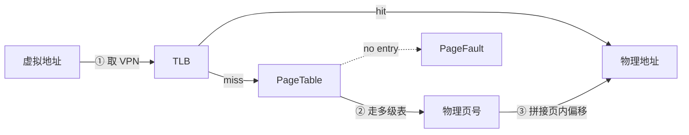
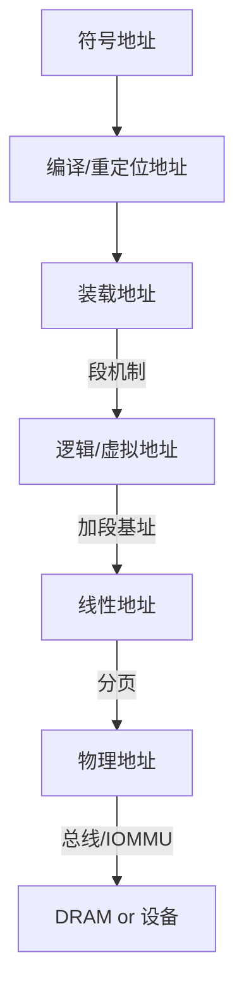
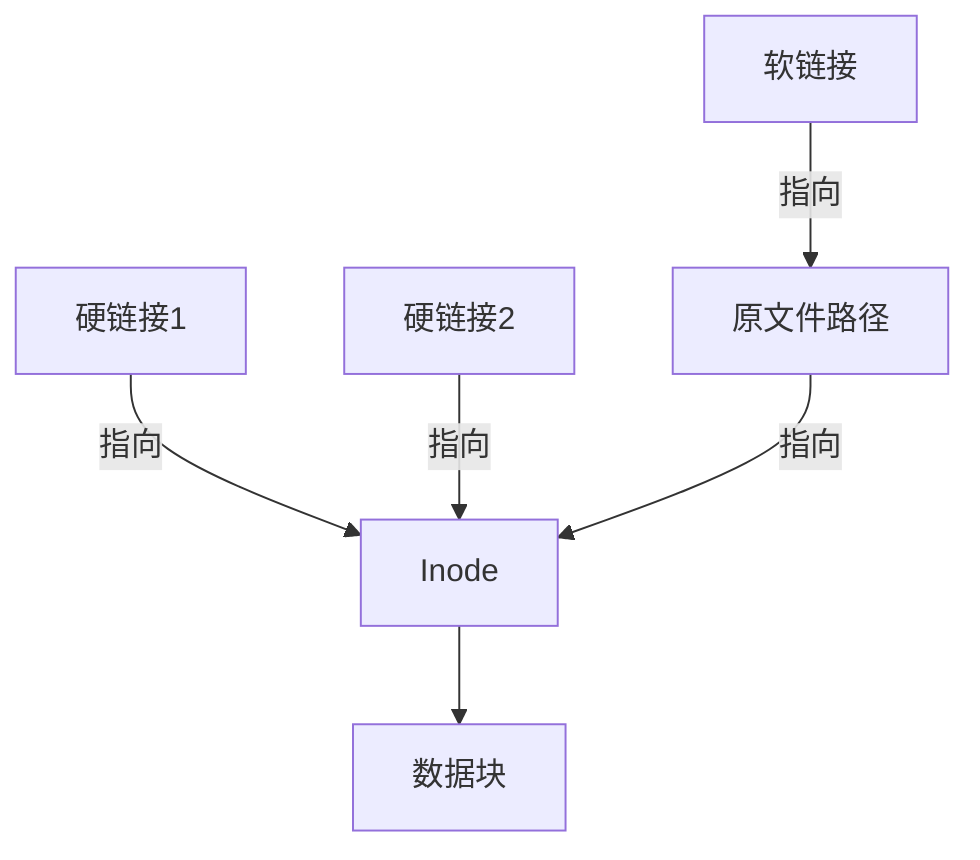
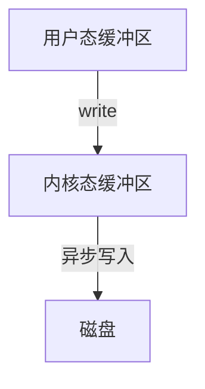

# 操作系统-牛客面经八股

> 来源：牛客网  |  共 74 题

## 1. 用户态和内核态有什么区别？
#### 

#### 一句话总结

 用户态和内核态是操作系统中两种不同的运行模式，用户态用于执行应用程序代码，受限于系统资源访问，而内核态则拥有对硬件和系统资源的完全控制，负责执行核心系统功能。

#### 1. 用户态（User Mode）

 - **定义**：用户态是应用程序运行的模式，具有受限的权限，不能直接访问硬件或内核数据结构。

 - **特点**： 受限访问：只能通过系统调用（System Call）请求内核服务。

 - 安全性：防止应用程序直接操作硬件，保护系统稳定性。

 - 进程隔离：每个进程在自己的虚拟地址空间中运行，互不干扰。

 **协助理解**：

 - 用户态就像在“安全沙箱”中玩耍的小孩，不能直接接触外面的世界，只能通过“请求”让大人（内核）帮忙。

#### 2. 内核态（Kernel Mode）

 - **定义**：内核态是操作系统内核运行的模式，具有最高权限，可以直接访问硬件和管理系统资源。

 - **特点**： 完全控制：可以执行特权指令，直接操作硬件设备。

 - 资源管理：负责内存管理、进程调度、文件系统、网络通信等核心功能。

 - 中断处理：响应硬件中断和异常，确保系统正常运行。

 **协助理解**：

 - 内核态就像“家长”或“管理员”，拥有房子的钥匙，可以自由出入和管理所有资源。

#### 3. 用户态与内核态的切换

 - **系统调用**：用户态程序通过系统调用请求内核服务，触发用户态到内核态的切换。

 - **中断/异常**：硬件中断或异常会导致 CPU 从用户态切换到内核态，以便内核处理。

 - **返回用户态**：内核完成任务后，通过返回指令切换回用户态，继续执行应用程序。

```cpp
用户态
 ┌───────┐
 │ 应用程序 │
 │ (受限权限) │
 └───────┘
 │ 系统调用
 ▼
内核态
 ┌───────┐
 │ 操作系统内核 │
 │ (完全控制) │
 └───────┘
 ▲
 │ 返回用户态
```

#### 4. 关键区别与影响

 - **权限级别**：用户态权限受限，内核态权限最高。

 - **访问范围**：用户态不能直接访问硬件，内核态可以。

 - **安全性**：用户态隔离保护系统，内核态负责系统安全。

 - **性能影响**：频繁的态切换会增加系统开销，影响性能。

#### 5. 优化与设计考虑

 - **减少态切换**：尽量减少不必要的系统调用和中断，优化性能。

 - **用户态驱动**：某些驱动程序可以在用户态实现，减少内核态负担。

 - **安全设计**：确保用户态程序不能通过漏洞提升权限，影响系统安全。

### 小结

 - **用户态**：应用程序运行模式，权限受限，需通过系统调用请求内核服务。

 - **内核态**：操作系统内核运行模式，权限最高，负责系统资源管理和硬件控制。

 - 通过“沙箱中的小孩”和“家长”的比喻，可以形象理解用户态和内核态的区别及其在系统中的角色。

## 2. 什么是系统调用？
#### 

#### 一句话总结

 系统调用是用户态程序与操作系统内核交互的接口，通过它，应用程序可以请求内核执行特权操作，如文件读写、内存管理和进程控制。

#### 1. 系统调用的定义

 - **定义**：系统调用是操作系统提供给用户态程序的接口，用于请求内核执行特权操作。

 - **作用**：提供受控的方式让用户程序访问硬件资源和内核服务，确保系统安全和稳定。

 - **常见系统调用**：open、read、write、fork、execve、wait、mmap等。

 **协助理解**：

 - 系统调用就像“服务窗口”，用户程序（顾客）通过窗口请求内核（服务员）提供特定服务（特权操作）。

#### 2. 系统调用的工作流程

 - **用户态发起请求** 应用程序通过库函数（如 C 标准库）调用系统调用接口。

 - **切换到内核态** 通过软中断（如int 0x80）或快速系统调用指令（如syscall）切换到内核态。

 - **内核处理请求** 内核根据系统调用号和参数执行相应的内核服务。

 - **返回用户态** 内核完成操作后，将结果返回给用户态程序，并切换回用户态。

```cpp
用户态
 ┌────────┐
 │ 应用程序 │
 │ (调用库函数) │
 └────────┘
 │ 系统调用
 ▼
内核态
 ┌────────┐
 │ 操作系统内核 │
 │ (处理请求) │
 └────────┘
 ▲
 │ 返回结果
```

#### 3. 系统调用的类型

 - **文件操作**：open、read、write、close

 - **进程控制**：fork、execve、exit、wait

 - **内存管理**：mmap、munmap、brk

 - **网络通信**：socket、connect、bind、listen

 - **设备管理**：ioctl、select、poll

#### 4. 系统调用的实现与优化

 - **软中断 vs 快速调用**： 早期使用软中断（int 0x80）切换内核态，现代 CPU 提供快速调用指令（syscall/sysenter）提高效率。

 - **库函数封装**： C 标准库（glibc）提供对系统调用的封装，简化应用程序开发。

 - **减少调用开销**： 尽量减少不必要的系统调用，合并小请求，降低态切换开销。

### 小结

 - **系统调用**：用户态程序请求内核执行特权操作的接口，确保安全访问系统资源。

 - **工作流程**：用户态请求→切换内核态→内核处理→返回用户态。

 - 通过“服务窗口”比喻，可以形象理解系统调用的作用和在操作系统中的角色。

## 3. Linux 内核与 Windows 内核有什么区别？
#### 

### 

### 一句话总结

 Linux 内核和 Windows 内核在架构设计、开源性、硬件支持和安全模型等方面存在显著区别，适用于不同的应用场景。

### 详细解析

 Linux 内核和 Windows 内核是两种不同的操作系统内核，各有其技术特点和设计理念：

 - **架构设计Linux 内核**：采用单内核（Monolithic Kernel）设计，所有核心服务运行在内核空间，提供高性能和灵活性。

 - **Windows 内核**：采用混合内核（Hybrid Kernel）设计，结合了微内核和单内核的优点，提供模块化和稳定性。

 - -Linux 内核像一个大工厂，所有生产线在同一屋檐下；Windows 内核像一个工业园区，各个工厂独立运作但相互协作。

 - **开源性Linux 内核**：完全开源，允许用户查看、修改和分发代码。

 - **Windows 内核**：专有软件，代码不公开，仅限于微软内部和授权合作伙伴。

 - -Linux 内核像一本开放的教科书，任何人都可以阅读和修改；Windows 内核像一本保密的手册，仅限特定人员使用。

 - **硬件支持Linux 内核**：广泛支持多种硬件平台，适用于服务器、嵌入式设备等。

 - **Windows 内核**：主要支持 x86 和 x64 架构，专注于桌面和服务器市场。

 - -Linux 内核像一个多功能工具箱，适用于各种场合；Windows 内核像一个专业工具，专注于特定任务。

 - **安全模型Linux 内核**：基于权限和用户组的安全模型，支持 SELinux 等增强安全模块。

 - **Windows 内核**：基于用户账户控制（UAC）和安全标识符（SID）的安全模型，提供细粒度的权限管理。

 - -Linux 内核的安全模型像一个社区，依靠规则和自律；Windows 内核的安全模型像一个公司，依靠层级和权限。

 - **更新和维护Linux 内核**：社区驱动的更新，频繁发布新版本。

 - **Windows 内核**：由微软集中管理，定期发布更新。

 - -Linux 内核的更新像一个开放的市场，快速响应需求；Windows 内核的更新像一个有序的商店，定期上新。

#### 总结：

 - **架构设计**：Linux 单内核，Windows 混合内核。

 - **开源性**：Linux 开源，Windows 专有。

 - **硬件支持**：Linux 广泛支持，Windows 专注 x86/x64。

 - **安全模型**：Linux 权限和用户组，Windows UAC 和 SID。

 - **更新和维护**：Linux 社区驱动，Windows 微软管理。

## 4. 什么是物理地址，什么是逻辑 / 虚拟 / 线性地址？
#### 

#### 一句话总结

 物理地址是内存芯片上的实际地址，逻辑/虚拟/线性地址是程序在运行时使用的地址，通过内存管理单元（MMU）映射到物理地址，实现地址空间隔离和内存保护。

#### 1. 物理地址

 - **定义**：物理地址是内存芯片上的实际地址，用于直接访问内存单元。

 - **特点**： 由硬件直接使用，唯一标识内存中的一个字节。

 - 不同进程共享同一物理地址空间。

 **协助理解**：

 - 物理地址就像“GPS 坐标”，就像卫星定位给出的 经纬度：唯一、精确，无论政府怎么改行政区划，这个坐标都不会变。

#### 2. 逻辑地址（虚拟地址）

 - **定义**：逻辑地址是程序在编译时生成的地址，由 CPU 在运行时使用，通过段寄存器和偏移量计算得到。

 - **特点**： 每个进程有自己的逻辑地址空间，互不干扰。

 - 逻辑地址通过段选择器和偏移量转换为线性地址。

 **协助理解**：

 - 逻辑地址就像“房间内部写的房门贴纸”，你在房门上只写「A楼‐5层‐502」，而不写城市名、道路名、经纬度。这一行地址贴纸只在同一栋楼里才有意义，需要先找到 A 楼，再在 A 楼里找 5 层 502 房。

#### 3. 线性地址

 - **定义**：线性地址是逻辑地址经过段选择器转换后的地址，未经过页表映射。

 - **特点**： 线性地址是分页机制的输入，进一步映射到物理地址。

 - 在无分页的系统中，线性地址即为物理地址。

 **协助理解**：

 - 线性地址就像园区里的“精确门牌号”，园区物业把「A楼‐5层‐502」翻译成「银河花园 8 栋 5 楼 502 室」。

 3.1. 虚拟地址

 - **定义**：虚拟地址是程序在运行时使用的地址，通过 MMU 映射到物理地址。

 - **特点**： 提供进程隔离和内存保护。

 - 允许程序使用比物理内存更大的地址空间。

 **协助理解**：

“虚拟地址(Virtual Address)”通常就是指 线性地址（也有人笼统地把能被分页单元翻译的地址都叫虚拟地址）。

#### 4. 地址转换过程

 - **逻辑地址到线性地址** 通过段选择器和偏移量计算得到线性地址。

 - **线性地址到物理地址** 通过页表映射，线性地址转换为物理地址。

 - **MMU 的作用** 内存管理单元（MMU）负责地址转换，提供内存保护和进程隔离。

#### 5. 优势与应用

 - **内存保护**：防止进程非法访问其他进程的内存。

 - **地址空间隔离**：每个进程有独立的地址空间，增强系统稳定性。

 - **内存扩展**：通过虚拟内存技术，程序可以使用比物理内存更大的地址空间。

### 小结

 - **物理地址**：内存芯片上的实际地址，硬件直接使用。

 - **逻辑/虚拟/线性地址**：程序使用的地址，通过 MMU 映射到物理地址，实现内存保护和进程隔离。

## 5. CPU 使用率与 Load 平均值分别指什么？
#### 

#### 一句话总结

 CPU 使用率表示 CPU 在某一时刻的繁忙程度（即有多少时间在执行任务），而 Load 平均值则反映系统的整体负载情况，包括正在执行和等待 CPU 的进程数。

### 详细解析

#### 1. CPU 使用率

 - **定义**：CPU 使用率是指在一个时间段内，CPU 处于活跃状态（执行用户态、内核态任务）的百分比。

 - **计算**：通常分为用户态、系统态、空闲态等，使用top或mpstat等工具查看。

 - **指标意义**： 100% 表示 CPU 完全被占用；

 - 低于 100% 表示有空闲时间；

 - 高用户态（us）表示计算密集型任务；

 - 高系统态（sy）表示内核态任务多，如 I/O 操作。

 **协助理解**：

 - CPU 使用率就像工厂机器的开工率，100% 表示机器一直在运转，没有停歇。

```cpp
CPU 使用率
 ┌───────┐
 │ 100% │
 │ 75% │
 │ 50% │
 │ 25% │
 └───────┘

```

#### 2. Load 平均值

 - **定义**：Load 平均值是指在特定时间窗口（1、5、15 分钟）内，系统中正在执行和等待 CPU 的进程数的平均值。

 - **计算**：通过uptime或top查看，通常以三个数值表示。

 - **指标意义**： Load 值接近 CPU 核心数表示系统负载适中；

 - Load 值远高于 CPU 核心数表示系统过载，进程排队等待 CPU。

 - 例如，4 核 CPU 上 Load 值为 4 表示满负荷，8 表示过载。 **协助理解**： Load 平均值就像工厂的订单量，反映了当前有多少订单在处理和排队。

 - 如果订单量（Load）超过机器数（CPU 核心数），就会出现排队等待。

```cpp
Load 平均值
┌───────┐
│ 8.0 (过载) │
│ 4.0 (满负荷) │
│ 2.0 (适中) │
│ 1.0 (轻负载) │
└───────┘
```

#### 3. CPU 使用率 vs Load 平均值

 - **CPU 使用率**： 关注的是 CPU 的繁忙程度，是否有空闲时间。

 - 只反映 CPU 的使用情况，不考虑等待的进程。

 - **Load 平均值**： 关注的是系统整体负载，包括正在执行和等待的进程。

 - 反映了系统的压力和潜在的瓶颈。

#### 4. 监控与优化建议

 - **监控工具**： top、htop、uptime、mpstat、sar等。

 - **优化建议**： 高 CPU 使用率：优化代码、增加 CPU 核心、分布式部署。

 - 高 Load 平均值：检查 I/O 瓶颈、优化进程调度、增加硬件资源。

### 小结

 - **CPU 使用率**：反映 CPU 的繁忙程度，关注执行任务的时间占比。

 - **Load 平均值**：反映系统整体负载，关注执行和等待的进程数。

## 6. CPU 是如何执行程序 / 任务的？
#### 

#### 一句话总结

 CPU 执行程序通过取指令、解码、执行、存储和写回的循环过程，结合流水线、缓存和分支预测等技术，实现高效的指令处理和任务调度。

### 详细解析

#### 1. CPU 执行程序的基本步骤

 - **取指令（Fetch）** 从内存中取出下一条指令，加载到指令寄存器。

 - 程序计数器（PC）指向当前指令的地址，并在取指后递增。

 - **解码（Decode）** 解析指令的操作码和操作数，确定执行的操作类型。

 - 控制单元生成相应的控制信号，准备执行。

 - **执行（Execute）** 根据解码结果，ALU（算术逻辑单元）执行算术或逻辑运算。

 - 可能涉及寄存器操作、内存访问或 I/O 操作。

 - **存储（Memory Access）** 如果指令需要访问内存，则在此阶段进行读写操作。

 - 例如，加载数据到寄存器或将结果写回内存。

 - **写回（Write Back）** 将执行结果写回寄存器或内存，更新状态。

 - 准备进入下一条指令的执行循环。

 **协助理解**：

 - CPU 执行程序就像“工厂流水线”，每个步骤（取指、解码、执行、存储、写回）都是一个工序，工件（指令）在流水线上依次加工。

```cpp
取指令
 ┌────────┐
 │ 从内存取指令 │
 └────────┘

解码
 ┌────────┐
 │ 解析指令 │
 └────────┘

执行
 ┌────────┐
 │ ALU 运算 │
 └────────┘

存储
 ┌────────┐
 │ 内存读写 │
 └────────┘

写回
 ┌────────┐
 │ 更新寄存器 │
 └────────┘
```

#### 2. 高效执行的关键技术

 - **流水线（Pipelining）** 将指令执行分为多个阶段，多个指令在不同阶段并行处理，提高吞吐量。

 - 类似于“工厂流水线”，不同工序同时进行，减少等待时间。

 - **缓存（Cache）** 在 CPU 内部设置高速缓存，存储常用数据和指令，减少内存访问延迟。

 - 分为 L1、L2、L3 缓存，逐级增大容量和降低速度。

 - **分支预测（Branch Prediction）** 预测程序的分支路径，提前加载可能执行的指令，减少分支跳转带来的停顿。

 - 类似于“预判工序”，提前准备可能需要的材料。

#### 3. 多任务调度与并行执行

 - **多任务调度** 操作系统通过进程调度算法（如时间片轮转、优先级调度）管理 CPU 资源，切换任务。

 - CPU 利用上下文切换保存和恢复任务状态，实现多任务并发。

 - **多核与超线程** 现代 CPU 具有多个核心，每个核心可以独立执行任务。

 - 超线程技术允许每个核心同时处理多个线程，提高并行度。

### 小结

 - **CPU 执行程序**：通过取指、解码、执行、存储、写回的循环过程，完成指令处理。

 - **关键技术**：流水线、缓存、分支预测、多任务调度、多核与超线程。

 - 通过“工厂流水线”比喻，可以形象理解 CPU 执行程序的步骤和优化技术。

## 7. 负数的二进制如何表示？
#### 

#### 一句话总结

 负数在计算机中通常使用补码（二进制补码）表示，这种方法通过反转正数的所有位并加一来获得负数的二进制表示，解决了符号位和数值计算的一致性问题。

#### 1. 二进制表示法概述

 - **原码（Sign-Magnitude）** 最高位为符号位，0 表示正数，1 表示负数，其余位表示数值。

 - 缺点：存在 +0 和 -0，运算复杂。

 - **反码（Ones' Complement）** 正数的反码与原码相同，负数的反码是对正数逐位取反。

 - 缺点：仍存在 +0 和 -0，运算需处理进位。

 - **补码（Two's Complement）** 正数的补码与原码相同，负数的补码是对正数逐位取反后加一。

 - 优点：只有一种 0，运算简单，符号位和数值位统一处理，加减法运算不需额外处理符号位，直接使用二进制加法。

#### 2. 补码的计算方法

 - **正数补码** 与原码相同。

 - 例如，+5 的补码：0000 0101（8 位表示）。

 - **负数补码** 对正数逐位取反，然后加一。

 - 例如，-5 的补码： +5 的原码：0000 0101

 - 逐位取反：1111 1010

 - 加一：1111 1011

```cpp
+5 的补码
 ┌───────┐
 │ 0000 0101 │
 └───────┘

-5 的补码
 ┌───────┐
 │ 1111 1011 │
 └───────┘
```

#### 3. 补码的应用

 - **整数运算**：计算机中整数运算普遍使用补码表示，简化了加减法和逻辑运算。

 - **位运算**：补码的表示方式使得位运算（如与、或、异或）更加直观和一致。

### 小结

 - **负数的二进制表示**：通常使用补码，通过对正数逐位取反加一实现。

 - **补码的优点**：统一处理符号位和数值位，简化运算，避免符号零问题。

## 8. 为什么磁盘比内存慢好几个数量级？
#### 

#### 一句话总结

 磁盘比内存慢好几个数量级主要是因为磁盘的机械结构导致访问延迟高，而内存是纯电子设备，能够以极高的速度进行数据读写。

#### 1. 磁盘与内存的基本结构

 - **磁盘（HDD）** 机械结构：由旋转的磁盘盘片和移动的磁头组成。

 - 访问方式：磁头需要移动到正确的轨道并等待盘片旋转到正确位置才能读写数据。

 - 典型延迟：毫秒级（ms），主要由寻道时间和旋转延迟构成。

 - **内存（RAM）** 电子结构：由半导体芯片组成，没有机械运动部件。

 - 访问方式：通过电子信号直接访问存储单元。

 - 典型延迟：纳秒级（ns），数据可以在极短时间内随机访问。

 **协助理解**：

 - 磁盘就像“老式唱片机”，需要机械臂移动到正确的轨道才能播放音乐。

 - 内存则像“电子收音机”，可以瞬间调到任何频道播放。

#### 2. 访问延迟的来源

 - **磁盘的机械延迟寻道时间**：磁头移动到目标轨道所需的时间。

 - **旋转延迟**：等待盘片旋转到正确位置的时间。

 - **传输时间**：数据从盘片传输到磁头的时间。

 - **内存的电子延迟** 由于内存是纯电子设备，访问延迟主要由电信号传输时间决定，极短。

#### 3. 磁盘与内存的性能对比

 - **数据吞吐量** 磁盘：受限于机械运动，数据传输速率较低。

 - 内存：高带宽，能够快速读写大量数据。

 - **随机访问性能** 磁盘：随机访问性能差，频繁的寻道和旋转导致延迟高。

 - 内存：随机访问性能优异，几乎没有延迟。

#### 4. 技术进步与替代方案

 - **固态硬盘（SSD）** 采用闪存技术，没有机械部件，访问速度比传统 HDD 快得多，但仍比内存慢。

 - **内存缓存** 使用内存作为缓存，加速磁盘访问，减少延迟。

 - **新型存储技术** 研究中的新型存储技术（如 3D XPoint）试图缩小内存与存储之间的速度差距。

### 小结

 - **磁盘比内存慢**：主要由于磁盘的机械结构导致高延迟，而内存是纯电子设备，访问速度极快。

 - **性能对比**：磁盘在随机访问和数据吞吐量上都不如内存。

 - 通过“老式唱片机”和“电子收音机”比喻，可以形象理解磁盘和内存的速度差异及其原因。

## 9. 键盘敲下 A 操作系统内部发生了什么？
#### 

#### 一句话总结

 当键盘敲下 A 时，键盘控制器生成中断信号，操作系统通过中断处理程序读取扫描码，转换为字符并传递给应用程序，实现从硬件输入到软件响应的完整过程。

#### 1. 键盘输入的基本流程

 - **键盘硬件生成信号** 键盘内部的电路检测到按键 A 被按下，生成对应的扫描码。

 - 扫描码是硬件定义的编码，用于标识具体按键。

 - **键盘控制器发送中断** 键盘控制器（通常是 PC 的 8042 控制器）检测到按键事件，向 CPU 发送中断请求（IRQ 1）。

 - 中断请求打断当前 CPU 执行，转而处理键盘输入。

 - **操作系统中断处理** CPU 响应中断，保存当前执行状态，跳转到键盘中断处理程序。

 - 中断处理程序从键盘控制器读取扫描码。

 - **扫描码转换为字符** 操作系统将扫描码转换为字符（如 ASCII 码），考虑键盘布局和修饰键（如 Shift）。

 - 例如，扫描码 0x1E 对应字符 'A'。

 - **传递给应用程序** 操作系统将字符放入键盘缓冲区，供应用程序读取。

 - 应用程序通过系统调用或事件机制获取输入字符，进行相应处理。

```cpp
键盘输入流程
 ┌────────┐
 │ 键盘生成信号 │
 └────────┘
 │
 ▼
 ┌────────┐
 │ 控制器发送中断 │
 └────────┘
 │
 ▼
 ┌────────┐
 │ OS 处理中断 │
 └────────┘
 │
 ▼
 ┌────────┐
 │ 转换为字符 │
 └────────┘
 │
 ▼
 ┌────────┐
 │ 应用程序读取 │
 └────────┘
```

#### 2. 关键技术与优化

 - **中断优先级** 键盘中断通常优先级较高，确保输入响应及时。

 - **键盘缓冲区** 操作系统维护键盘缓冲区，存储未处理的输入，防止丢失。

 - **多任务处理** 操作系统通过调度机制，确保中断处理与其他任务并行进行。

#### 3. 可能的延伸问题

 - **键盘布局** 不同国家和地区的键盘布局不同，操作系统需根据布局转换扫描码。

 - **修饰键处理** Shift、Ctrl、Alt 等修饰键影响字符转换，需在中断处理时考虑。

 - **多媒体键支持** 现代键盘支持多媒体键（如音量控制），需额外处理。

### 小结

 - **键盘敲下 A 的过程**：从硬件生成信号到操作系统中断处理，再到字符转换和应用程序读取。

 - **关键技术**：中断处理、扫描码转换、键盘缓冲区。

## 10. 并行和并发是什么？
#### 

#### 一句话总结

 并行和并发是计算机系统中处理多任务的两种方式，并行指多个任务同时执行，而并发指多个任务在同一时间段内交替执行。

#### 1. 并行（Parallelism）

 - **定义**：并行是指在多核或多处理器系统中，多个任务在同一时刻同时执行。

 - **特点**： 需要硬件支持（多核 CPU、多处理器）。

 - 任务之间可以独立运行，不需要相互等待。

 - 适用于计算密集型任务，如科学计算、图像处理。

 **协助理解**：

 - 并行就像“多车道高速公路”，每辆车（任务）在自己的车道上同时行驶，不互相干扰。

#### 2. 并发（Concurrency）

 - **定义**：并发是指在单核或多核系统中，多个任务在同一时间段内交替执行，以实现同时进行的效果。

 - **特点**： 不一定同时执行，依赖于任务调度。

 - 任务之间可能需要同步和通信。

 - 适用于 I/O 密集型任务，如网络请求、用户交互。

 **协助理解**：

 - 并发就像“单车道交替通行”，多辆车（任务）在同一车道上交替前进，快速切换。

#### 3. 并行与并发的区别

 - **执行方式** 并行：任务同时执行，依赖硬件支持。

 - 并发：任务交替执行，依赖调度策略。

 - **适用场景** 并行：适合计算密集型任务，充分利用多核资源。

 - 并发：适合 I/O 密集型任务，提高资源利用率。

 - **实现难度** 并行：需要考虑任务分解和负载均衡。

 - 并发：需要处理任务同步和竞争条件。

#### 4. 实现技术

 - **并行技术** 多线程、多进程、GPU 计算、分布式计算。

 - **并发技术** 线程池、异步 I/O、协程、事件驱动。

#### 5. 可能的延伸问题

 - **线程安全** 并发编程中需注意线程安全，避免数据竞争和死锁。

 - **性能优化** 并行编程中需优化任务分解和调度，提高效率。

### 小结

 - **并行和并发**：并行是同时执行多个任务，并发是交替执行多个任务。

 - **适用场景**：并行适合计算密集型，并发适合 I/O 密集型。

## 11. 什么是中断和异常？
#### 

#### 一句话总结

 中断和异常是计算机系统中用于处理异步和同步事件的机制，中断通常由外部设备触发，而异常由程序执行过程中出现的错误或特殊条件引发。

#### 1. 中断（Interrupt）

 - **定义**：中断是由外部设备或硬件定时器发出的信号，通知 CPU 需要处理的事件。

 - **特点**： **异步**：中断可以在程序执行的任何时刻发生。

 - **外部来源**：通常由硬件设备（如键盘、鼠标、网络接口）触发。

 - **优先级**：中断可以有不同的优先级，CPU 根据优先级处理。

 **协助理解**：

 - 中断 (Interrupt)：外部世界突然来电铃声——“喂，CPU，请暂停一下先处理我！”

#### 2. 异常（Exception）

 - **定义**：异常是由程序执行过程中出现的错误或特殊条件引发的事件。

 - **特点**： **同步**：异常在程序执行到特定指令时发生。

 - **内部来源**：由 CPU 检测到的错误（如除零、非法指令）或操作系统定义的条件（如系统调用）。

 - **处理机制**：通过异常处理程序（如 try-catch 块）进行处理。

 **协助理解**：

 - 异常 (Exception)：CPU 自己在执行指令时“卡壳”或“主动报备”——“哎呀我除以 0 了 / 我要陷入内核！”

#### 3. 中断与异常的处理流程

 - **中断处理流程中断请求**：外部设备发出中断信号。

 - **保存状态**：CPU 保存当前执行状态。

 - **中断向量**：根据中断号查找中断向量表，跳转到对应的中断处理程序。

 - **处理完成**：中断处理程序执行完毕，恢复 CPU 状态，继续执行被中断的程序。

 - **异常处理流程异常检测**：CPU 检测到异常条件。

 - **保存状态**：保存当前执行状态。

 - **异常向量**：根据异常类型查找异常向量表，跳转到对应的异常处理程序。

 - **处理完成**：异常处理程序执行完毕，恢复 CPU 状态，继续执行或终止程序。

#### 4. 中断与异常的区别

 - **触发来源** 中断：外部设备或硬件定时器。

 - 异常：程序执行中的错误或特殊条件。

 - **触发时机** 中断：异步，随时可能发生。

 - 异常：同步，特定指令执行时发生。

 - **处理优先级** 中断：通常有优先级，可能打断异常处理。

 - 异常：处理优先级通常低于中断。

### 小结

 - **中断和异常**：中断是外部设备触发的异步事件，异常是程序执行中出现的同步错误。

 - **处理流程**：中断和异常都通过向量表查找处理程序，保存和恢复 CPU 状态。

## 12. 软中断与硬中断有什么区别？
#### 

#### 一句话总结

 软中断和硬中断都是处理异步事件的机制，硬中断由硬件设备触发，优先级高且立即响应，而软中断由软件触发，用于延迟处理任务，优先级低于硬中断。

#### 1. 硬中断（Hardware Interrupt）

 - **定义**：硬中断是由硬件设备（如键盘、鼠标、网络接口）发出的信号，通知 CPU 需要立即处理的事件。

 - **特点**： **异步触发**：可以在程序执行的任何时刻发生。

 - **高优先级**：通常优先级较高，CPU 会立即暂停当前任务处理中断。

 - **快速响应**：中断处理程序（ISR）需要快速执行，以便尽快恢复正常任务。

 **协助理解**：

 - 硬中断就像“紧急电话”，无论你在做什么，电话响起时你需要立即接听。

#### 2. 软中断（Software Interrupt）

 - **定义**：软中断是由软件触发的中断，用于延迟处理需要较长时间的任务，通常在硬中断处理程序中触发。

 - **特点**： **软件触发**：由操作系统或应用程序发起。

 - **低优先级**：优先级低于硬中断，通常在硬中断处理完成后执行。

 - **延迟处理**：用于处理需要较长时间的任务，避免阻塞硬中断。

 **协助理解**：

 - 软中断就像“待办事项清单”，你可以在紧急任务完成后再处理这些事项。

#### 3. 硬中断与软中断的处理流程

 - **硬中断处理流程中断请求**：硬件设备发出中断信号。

 - **保存状态**：CPU 保存当前执行状态，暂停当前任务。

 - **中断向量**：根据中断号查找中断向量表，跳转到对应的中断处理程序。

 - **快速处理**：中断处理程序执行完毕，恢复 CPU 状态，继续执行被中断的程序。

 - **软中断处理流程触发软中断**：在硬中断处理程序中或由操作系统触发。

 - **排队等待**：软中断排队等待硬中断处理完成。

 - **执行软中断**：在适当时机执行软中断处理程序，完成延迟任务。

#### 4. 硬中断与软中断的区别

 - **触发来源** 硬中断：由硬件设备触发。

 - 软中断：由软件或操作系统触发。

 - **优先级与响应** 硬中断：高优先级，立即响应。

 - 软中断：低优先级，延迟处理。

 - **处理目的** 硬中断：快速处理紧急事件。

 - 软中断：延迟处理较长时间任务，避免阻塞。

### 小结

 - **软中断与硬中断**：硬中断由硬件触发，优先级高且立即响应；软中断由软件触发，优先级低且延迟处理。

 - **处理流程**：硬中断快速处理，软中断排队等待适当时机执行。

 - 通过“紧急电话”和“待办事项清单”比喻，可以形象理解软中断和硬中断的触发机制和处理流程。

## 13. 什么是进程和线程？进程和线程的区别？
#### 

#### 一句话总结

 进程是操作系统中资源分配的基本单位，线程是进程中执行的基本单位，进程拥有独立的内存空间，而线程共享进程的内存空间和资源。

#### 1. 进程（Process）

 - **定义**：进程是一个正在执行的程序实例，是操作系统进行资源分配和调度的基本单位。

 - **特点**： **独立性**：每个进程有自己的内存空间（代码段、数据段、堆、栈）。

 - **资源拥有**：进程拥有自己的文件描述符、信号处理、地址空间等资源。

 - **开销较大**：进程切换需要保存和恢复大量上下文信息。

 **协助理解**：

 - 进程就像“独立的房子”，每个房子有自己的房间和设施，互不干扰。

#### 2. 线程（Thread）

 - **定义**：线程是进程中的一个执行路径，是 CPU 调度和执行的基本单位。

 - **特点**： **共享性**：同一进程的线程共享进程的内存空间和资源。

 - **轻量级**：线程切换开销小，创建和销毁速度快。

 - **并发执行**：多个线程可以在多核 CPU 上并发执行，提高程序效率。 **协助理解**： 线程就像“房子里的房间”，多个房间共享同一个房子的资源，但可以独立活动。

#### 3. 进程与线程的区别

 - **内存空间** 进程：拥有独立的内存空间。

 - 线程：共享进程的内存空间。

 - **资源开销** 进程：创建和切换开销大。

 - 线程：创建和切换开销小。

 - **通信方式** 进程：通过进程间通信（IPC）进行数据交换，如管道、消息队列、共享内存。

 - 线程：通过共享内存直接通信，速度快但需注意同步。

 - **并发性** 进程：适合多任务并发，进程间隔离性好。

 - 线程：适合多线程并发，资源共享效率高。

#### 4. 进程与线程的应用场景

 - **进程应用** 适用于需要高隔离性和稳定性的场景，如服务器进程、独立应用程序。

 - **线程应用** 适用于需要高并发和快速响应的场景，如多线程服务器、实时应用。

### 小结

 - **进程和线程**：进程是资源分配单位，线程是执行单位，进程独立，线程共享。

 - **区别**：内存空间、资源开销、通信方式、并发性。

 - 通过“独立房子”和“房子里的房间”比喻，可以形象理解进程和线程的特性及区别。

## 14. 什么是协程？
#### 

#### 一句话总结

 协程是一种用户态的轻量级线程，允许在单个线程中执行多个任务，通过程序自身控制的方式实现任务切换，提供高效的并发处理。

#### 1. 协程的定义

 - **定义**：协程（Coroutine）是一种比线程更轻量级的并发单元，允许在单个线程中执行多个任务，通过程序自身控制的方式实现任务切换。

 - **特点**： **轻量级**：协程在用户态切换，开销小，创建和销毁速度快。

 - **非抢占式**：协程的切换由程序显式控制，而非由操作系统调度。

 - **高效并发**：适合 I/O 密集型任务，避免线程上下文切换的开销。

 **协助理解**：

 - 协程就像“舞台上的演员”，每个演员（协程）在自己的台词结束后主动让出舞台，等待下次上场。

#### 2. 协程的工作原理

 - **协程创建** 协程由程序显式创建，通常通过语言内置的协程库或框架。

 - **协程切换** 协程通过yield或await等关键字主动让出执行权，切换到其他协程。

 - **协程恢复** 协程在适当时机被恢复执行，继续从上次让出的地方运行。

 - **协程结束** 协程执行完毕后，释放资源，等待被垃圾回收。

#### 3. 协程的优势

 - **高效资源利用** 协程在用户态切换，避免了线程切换的内核态开销。

 - **简单的并发模型** 协程通过显式切换，避免了多线程的竞争和锁机制。

 - **适合 I/O 密集型任务** 协程在等待 I/O 操作时可以让出执行权，提高 CPU 利用率。

#### 4. 协程的应用场景

 - **异步编程** 协程广泛应用于异步 I/O 操作，如网络请求、文件读写。

 - **高并发服务器** 协程用于实现高并发的网络服务器，处理大量并发连接。

 - **游戏开发** 协程用于实现游戏中的任务调度和动画控制。

### 小结

 - **协程**：用户态的轻量级线程，提供高效的并发处理，通过程序自身控制的方式实现任务切换。

 - **工作原理**：协程创建、切换、恢复、结束。

## 15. 什么时候选用进程，什么时候选用线程？
#### 

#### 一句话总结

 当需要独立的内存空间和更高的稳定性时选择进程，而需要更高的资源共享和更快的通信时选择线程。

#### 详细解析

 在计算机科学中，进程和线程是两种基本的执行单元。理解它们的区别和应用场景对于优化程序性能和资源管理至关重要。

 进程

 **定义**：进程是一个独立的程序执行实例，拥有自己的内存空间和系统资源。

 **适用场景**：

 - **独立性**：当任务需要独立运行，且不希望与其他任务共享内存时，选择进程。例如，运行不同的应用程序（如浏览器和文本编辑器）时。

 - **稳定性**：进程之间相互隔离，一个进程崩溃不会影响其他进程。这就像在不同的房间里工作，即使一个房间着火，其他房间也不会受到影响。

 **缺点**：

 - **开销大**：进程的创建和切换需要更多的系统资源和时间。

 - **通信复杂**：进程间通信（IPC）需要通过操作系统提供的机制，如管道、消息队列等，效率较低。

 线程

 **定义**：线程是进程中的一个执行路径，多个线程共享同一进程的内存空间和资源。

 **适用场景**：

 - **资源共享**：当多个任务需要共享数据或资源时，选择线程。例如，Web服务器处理多个请求时，每个请求可以作为一个线程。

 - **高效通信**：线程间通信更简单，因为它们共享同一内存空间。这就像在同一个房间里工作，大家可以直接对话和共享资料。

 **缺点**：

 - **安全性**：由于共享内存，线程之间的错误可能导致整个进程崩溃。这就像在同一个房间里工作，如果一个人打翻了墨水，所有人都可能受到影响。

 - **同步问题**：需要小心处理线程同步，以避免竞争条件和死锁。

 图示说明

```plaintext
+-----------------+ +-----------------+
| 进程 A | | 进程 B |
| +-------------+ | | +-------------+ |
| | 线程 A1 | | | | 线程 B1 | |
| | 线程 A2 | | | | 线程 B2 | |
| +-------------+ | | +-------------+ |
+-----------------+ +-----------------+
```

 在上图中，进程 A 和进程 B 是相互独立的，拥有各自的内存空间。而进程 A 内的线程 A1 和 A2 共享同一内存空间。

#### 总结

 选择进程还是线程，取决于任务的独立性、资源共享需求和通信效率。理解它们的特性和适用场景，可以帮助我们在设计系统时做出更明智的决策。

## 16. 为什么要使用多线程？
#### 

#### 一句话总结

 使用多线程可以提高程序的并发性和响应速度，充分利用多核处理器的性能。

#### 详细解析

 多线程是一种在单个进程中并发执行多个任务的技术。它在现代计算中扮演着重要角色，尤其是在需要高效处理多个任务的应用中。

 多线程的优势

 - **提高并发性**： 多线程允许程序同时执行多个任务，从而提高了程序的并发性。这就像在一个工厂里，多个工人同时工作，每个人负责不同的任务，整体效率更高。

 - **增强响应速度**： 在用户界面应用中，多线程可以保持界面的响应性。例如，一个线程负责处理用户输入，另一个线程负责后台数据处理。这样，即使后台任务繁重，用户界面仍然可以流畅运行。

 - **充分利用多核处理器**： 现代计算机通常配备多核处理器。多线程可以将任务分配到不同的处理器核心上，最大化硬件资源的利用率。这就像在一个多车道的高速公路上，车辆可以在不同的车道上同时行驶，避免交通堵塞。

 - **简化建模**： 对于某些问题，多线程可以使程序设计更直观。例如，模拟一个多人游戏时，每个玩家可以用一个线程来表示，简化了游戏逻辑的实现。

 多线程的挑战

 - **线程安全**： 由于线程共享同一内存空间，必须小心处理数据的访问和修改，以避免竞争条件。这就像在一个共享厨房里做饭，大家需要协调使用同一套厨具。

 - **死锁**： 如果线程之间的资源请求顺序不当，可能导致死锁，即线程相互等待对方释放资源，程序无法继续执行。这就像两辆车在狭窄的道路上相遇，谁也不让谁，结果都无法前进。

 图示说明

```cpp
+-----------------+
| 主线程 |
| +-------------+ |
| | 线程 1 | |
| | 处理用户输入 | |
| +-------------+ |
| +-------------+ |
| | 线程 2 | |
| | 处理数据 | |
| +-------------+ |
| +-------------+ |
| | 线程 3 | |
| | 发送网络请求| |
| +-------------+ |
+-----------------+
```

 在上图中，主线程负责协调，线程 1 处理用户输入，线程 2 处理数据，线程 3 发送网络请求。各个线程并行工作，提高了程序的整体效率。

#### 总结

 多线程技术通过提高并发性、增强响应速度和充分利用多核处理器的性能，显著提升了程序的执行效率。然而，开发者需要小心处理线程安全和死锁问题，以确保程序的稳定性和可靠性。

## 17. 线程切换时操作系统要做哪些动作？
#### 

#### 一句话总结

 线程切换时，操作系统需要保存当前线程的状态并加载下一个线程的状态，以确保任务的连续性和正确性。

#### 详细解析

 线程切换是操作系统在多任务环境中管理线程执行的关键过程。它涉及保存和恢复线程的执行状态，以便在不同线程之间切换。

 线程切换的步骤

 - **保存当前线程状态**： **寄存器状态**：操作系统需要保存当前线程的CPU寄存器状态，包括程序计数器、堆栈指针等。这就像在书签上记下你读到的页码，以便下次继续阅读。

 - **线程控制块（TCB）**：线程的所有状态信息被存储在一个称为线程控制块的数据结构中。TCB包含线程ID、优先级、寄存器状态等信息。

 - **选择下一个线程**： **调度算法**：操作系统根据调度算法（如先来先服务、优先级调度等）选择下一个要执行的线程。这就像在排队时，决定下一个该轮到谁。

 - **加载下一个线程状态**： **恢复寄存器状态**：从下一个线程的TCB中恢复其寄存器状态，使其能够从上次中断的地方继续执行。这就像从书签处继续阅读书本。

 - **更新内存管理**： 如果线程属于不同的进程，操作系统还需要更新内存管理单元（MMU）以切换到新的地址空间。

 图示说明

```cpp
+-----------------+ +-----------------+
| 当前线程 T1 | | 下一个线程 T2 |
| +-------------+ | | +-------------+ |
| | 保存状态 | | | | 恢复状态 | |
| | 选择下一个 | | --> | | 执行 | |
| +-------------+ | | +-------------+ |
+-----------------+ +-----------------+
```

 在上图中，当前线程 T1 的状态被保存，操作系统选择下一个线程 T2，并恢复其状态以继续执行。

 线程切换的开销

 - **上下文切换开销**：线程切换涉及保存和恢复状态，可能导致性能开销。频繁的线程切换会影响系统效率。

 - **缓存失效**：切换线程可能导致CPU缓存失效，因为新线程可能需要不同的数据和指令。

#### 总结

 线程切换是操作系统管理多任务执行的核心功能。通过保存和恢复线程状态，操作系统确保了任务的连续性和正确性。然而，线程切换也带来了性能开销，开发者需要在设计多线程应用时加以考虑。

## 18. 同步与异步的区别？
#### 

#### 

#### 一句话总结

 同步与异步的区别在于**任务的执行方式和等待机制**：同步任务需要等待前一个任务完成后才能继续，而异步任务可以在等待期间执行其他任务，从而提高系统的并发性和响应速度。

 协助理解

想象你在餐厅点餐：

 - **同步**：你站在柜台前等餐，直到食物准备好才能离开。

 - **异步**：你点完餐后坐下，继续做其他事情，食物准备好时服务员会通知你。

#### 1. 同步 (Synchronous)

 - **定义**：同步操作要求任务按顺序执行，当前任务完成后才能开始下一个任务。

 - **特点**： 简单直观，易于理解和实现。

 - 可能导致等待时间长，降低系统效率。

 - 适用于需要严格顺序执行的场景。

```plaintext
┌───────┐
│ 任务1 开始 │
├───────┤
│ 任务1 完成 │
├───────┤
│ 任务2 开始 │
└───────┘
```

#### 2. 异步 (Asynchronous)

 - **定义**：异步操作允许任务在等待期间执行其他任务，任务完成后通过回调或通知机制处理结果。

 - **特点**： 提高了系统的并发性和响应速度。

 - 编程复杂度较高，需要处理回调或事件通知。

 - 适用于需要高并发和快速响应的场景。

```plaintext
┌───────┐
│ 任务1 开始 │
├───────┤
│ 任务1 等待 │
├───────┤
│ 任务2 开始 │
├───────┤
│ 任务1 完成通知│
└───────┘
```

#### 3. 同步与异步的对比

| 维度 | 同步 | 异步 |
| --- | --- | --- |
| 执行顺序 | 顺序执行 | 并发执行 |
| 等待机制 | 阻塞等待 | 非阻塞等待 |
| 系统效率 | 可能较低 | 较高 |
| 编程复杂度 | 简单 | 较高 |
| 适用场景 | 需要顺序执行 | 高并发、快速响应 |

#### 4. 应用场景

 - **同步**： 文件读写：需要按顺序读取或写入数据。

 - 数据库事务：需要确保操作的原子性和一致性。

 - **异步**： 网络请求：可以在等待响应期间处理其他任务。

 - 用户界面：可以在后台执行耗时操作，保持界面响应。

#### 5. 结构示意图

 - **同步**：任务按顺序执行，任务1完成后才能开始任务2。

 - **异步**：任务1和任务2可以并发执行，任务1完成后通过通知机制处理结果。

#### 6. 常见问题与解答

| 问题 | 解答 |
| --- | --- |
| 同步和异步的主要区别是什么？ | 同步需要等待任务完成后才能继续，异步可以在等待期间执行其他任务。 |
| 异步编程的优势是什么？ | 提高系统的并发性和响应速度，适合高并发场景。 |
| 如何实现异步操作？ | 使用回调函数、事件驱动或异步库（如async/await）。 |

### 总结

 同步与异步的区别在于**任务的执行方式和等待机制**：

 - **同步**适合需要顺序执行的场景，简单易用。

 - **异步**则提高了系统的并发性和响应速度，适合高并发和快速响应的应用。

 理解这两者的区别和应用场景，有助于在系统设计中选择合适的任务处理方式。

## 19. 进程切换为什么比线程更耗资源？
#### 

#### 一句话总结

 进程切换比线程切换更耗资源，因为它需要切换独立的内存空间和系统资源，而线程切换只需在同一进程内切换执行路径。

#### 详细解析

 进程和线程是操作系统中两种基本的执行单元。理解进程切换为何比线程切换更耗资源，有助于优化系统性能和资源管理。

 进程切换的资源消耗

 - **内存空间切换**： **地址空间**：每个进程拥有独立的地址空间，进程切换时，操作系统需要更新内存管理单元（MMU）以切换到新的地址空间。这就像搬家时需要重新布置所有家具，耗时耗力。

 - **缓存失效**：由于不同进程可能使用不同的数据和指令，切换进程可能导致CPU缓存失效，增加内存访问时间。

 - **系统资源切换**： **文件描述符**：进程切换需要保存和恢复文件描述符、信号处理器等系统资源状态。

 - **安全和权限**：操作系统需要重新加载进程的安全和权限信息，以确保正确的访问控制。

 - **上下文切换开销**： **进程控制块（PCB）**：进程切换涉及保存和恢复进程控制块中的所有状态信息，包括寄存器、程序计数器、堆栈指针等。

 线程切换的资源消耗

 - **共享内存空间**： 线程共享同一进程的内存空间，切换线程时无需更新地址空间。这就像在同一个房间里换座位，简单快捷。

 - **较少的系统资源切换**： 线程切换只需保存和恢复寄存器状态，系统资源切换较少。

 图示说明

```cpp
+-----------------+ +-----------------+
| 进程切换 | | 线程切换 |
| +-------------+ | | +-------------+ |
| | 切换地址空间| | | | 切换寄存器 | |
| | 切换系统资源| | --> | | 共享内存 | |
| +-------------+ | | +-------------+ |
+-----------------+ +-----------------+
```

 在上图中，进程切换需要切换地址空间和系统资源，而线程切换只需在共享内存中切换寄存器状态。

#### 总结

 进程切换比线程切换更耗资源，因为它涉及独立的内存空间和系统资源的切换，而线程切换只需在同一进程内切换执行路径。理解这些差异有助于在设计系统时做出更高效的选择。

## 20. 线程崩溃会不会导致进程崩溃？
#### 

#### 一句话总结

 线程崩溃可能导致整个进程崩溃，因为线程共享同一进程的内存空间和资源，错误可能影响整个进程的稳定性。

#### 详细解析

 在多线程编程中，线程是进程内的执行单元，多个线程共享同一进程的内存空间和资源。这种共享特性既是多线程的优势，也是其潜在的风险来源。

 线程崩溃的影响

 - **共享内存空间**： 由于线程共享同一进程的内存空间，一个线程的崩溃可能会破坏共享数据，导致其他线程的异常行为。

 - **资源共享**： 线程共享文件描述符、网络连接等系统资源。如果一个线程在使用这些资源时崩溃，可能会导致资源状态不一致，影响其他线程的正常运行。

 - **全局状态**： 线程可能修改全局变量或进程级别的状态信息。如果一个线程在修改这些信息时崩溃，可能导致整个进程进入不一致的状态。

 线程崩溃的处理

 - **异常处理**： 使用异常处理机制捕获线程中的错误，防止崩溃影响整个进程。这就像在厨房里准备一个灭火器，以防止小火灾蔓延。

 - **线程隔离**： 尽量将关键任务分配到不同的线程中，减少单个线程崩溃对整个进程的影响。

 - **监控和重启**： 实施监控机制，检测线程崩溃并尝试重启线程，以保持进程的稳定性。

 图示说明

```cpp
+-----------------+
| 进程 |
| +-------------+ |
| | 线程 1 | |
| | 线程 2 崩溃 | |
| | 线程 3 | |
| +-------------+ |
+-----------------+
```

 在上图中，线程 2 的崩溃可能影响线程 1 和线程 3 的正常运行，进而导致整个进程的不稳定。

#### 总结

 线程崩溃可能导致整个进程崩溃，因为线程共享同一进程的内存空间和资源。通过异常处理、线程隔离和监控机制，可以减少线程崩溃对进程的影响，确保系统的稳定性和可靠性。

## 21. 一个进程最多能创建多少线程？
#### 

#### 一句话总结

 一个进程能创建的最大线程数取决于操作系统的限制、可用系统资源（如内存）以及程序的具体实现。

#### 详细解析

 在多线程编程中，了解一个进程能创建多少线程对于设计高效的并发程序至关重要。这个数量并不是固定的，而是受多种因素影响。

 影响因素

 - **操作系统限制**： 不同的操作系统对单个进程的线程数量有不同的限制。例如，Linux系统可以通过ulimit命令查看和设置线程限制，而Windows系统则有不同的默认限制。

 - **可用内存**： 每个线程需要分配一定的内存空间用于堆栈。系统的可用内存量直接影响能创建的最大线程数。这就像在一个房间里放置桌子，房间越大（内存越多），能放的桌子（线程）就越多。

 - **线程栈大小**： 线程的栈大小可以在创建线程时指定。较小的栈大小可以创建更多的线程，但可能导致栈溢出错误。合理设置栈大小是平衡线程数量和稳定性的关键。

 - **系统资源**： 除了内存，CPU、文件描述符等系统资源也会影响线程的创建数量。资源越丰富，能支持的线程就越多。

 实际应用

 - **测试和调整**： 在开发过程中，可以通过测试来确定程序在特定环境下能创建的最大线程数，并根据需要调整程序设计。

 - **监控和优化**： 实施监控机制，观察线程的使用情况，及时优化资源分配，以提高程序的稳定性和性能。

#### 总结

 一个进程能创建的最大线程数取决于操作系统的限制、可用系统资源以及程序的具体实现。通过合理配置和优化，可以在满足需求的同时确保系统的稳定性和性能。

## 22. PCB（进程控制块）包含哪些信息？
#### 

#### 一句话总结

 进程控制块（PCB）包含进程的标识信息、状态信息、调度信息、内存管理信息、I/O状态信息等，是操作系统管理进程的核心数据结构。

#### 详细解析

 进程控制块（PCB）是操作系统中用于存储和管理进程信息的关键数据结构。每个进程在系统中都有一个对应的PCB，操作系统通过PCB来跟踪和控制进程的执行。

 PCB包含的信息

 - **进程标识信息**： **进程ID（PID）**：每个进程都有一个唯一的标识符，用于区分不同的进程。

 - **父进程ID**：记录创建该进程的父进程的ID。

 - **进程状态信息**： **进程状态**：表示进程当前的状态，如运行、就绪、阻塞等。

 - **程序计数器**：指示进程下一条要执行的指令的地址。

 - **调度信息**： **优先级**：进程的优先级信息，用于调度决策。

 - **调度队列指针**：指向进程在调度队列中的位置。

 - **内存管理信息**： **基址和限长寄存器**：用于定义进程的地址空间。

 - **页表或段表**：用于内存管理和地址转换。

 - **I/O状态信息**： **打开的文件列表**：记录进程当前打开的文件。

 - **I/O设备信息**：记录进程使用的I/O设备状态。

 - **会计信息**： **CPU使用时间**：记录进程使用的CPU时间。

 - **记账信息**：用于系统资源的使用统计。

 协助理解

 可以将PCB想象成一个详细的档案袋，里面装着关于进程的所有信息。就像一个员工档案袋，里面有员工的ID、职位、工作状态、办公资源等信息，方便公司管理和调度员工。

#### 总结

 进程控制块（PCB）是操作系统管理进程的核心数据结构，包含进程的标识信息、状态信息、调度信息、内存管理信息、I/O状态信息等。通过PCB，操作系统能够有效地跟踪和控制进程的执行。

## 23. 进程有哪些状态？
#### 

#### 一句话总结

 进程的状态通常包括新建、就绪、运行、等待（阻塞）、终止等状态，反映了进程在生命周期中的不同阶段。

#### 详细解析

 在操作系统中，进程是一个动态实体，其状态会随着时间和事件的变化而改变。理解进程的状态有助于掌握操作系统的调度和资源管理机制。

 进程的主要状态

 - **新建（New）**： 进程正在被创建，尚未进入就绪队列。这就像一个新员工刚被录用，还在办理入职手续。

 - **就绪（Ready）**： 进程已准备好执行，等待被调度到CPU上。这就像员工已经准备好开始工作，但还在等待分配任务。

 - **运行（Running）**： 进程正在CPU上执行。此时，进程占用CPU资源，执行其指令。这就像员工正在执行分配的任务。

 - **等待（阻塞）（Waiting/Blocked）**： 进程在等待某个事件（如I/O操作完成）而无法继续执行。这就像员工在等待外部资源（如材料或信息）来完成任务。

 - **终止（Terminated）**： 进程已完成执行或被强制终止，系统将回收其资源。这就像员工完成任务后离开工作岗位。

 状态转换

 - **就绪到运行**：当调度器选择一个就绪进程并分配CPU时，进程从就绪状态转换到运行状态。

 - **运行到等待**：当进程需要等待某个事件（如I/O操作）时，从运行状态转换到等待状态。

 - **等待到就绪**：当等待的事件发生时，进程从等待状态转换到就绪状态。

 - **运行到就绪**：当进程的时间片用完时，操作系统将其从运行状态转换到就绪状态，以便其他进程获得CPU。

 图示说明

```cpp
+--------+ +--------+ +--------+
| 新建 | ---> | 就绪 | <--> | 运行 |
+--------+ +--------+ +--------+
 | ^ |
 | | |
 v | v
 +--------+ +--------+
 | 等待 | | 终止 |
 +--------+ +--------+
```

 在上图中，箭头表示进程状态的可能转换路径。

#### 总结

 进程的状态包括新建、就绪、运行、等待（阻塞）、终止等状态，反映了进程在生命周期中的不同阶段。理解这些状态及其转换有助于掌握操作系统的调度和资源管理机制。

## 24. 僵尸进程与孤儿进程
#### 

#### 一句话总结

 僵尸进程是已终止但未被父进程回收的进程，而孤儿进程是其父进程已终止但自身仍在运行的进程。

#### 详细解析

 在操作系统中，进程的生命周期管理是一个重要的任务。理解僵尸进程和孤儿进程有助于开发者编写更健壮的程序，避免资源浪费和系统不稳定。

 僵尸进程

 - **定义**： 僵尸进程是指一个进程已经完成执行并终止，但其父进程尚未调用wait()或waitpid()来获取其终止状态并释放其进程表条目。

 - **原因**： 当子进程终止时，操作系统会保留其进程表条目，以便父进程可以获取子进程的退出状态。如果父进程没有及时回收，子进程就会变成僵尸进程。

 - **影响**： 僵尸进程会占用系统的进程表条目，过多的僵尸进程可能导致系统无法创建新进程。

 - **解决方法**： 父进程应及时调用wait()或waitpid()来回收子进程。

 - 使用信号处理机制（如SIGCHLD）自动回收子进程。

 孤儿进程

 - **定义**： 孤儿进程是指其父进程已经终止，但自身仍在运行的进程。

 - **处理**： 当一个进程成为孤儿进程时，操作系统会将其重新分配给init进程（在Unix/Linux系统中），由init进程负责回收。

 - **影响**： 孤儿进程通常不会对系统造成问题，因为init进程会负责其资源回收。

 协助理解

 - **僵尸进程**：就像一个已经毕业的学生，但学校还没有更新其档案，导致档案室的空间被占用。

 - **孤儿进程**：就像一个孩子的父母不在了，但被社区收养，继续正常生活。

#### 总结

 僵尸进程是已终止但未被父进程回收的进程，而孤儿进程是其父进程已终止但自身仍在运行的进程。通过合理的进程管理和信号处理，可以有效避免僵尸进程的产生，并确保孤儿进程被正确处理。

## 25. 如何查看系统中是否存在僵尸进程？
#### 

#### 一句话总结

 可以通过使用命令行工具如ps命令查看系统中进程的状态，识别出状态为Z的进程即为僵尸进程。

#### 详细解析

 在操作系统中，僵尸进程是已终止但未被父进程回收的进程。识别和处理僵尸进程有助于维护系统的稳定性和资源的有效利用。

 使用ps命令查看僵尸进程

 - **基本命令**： 在Unix/Linux系统中，可以使用ps命令来查看当前系统中的进程状态。

 - 运行以下命令以列出所有进程及其状态： ```bash ps aux ```

 - **识别僵尸进程**： 在ps命令的输出中，关注STAT（状态）列。

 - 状态为Z（或Z+）的进程即为僵尸进程。Z表示进程已终止但未被回收。

 - **示例输出**： 下面是ps aux命令的示例输出，其中包含一个僵尸进程： ```plaintext USER PID %CPU %MEM VSZ RSS TTY STAT START TIME COMMAND root 1 0.0 0.1 22528 4100 ? Ss 10:00 0:01 /sbin/init user 1234 0.0 0.0 0 0 ? Z 10:05 0:00 [zombie] ```

 - **处理僵尸进程**： 确保父进程调用wait()或waitpid()来回收子进程。

 - 如果父进程无法回收，可能需要重启父进程或系统。

#### 总结

 通过使用ps命令查看系统中进程的状态，可以识别出状态为Z的僵尸进程。及时识别和处理僵尸进程有助于维护系统的稳定性和资源的有效利用。

## 26. 常见进程调度算法
#### 

#### 一句话总结

 常见的进程调度算法包括先来先服务（FCFS）、短作业优先（SJF）、优先级调度、轮转调度（RR）和多级反馈队列调度，每种算法在不同场景下具有不同的优缺点。

#### 详细解析

 进程调度是操作系统管理CPU时间分配的核心任务。不同的调度算法适用于不同的应用场景，理解这些算法有助于优化系统性能和响应时间。

 常见进程调度算法

 - **先来先服务（FCFS）**： **原理**：按照进程到达的顺序分配CPU。

 - **优点**：简单易实现。

 - **缺点**：可能导致长时间等待（如“车队效应”），不适合实时系统。

 - **比喻**：就像排队买票，先到的人先买。

 - **短作业优先（SJF）**： **原理**：优先调度预计执行时间最短的进程。

 - **优点**：可以最小化平均等待时间。

 - **缺点**：需要准确预测执行时间，可能导致长作业饥饿。

 - **比喻**：就像在餐厅，先做简单的菜品以提高效率。

 - **优先级调度**： **原理**：根据进程的优先级分配CPU，优先级高的进程先执行。

 - **优点**：可以灵活控制进程的执行顺序。

 - **缺点**：可能导致低优先级进程饥饿。

 - **比喻**：就像在医院，急诊病人优先处理。

 - **轮转调度（RR）**： **原理**：每个进程分配一个固定的时间片，时间片用完后切换到下一个进程。

 - **优点**：公平分配CPU时间，适合时间共享系统。

 - **缺点**：时间片过长或过短都会影响性能。

 - **多级反馈队列调度**： **原理**：使用多个队列，每个队列有不同的优先级和时间片，进程可以在队列间移动。

 - **优点**：灵活且适应性强，适合多种工作负载。

 - **缺点**：实现复杂。

#### 总结

 常见的进程调度算法包括先来先服务、短作业优先、优先级调度、轮转调度和多级反馈队列调度。每种算法在不同场景下具有不同的优缺点，选择合适的调度算法可以显著提高系统的性能和响应时间。

## 27. CFS（Completely Fair Scheduler）了解吗？
#### 

#### 一句话总结

 CFS（完全公平调度器）是Linux内核中的默认调度算法，旨在通过公平分配CPU时间片来优化系统的响应性和吞吐量。

#### 详细解析

 CFS（Completely Fair Scheduler）是Linux内核自2.6.23版本以来的默认进程调度器。它通过引入“虚拟运行时间”的概念，试图在多任务环境中实现尽可能的公平性。

 CFS的核心概念

 - **虚拟运行时间（vruntime）**： 每个进程都有一个虚拟运行时间，表示进程在CPU上运行的时间。

 - CFS通过最小化每个进程的虚拟运行时间差异来实现公平性。

 - **红黑树**： CFS使用红黑树数据结构来管理进程队列，红黑树是一种自平衡的二叉搜索树。

 - 进程根据其虚拟运行时间插入到红黑树中，树的根节点总是具有最小虚拟运行时间的进程。

 - **时间片分配**： CFS不使用固定的时间片，而是根据进程的优先级和系统负载动态调整。

 - 进程的优先级越高，获得的CPU时间越多。

 CFS的优点

 - **公平性**： 通过虚拟运行时间和红黑树，CFS确保所有进程在长时间内获得相同的CPU时间。

 - **响应性**： CFS能够快速响应系统负载的变化，适合桌面和服务器环境。

 - **灵活性**： 支持多种调度策略和优先级调整，适应不同的应用场景。

 协助理解

 可以将CFS想象成一个旋转木马，每个孩子（进程）都有机会骑上去。旋转木马的速度（CPU时间）根据每个孩子的需求和等待时间动态调整，确保每个孩子都能公平地享受骑行。

#### 总结

 CFS（完全公平调度器）是Linux内核中的默认调度算法，通过虚拟运行时间和红黑树实现公平的CPU时间分配。CFS的设计目标是优化系统的响应性和吞吐量，适合多种应用场景。

## 28. CPU 调度的最小单位是什么？
#### 

#### 一句话总结

 CPU调度的最小单位是线程，线程需要调度以便在多任务环境中有效利用CPU资源。

#### 详细解析

 在现代操作系统中，CPU调度是管理和分配CPU时间的关键任务。理解调度的最小单位以及线程的调度机制，有助于优化系统性能和资源利用。

 CPU调度的最小单位

 - **线程**： 线程是CPU调度的最小单位。每个线程代表一个独立的执行路径，能够独立调度和执行。

 - 线程共享同一进程的内存空间和资源，但可以独立运行和被调度。

 - **进程与线程的区别**： 进程是资源分配的基本单位，拥有独立的内存空间。

 - 线程是调度的基本单位，多个线程共享同一进程的资源。

 线程需要调度

 - **多任务环境**： 在多任务环境中，多个线程需要在有限的CPU资源上运行。调度器负责决定哪个线程在何时运行。

 - 线程调度确保系统的响应性和资源的高效利用。

 - **调度算法**： 线程调度可以使用多种算法，如轮转调度、优先级调度等。

 - 调度算法决定了线程的执行顺序和时间分配。

 - **线程的优点**： 线程的创建和切换开销较小，适合需要频繁切换的应用场景。

 - 线程间通信更高效，因为它们共享同一内存空间。

#### 总结

 CPU调度的最小单位是线程，线程需要调度以便在多任务环境中有效利用CPU资源。通过合理的线程调度，系统可以实现高效的资源利用和良好的响应性。

## 29. 进程间共享内存通信有什么好处
#### 

#### 一句话总结

 进程间共享内存通信的主要好处是速度快和效率高，因为它允许进程直接访问共享数据而无需通过内核进行数据传输。

#### 详细解析

 在多进程系统中，进程间通信（IPC）是实现进程协作的关键。共享内存是一种高效的IPC机制，允许多个进程直接访问同一块内存区域。

 共享内存通信的好处

 - **速度快**： 共享内存是最快的进程间通信方式，因为数据不需要在内核和用户空间之间来回复制。

 - 进程可以直接读取和写入共享内存，就像访问自己的内存一样。

 - **效率高**： 共享内存减少了系统调用的开销，因为数据传输不需要通过内核。

 - 适合需要频繁和大量数据交换的应用场景，如多媒体处理和实时数据分析。

 - **简单的数据共享**： 共享内存提供了一个简单的方式来共享复杂的数据结构，如数组和对象。

 - 进程可以通过指针直接操作共享数据，避免了数据序列化和反序列化的开销。

 - **灵活性**： 共享内存可以与其他IPC机制（如信号量）结合使用，以实现同步和互斥。

 - 这种组合提供了更大的灵活性和控制能力。

 协助理解

 可以将共享内存想象成一个公共的白板，多个进程就像在同一个房间里工作的团队成员，他们可以直接在白板上写下和读取信息，而不需要通过信使传递纸条。

#### 总结

 进程间共享内存通信的主要好处是速度快和效率高，因为它允许进程直接访问共享数据而无需通过内核进行数据传输。共享内存适合需要频繁和大量数据交换的应用场景，并提供了简单而灵活的数据共享方式。

## 30. 进程间通信方式有哪些？
#### 

#### 一句话总结

 进程间通信（IPC）方式包括管道、消息队列、共享内存、信号量、套接字和信号等，每种方式在不同场景下具有独特的优势和适用性。

#### 详细解析

 进程间通信（IPC）是操作系统提供的机制，用于在不同进程之间交换数据和信息。不同的IPC方式适用于不同的应用场景，理解这些方式有助于选择合适的通信机制。

 常见的进程间通信方式

 - **管道（Pipe）**： **特点**：单向通信，数据以字节流的形式传输。

 - **适用场景**：父子进程之间的简单数据传输。

 - **比喻**：就像一根水管，水（数据）只能从一端流向另一端。

 - **命名管道（FIFO）**： **特点**：支持双向通信，可以在无亲缘关系的进程间使用。

 - **适用场景**：需要在不同进程间进行简单数据交换。

 - **比喻**：就像一个公共的信箱，任何人都可以投递和取信。

 - **消息队列（Message Queue）**： **特点**：消息以独立的单元传输，支持优先级。

 - **适用场景**：需要有序和优先级的数据传输。

 - **比喻**：就像一个邮局，信件（消息）可以按优先级处理。

 - **共享内存（Shared Memory）**： **特点**：最快的IPC方式，允许进程直接访问同一内存区域。

 - **适用场景**：需要频繁和大量数据交换。

 - **比喻**：就像一个公共的白板，所有人都可以直接写和读。

 - **信号量（Semaphore）**： **特点**：用于进程间的同步和互斥控制。

 - **适用场景**：需要控制对共享资源的访问。

 - **比喻**：就像一个交通信号灯，控制车辆（进程）的通行。

 - **套接字（Socket）**： **特点**：支持网络通信，可以在不同主机间通信。

 - **适用场景**：需要在网络上进行数据传输。

 - **比喻**：就像一个电话系统，允许远程通信。

 - **信号（Signal）**： **特点**：用于通知进程某个事件的发生。

 - **适用场景**：需要简单的事件通知。

 - **比喻**：就像一个警报器，提醒某个事件的发生。

#### 总结

 进程间通信（IPC）方式包括管道、消息队列、共享内存、信号量、套接字和信号等。每种方式在不同场景下具有独特的优势和适用性，选择合适的IPC方式可以提高系统的性能和可靠性。

## 31. 线程间同步方式有哪些？
#### 

#### 一句话总结

 线程间同步方式包括互斥锁、读写锁、条件变量、信号量和自旋锁等，每种方式在不同场景下提供了对共享资源的有效控制。

#### 详细解析

 在多线程编程中，线程间同步是确保多个线程安全访问共享资源的关键。不同的同步机制适用于不同的应用场景，理解这些机制有助于编写高效且安全的多线程程序。

 常见的线程间同步方式

 - **互斥锁（Mutex）**： **特点**：提供对共享资源的独占访问，防止多个线程同时访问。

 - **适用场景**：需要确保同一时间只有一个线程访问共享资源。

 - **比喻**：就像一个房间的钥匙，只有持有钥匙的人才能进入房间。

 - **读写锁（Read-Write Lock）**： **特点**：允许多个线程同时读取，但写操作是独占的。

 - **适用场景**：读操作频繁且写操作较少的场景。

 - **比喻**：就像一个图书馆，很多人可以同时看书（读），但只有一个人可以修改书（写）。

 - **条件变量（Condition Variable）**： **特点**：用于线程间的条件同步，线程可以等待某个条件成立。

 - **适用场景**：需要线程等待某个条件变化的场景。

 - **比喻**：就像一个交通灯，车辆（线程）等待绿灯（条件）才能通行。

 - **信号量（Semaphore）**： **特点**：用于控制对资源的访问，计数器表示可用资源的数量。

 - **适用场景**：需要限制对资源的并发访问数量。

 - **比喻**：就像一个停车场，只有有限的车位（资源），车位满时车辆需等待。

 - **自旋锁（Spinlock）**： **特点**：线程在等待锁时会不断检查锁的状态，适合短时间的锁定。

 - **适用场景**：锁定时间很短且线程切换开销较大的场景。

 - **比喻**：就像在门口排队，等待的人不断查看门是否打开。

#### 总结

 线程间同步方式包括互斥锁、读写锁、条件变量、信号量和自旋锁等。每种方式在不同场景下提供了对共享资源的有效控制，选择合适的同步机制可以提高程序的性能和安全性。

## 32. 介绍一下你知道的锁
#### 

#### 一句话总结

 锁是用于控制多个线程或进程对共享资源访问的同步机制，常见的锁包括互斥锁、读写锁、自旋锁和递归锁等，每种锁在不同场景下提供了特定的访问控制。

#### 详细解析

 在多线程和多进程编程中，锁是确保共享资源安全访问的关键工具。不同类型的锁适用于不同的应用场景，理解这些锁的特性有助于编写高效且安全的并发程序。

 常见的锁类型

 - **互斥锁（Mutex）**： **特点**：提供对共享资源的独占访问，防止多个线程同时访问。

 - **适用场景**：需要确保同一时间只有一个线程访问共享资源。

 - **比喻**：就像一个房间的钥匙，只有持有钥匙的人才能进入房间。

 - **读写锁（Read-Write Lock）**： **特点**：允许多个线程同时读取，但写操作是独占的。

 - **适用场景**：读操作频繁且写操作较少的场景。

 - **比喻**：就像一个图书馆，很多人可以同时看书（读），但只有一个人可以修改书（写）。

 - **自旋锁（Spinlock）**： **特点**：线程在等待锁时会不断检查锁的状态，适合短时间的锁定。

 - **适用场景**：锁定时间很短且线程切换开销较大的场景。

 - **比喻**：就像在门口排队，等待的人不断查看门是否打开。

 - **递归锁（Recursive Lock）**： **特点**：允许同一线程多次获得同一把锁，需注意解锁次数与加锁次数匹配。

 - **适用场景**：需要在同一线程中多次进入临界区的场景。

 - **比喻**：就像一个密码锁，知道密码的人可以多次打开和关闭。

 - **乐观锁（Optimistic Lock）**： **特点**：假设不会发生冲突，只有在提交时检查冲突。

 - **适用场景**：冲突较少的场景，适合数据库事务。

 - **比喻**：就像在超市购物，假设不会有人抢购物车，只有在结账时检查是否有问题。

 - **悲观锁（Pessimistic Lock）**： **特点**：假设会发生冲突，访问资源时立即加锁。

 - **适用场景**：冲突较多的场景，适合需要严格控制的资源。

 - **比喻**：就像在银行排队，假设每个人都需要等待，确保一个一个服务。

 乐观锁与悲观锁的不同

 - **冲突假设**： 乐观锁假设冲突很少发生，主要在操作完成时检查冲突。

 - 悲观锁假设冲突频繁发生，访问资源时立即加锁以防止冲突。

 - **性能影响**： 乐观锁在冲突少的情况下性能更高，因为不需要频繁加锁和解锁。

 - 悲观锁在冲突多的情况下更安全，但可能导致较高的锁争用和等待时间。

 - **实现复杂度**： 乐观锁实现相对复杂，需要额外的机制（如版本号）来检测冲突。

 - 悲观锁实现相对简单，通过现有的锁机制即可实现。

#### 总结

 锁是用于控制多个线程或进程对共享资源访问的同步机制，常见的锁包括互斥锁、读写锁、自旋锁、递归锁、乐观锁和悲观锁等。每种锁在不同场景下提供了特定的访问控制，选择合适的锁可以提高程序的性能和安全性。乐观锁和悲观锁在处理资源冲突时采用了不同的策略。乐观锁假设冲突少，主要在提交时检查冲突，而悲观锁假设冲突多，访问时立即加锁。选择合适的锁可以提高程序的性能和安全性。

## 33. 信号和信号量有什么区别？
#### 

#### 一句话总结

 信号是用于通知进程某个事件发生的异步通信机制，而信号量是用于控制对共享资源访问的同步机制。

#### 详细解析

 信号和信号量在操作系统中扮演着不同的角色，尽管它们的名称相似，但它们的功能和应用场景截然不同。

 信号

 - **定义**： 信号是一种异步通知机制，用于通知进程某个事件的发生，如中断、异常或用户定义的事件。

 - **特点**： 异步：信号可以在任何时间发送给进程，进程需要在接收到信号后立即处理。

 - 轻量级：信号的传递和处理开销较小。

 - **应用场景**： 处理异常情况，如除零错误、非法内存访问。

 - 用户中断，如Ctrl+C终止进程。

 - 定时器信号，用于实现定时操作。

 - **比喻**： 信号就像一个警报器，提醒进程某个事件的发生，进程需要立即响应。

 信号量

 - **定义**： 信号量是一种同步机制，用于控制多个进程或线程对共享资源的访问。

 - **特点**： 同步：信号量用于协调进程或线程的执行顺序，确保对共享资源的安全访问。

 - 计数器：信号量包含一个计数器，表示可用资源的数量。

 - **应用场景**： 控制对共享资源的并发访问，如限制同时访问文件的进程数量。

 - 实现进程或线程间的同步，确保按特定顺序执行。

 - **比喻**： 信号量就像一个停车场的计数器，限制同时进入的车辆数量，确保停车位不被超额使用。

#### 总结

 信号是用于通知进程某个事件发生的异步通信机制，而信号量是用于控制对共享资源访问的同步机制。信号用于处理异常和用户中断，而信号量用于协调进程或线程的执行顺序，确保资源的安全访问。理解它们的区别有助于在编程中选择合适的机制。

## 34. 多线程冲突了怎么办？
#### 

#### 一句话总结

 多线程冲突可以通过使用同步机制如互斥锁、读写锁、条件变量等来解决，以确保线程安全地访问共享资源。

#### 详细解析

 在多线程编程中，多个线程同时访问共享资源可能导致数据不一致或程序崩溃，这种情况称为线程冲突。解决线程冲突是确保程序正确性和稳定性的关键。

 解决多线程冲突的方法

 - **互斥锁（Mutex）**： **作用**：提供对共享资源的独占访问，防止多个线程同时修改资源。

 - **使用方法**：在访问共享资源的代码块前加锁，访问完成后解锁。

 - **适用场景**：需要确保同一时间只有一个线程访问共享资源。

 - **比喻**：就像一个房间的钥匙，只有持有钥匙的人才能进入房间。

 - **读写锁（Read-Write Lock）**： **作用**：允许多个线程同时读取，但写操作是独占的。

 - **使用方法**：在读操作前加读锁，在写操作前加写锁。

 - **适用场景**：读操作频繁且写操作较少的场景。

 - **比喻**：就像一个图书馆，很多人可以同时看书（读），但只有一个人可以修改书（写）。

 - **条件变量（Condition Variable）**： **作用**：用于线程间的条件同步，线程可以等待某个条件成立。

 - **使用方法**：线程在条件变量上等待，直到条件满足。

 - **适用场景**：需要线程等待某个条件变化的场景。

 - **比喻**：就像一个交通灯，车辆（线程）等待绿灯（条件）才能通行。

 - **信号量（Semaphore）**： **作用**：用于控制对资源的访问，计数器表示可用资源的数量。

 - **使用方法**：在访问资源前获取信号量，访问完成后释放信号量。

 - **适用场景**：需要限制对资源的并发访问数量。

 - **比喻**：就像一个停车场，只有有限的车位（资源），车位满时车辆需等待。

 - **自旋锁（Spinlock）**： **作用**：线程在等待锁时会不断检查锁的状态，适合短时间的锁定。

 - **使用方法**：在访问共享资源的代码块前加锁，访问完成后解锁。

 - **适用场景**：锁定时间很短且线程切换开销较大的场景。

 - **比喻**：就像在门口排队，等待的人不断查看门是否打开。

#### 总结

 多线程冲突可以通过使用同步机制如互斥锁、读写锁、条件变量、信号量和自旋锁来解决。这些机制确保线程安全地访问共享资源，避免数据不一致和程序崩溃。选择合适的同步机制可以提高程序的性能和稳定性。

## 35. 什么情况下会发生死锁？
#### 

#### 一句话总结

 死锁发生在多个进程或线程因相互等待对方释放资源而无法继续执行的情况下，通常需要满足互斥、持有并等待、不剥夺和循环等待四个条件。

#### 详细解析

 死锁是并发系统中常见的问题，导致进程或线程无法继续执行。理解死锁的发生条件有助于设计避免死锁的系统。

 死锁的四个必要条件

 - **互斥（Mutual Exclusion）**： 资源不能被多个进程同时使用。

 - **比喻**：就像一把钥匙只能被一个人使用。

 - **持有并等待（Hold and Wait）**： 进程持有至少一个资源，并等待获取其他资源。

 - **比喻**：就像一个人占着一把椅子，还在等待另一把椅子。

 - **不可剥夺（No Preemption）**： 资源不能被强制剥夺，必须由持有者主动释放。

 - **比喻**：就像一个人坐在椅子上，除非他自己站起来，否则别人不能强行让他离开。

 - **循环等待（Circular Wait）**： 存在一个进程等待环，环中的每个进程都在等待下一个进程持有的资源。

 - **比喻**：就像一群人围成一圈，每个人都在等待左边的人给他一把椅子。

 协助理解

 可以将死锁想象成一个交通堵塞的十字路口，每条路上的车辆都在等待其他路上的车辆让路，结果谁也无法前进。

#### 总结

 死锁发生在多个进程或线程因相互等待对方释放资源而无法继续执行的情况下，通常需要满足互斥、持有并等待、不剥夺和循环等待四个条件。理解这些条件有助于设计避免死锁的系统，确保程序的稳定性和效率。

## 36. 举一个操作系统层面的死锁示例
#### 

#### 一句话总结

 操作系统层面的死锁示例可以是两个进程分别持有一个资源并等待对方释放另一个资源，从而导致相互等待的局面。

#### 详细解析

 死锁是操作系统中常见的问题，尤其在资源分配和进程调度中。理解死锁的具体示例有助于识别和避免死锁。

 操作系统层面的死锁示例

 **示例场景**：

 假设有两个进程 P1 和 P2，以及两个资源 R1 和 R2。

 - **进程 P1**： 持有资源 R1。

 - 请求资源 R2。

 - **进程 P2**： 持有资源 R2。

 - 请求资源 R1。

 **死锁发生**：

 - P1 持有 R1 并等待 R2，而 P2 持有 R2 并等待 R1。

 - 由于两个进程都在等待对方释放资源，导致相互等待，形成死锁。

 协助理解

 可以将这个死锁场景想象成两个司机在狭窄的单行道上相遇，司机A占据了左侧车道，等待右侧车道的司机B让路，而司机B占据了右侧车道，等待左侧车道的司机A让路，结果谁也无法前进。

 图示说明

```plaintext
+-----------------+ +-----------------+
| 进程 P1 | | 进程 P2 |
| +-------------+ | | +-------------+ |
| | 持有 R1 | | | | 持有 R2 | |
| | 等待 R2 | | <--> | | 等待 R1 | |
| +-------------+ | | +-------------+ |
+-----------------+ +-----------------+
```

 在上图中，展示了两个进程之间的相互等待关系，导致死锁。

#### 总结

 操作系统层面的死锁示例可以是两个进程分别持有一个资源并等待对方释放另一个资源，从而导致相互等待的局面。理解这种死锁场景有助于识别和避免死锁，确保系统的稳定性和效率。

## 37. 如何解决 / 解除死锁？
#### 

#### 一句话总结

 解决或解除死锁可以通过预防、避免、检测和恢复等策略，具体方法包括资源分配顺序、银行家算法、超时机制、强制释放资源和进程优先级调整等。

#### 详细解析

 死锁是并发系统中的常见问题，导致进程或线程无法继续执行。解决死锁需要从预防、避免、检测和恢复四个方面入手，以下是详细的方法说明。

 1. 预防死锁

 - **资源分配顺序**： 确保所有进程按照相同的顺序请求资源，避免循环等待。

 - **实现**：为每种资源分配一个全局顺序编号，进程必须按顺序请求资源。

 - **比喻**：就像在餐厅排队，所有人按顺序点餐，避免混乱。

 - **一次性分配**： 要求进程在开始时一次性请求所有需要的资源。

 - **实现**：进程在启动时声明所有需要的资源，若无法满足则等待。

 - **比喻**：就像在超市购物，一次性买齐所有需要的物品，避免多次排队。

 2. 避免死锁

 - **银行家算法**： 动态检查资源分配状态，确保系统始终处于安全状态。

 - **实现**：在分配资源前，模拟分配并检查是否会导致不安全状态。

 - **比喻**：就像银行在贷款前检查客户的信用，确保不会出现坏账。

 - **资源请求图**： 使用图形化方法检测潜在的死锁情况。

 - **实现**：构建资源分配图，检测是否存在循环。 3. 检测死锁 

 - **定期检测**： 使用算法定期检查系统状态，识别死锁。

 - **实现**：定期运行死锁检测算法，检查等待图中的循环。

 - **比喻**：就像定期体检，及时发现健康问题。

 - **等待图**： 构建进程等待图，检测循环等待。

 - **实现**：使用图算法检测等待图中的环。

 4. 解除死锁

 - **超时机制**： 设置资源请求的超时时间，超时后强制释放资源。

 - **实现**：为每个资源请求设置超时时间，超时后中止请求。

 - **比喻**：就像停车场的限时停车，超时后必须离开。

 - **强制释放资源**： 终止某些进程以释放资源。

 - **实现**：选择优先级低或影响小的进程进行终止。

 - **比喻**：就像在拥堵的路口，强制让部分车辆掉头以疏通交通。

 - **进程优先级调整**： 动态调整进程优先级以打破循环等待。

 - **实现**：提高某些进程的优先级，使其优先获得资源。

#### 总结

 解决或解除死锁可以通过预防、避免、检测和恢复等策略，具体方法包括资源分配顺序、银行家算法、超时机制、强制释放资源和进程优先级调整等。理解和应用这些方法有助于设计稳定高效的并发系统。

## 38. 为什么要有虚拟内存？
#### 

#### 一句话总结

 虚拟内存通过把「看得见的地址」和「真正在用的物理内存」解耦，为进程提供隔离、按需扩容与连续编址的假象，从而让系统更安全、更灵活，也让程序员更省心。

#### 详细解析

 1. 为什么要抽象出“虚拟”

 - **容量不够也能跑** 物理内存只有 8 GB，但虚拟地址空间可以是 128 TB；当用量超出物理内存时，操作系统把暂时不用的页面换出到磁盘——这就像把不常看的旧书先搬去仓库，腾位置给新书。

 - **进程彼此隔离** 每个进程都以为自己独占从 0 开始的一整块地址空间，访问越界时 MMU 立刻触发异常（段错误）。这相当于给每个房客配一张“虚拟房间平面图”，别人家的墙你根本摸不到。

 - **简化程序设计与装载** 编译器和链接器可以把代码从地址 0 开始排版，不必关心最终会被装进物理内存的哪一角；操作系统在加载时只需更新页表即可。

 - **支持代码共享与内存碎片回收** 只读段（例如 libc）可以被多个进程映射到同一组物理页；不连续的物理碎片可在虚拟空间里拼成“连续大片地”。

 2. 难点：地址翻译到底怎么做？

 把虚拟地址翻成物理地址就像“查字典”：

```text
虚拟地址 0xABCD → 页号 0xA 偏移 0xBCD
 │
 ├─ 查页表(索引 0xA) → 得到帧号 0x3F
 │
物理地址 = 0x3F << 页偏移位 | 0xBCD = 0x3FBCD
```

 硬件里的 **MMU**（Memory Management Unit）负责这一步；为了加速“翻页”，又搞了 **TLB**（Translation Lookaside Buffer）作为“单词速查小词典”。

若页表条目指向的是磁盘（缺页），就触发**缺页中断**，由内核把那一页搬进来，再重试指令——就像服务员发现菜品不在前台冰箱，要跑去后厨现取。

 3. 协助理解：图书馆与借书卡

 - **虚拟书号**：读者手里的索书号（虚拟地址）。

 - **书架格子**：真正放书的位置（物理地址）。

 - **索引卡**：图书馆目录（页表），告诉你这本书在第几排第几层。

 - **热门书专柜**：TLB，把常看的书号和位置放在触手可及的小抽屉里。

 - **仓库**：磁盘，当馆内书架满了，冷门书先送去仓库（换页）。

 4. 小结思维导图

```text
┌ 连续编址假象 ┐
│ │
│ ➜ 简单编程 │
│ ➜ 装载灵活 │
└───────┘
┌─ 安全隔离 ──┐
│ │
│ ➜ 每进程独立 │
│ ➜ 访问违规保护│
└────────┘
┌─ 按需扩容 ──┐
│ │
│➜ 物理不足也能跑│
│➜ 缺页换页机制 │
└────────┘
┌ 共享与碎片回收 ┐
│ │
│ ➜ 代码共享 │
│ ➜ 物理碎片隐藏 │
└─────────┘
```

#### 结语

 虚拟内存就像给每个进程配了一位“隐形搬运工”和“一张私密地图”：

它一边悄悄搬运冷门数据去仓库，一边保证别人永远摸不到你的行李，还让你觉得行李箱大得装不满——这便是操作系统设计里“一石多鸟”的经典妙招。

## 39. 内存管理主要做了些什么？
#### 

#### 一句话总结

 内存管理主要负责分配、回收和保护内存资源，以确保程序高效、安全地运行。

 内存管理是操作系统和编程语言运行时的重要功能，涉及以下几个关键方面：

 - **内存分配 (Memory Allocation)静态分配**：在编译时确定内存需求，适用于全局变量和静态变量。

 - **动态分配**：在运行时根据需要分配内存，常用的有堆 (heap) 和栈 (stack)。

 - **比喻**：想象你在一个餐厅用餐，静态分配就像你提前预定了座位，而动态分配则是你到达后根据人数临时安排座位。

 - **内存回收 (Memory Deallocation)手动回收**：程序员负责释放不再使用的内存，如 C 语言中的free()。

 - **自动回收**：垃圾回收机制 (Garbage Collection, GC) 自动识别和回收不再使用的内存，如 Java 和 Python。

 - **比喻**：手动回收就像你用完餐后自己收拾餐具，而自动回收则是有服务员来帮你清理。

 - **内存保护 (Memory Protection)** 防止程序访问未授权的内存区域，避免数据泄露和程序崩溃。

 - 通过虚拟内存机制实现，提供进程隔离。

 - **比喻**：就像每个房间都有门锁，只有持有钥匙的人才能进入，确保隐私和安全。

 - **内存映射 (Memory Mapping)** 将文件或设备映射到内存地址空间，便于快速访问。

 - 常用于实现共享内存和内存映射文件。

 - **比喻**：想象你在图书馆借书，内存映射就像把书的目录直接放在桌上，随时可以查阅，而不需要每次都去书架上找。

 - **分页和分段 (Paging and Segmentation)分页**：将内存分成固定大小的页 (page)，简化内存管理。

 - **分段**：根据逻辑划分内存段，便于管理不同类型的数据。

 - **比喻**：分页就像把书分成一页一页，方便翻阅；分段则像把书按章节分开，便于理解内容结构。

 - **内存碎片 (Memory Fragmentation)外部碎片**：内存空闲但不连续，无法满足大块分配需求。

 - **内部碎片**：分配的内存块比实际需要大，造成浪费。

 - **比喻**：外部碎片就像停车场有很多空位，但都分散，无法停下一辆大巴；内部碎片则像你租了一个大仓库，但只用了一小部分。

### 图示说明

```plaintext
+-------------------+-------------------+-------------------+
| 进程 A 的内存 | 进程 B 的内存 | 进程 C 的内存 |
| +-----------+ | +-----------+ | +-----------+ |
| | 代码段 | | | 代码段 | | | 代码段 | |
| +-----------+ | +-----------+ | +-----------+ |
| | 数据段 | | | 数据段 | | | 数据段 | |
| +-----------+ | +-----------+ | +-----------+ |
| | 堆 | | | 堆 | | | 堆 | |
| +-----------+ | +-----------+ | +-----------+ |
| | 栈 | | | 栈 | | | 栈 | |
| +-----------+ | +-----------+ | +-----------+ |
+-------------------+-------------------+-------------------+
```

 - **代码段**：存储程序的可执行代码。

 - **数据段**：存储全局变量和静态变量。

 - **堆**：用于动态内存分配。

 - **栈**：用于函数调用和局部变量。

 通过内存管理，操作系统确保每个进程在其独立的内存空间中运行，避免相互干扰，提高系统的稳定性和安全性。

## 40. 什么是内存碎片？内部碎片与外部碎片区别？
#### 

#### 一句话总结

 内存碎片指的是**被占用却得不到有效利用的内存**，其中内部碎片发生在已分配块“里面”的剩余空隙，而外部碎片则散落在已分配块“之间”，两者来源、表现与治理方式皆不同。

#### 1. 何为“内存碎片”

 当内存经过多次申请／释放后，**物理可用内存 ≠ 实际可用内存**，部分字节虽空闲却无法被程序高效使用，这种浪费现象统称为碎片（Fragmentation）。

#### 2. 内部碎片（Internal Fragmentation）

| 现象 | 申请到的块比真正需要的大，块内部有“空心” |
| --- | --- |
| 产生原因 | - 分配器按固定粒度（页、Cache Line、Slab 大小）划分
- 对齐需求（8/16 B 对齐） |
| 影响 | 单块看似占满，实则暗藏空洞 → 浪费发生在块内 |
| 解决思路 | ① 设计更细的 size-class ② 小对象打包（object packing） ③ 精准对齐 |

 **协助理解**

你订了 20 ㎡ 卧室只摆 16 ㎡ 家具，多出的 4 ㎡ 常年落灰——房间里“内部空洞”就是内部碎片。

#### 3. 外部碎片（External Fragmentation）

| 现象 | 空闲内存被撕成碎片，虽然总量够大，却没有一块连续区能满足新请求 |
| --- | --- |
| 产生原因 | - 可变大小分配/释放顺序杂乱
- 不同生命周期对象交叉 |
| 影响 | 大对象申请失败、系统做昂贵的内存压缩/挪移 |
| 解决思路 | ① 固定大小页或 Slab（用“内部”换“外部”）
② 内存池/对象池
③ 压缩(Compaction)——内核搬家整理 |

 **协助理解**

把 10 块积木随意拼在桌上，中间留了许多缝。再想平放一本大书时发现总空隙足够，偏偏没有一片连贯的平面——缝隙就是外部碎片。

#### 5. 小结对照

| 对比项 | 内部碎片 | 外部碎片 |
| --- | --- | --- |
| 位置 | 块内部 | 块之间 |
| 成因 | 过大粒度、对齐 | 可变大小+释放顺序 |
| 典型场景 | 页/Slab/对齐填充 | malloc/free频繁穿插 |
| 治理 | 更细粒度、对象合并 | 固定分配、内存池、压缩 |

#### 结语

 理解内部与外部碎片如同分清“房间里闲置角落”与“房间之间缝隙”——只有对症下药，才能让宝贵的内存不被空耗，让系统既“住得下”又“住得舒坦”。

## 41. 常见内存管理方式有哪些？
#### 

#### 一句话总结

 常见的内存管理方式包括静态分配、动态分配、垃圾回收、分页、分段和虚拟内存等，每种方式都有其特定的应用场景和优缺点。

 为了逻辑清晰，下面先从**操作系统层**谈“如何把物理内存切片”，再到**运行时/语言层**谈“应用自己如何用这块蛋糕”。

#### 一、操作系统层：把蛋糕切成什么形状？

| 管理方式 | 核心思想 | 典型优缺点 | 协助理解 |
| --- | --- | --- | --- |
| 连续分配（Fixed / Variable Partition） | 给进程划一整块连续物理区 | 实现简单；易外部碎片 | “整条长凳一次坐一个人” |
| 分段（Segmentation） | 按逻辑模块（代码段、数据段…）独立分配 | 支持模块化；仍需连续空间 | “给客厅、厨房、卧室分别配专属房间” |
| 分页（Paging） | 把虚拟地址按等大页映射到任意物理帧 | 无外部碎片；多级页表有开销 | “把大地切成统一大小的方格地块” |
| 分段+分页 | 先分段再分页，两者兼得 | 结构复杂 | “先按功能分房，再把每间房铺同尺寸地砖” |
| 伙伴系统（Buddy System） | 物理内存以 2ⁿ 大小折半分裂/合并 | 分配速度快；内部碎片↑ | “不停对折A4纸，分出大小合适的便签” |
| Slab / SLUB | 预先按对象大小缓存，重复利用 | 低碎片、高性能 | “冰格模具，一格一冰块” |

 难点：为什么要分页？

 想像搬家要运 1000 箱书（虚拟页），有 100 个货架（物理帧）却分散在不同仓库；**页表**就是一份“书箱→货架”的快递单，**TLB**则是搬运工袖子里塞的小抄，避免每次都翻快递单。

#### 二、运行时／语言层：应用怎么花这笔钱？

| 管理方式 | 场景 | 关键点 | 协助理解 |
| --- | --- | --- | --- |
| malloc/free手工管理 | C/C++ | 灵活；易泄漏/悬垂 | “现金支付，花多少付多少，丢了就没了” |
| Arena / 内存池 | 服务器、游戏 | 一次性大块申请，内部小额分配；释放快 | “把钞票先换成代金券，集中结算” |
| 引用计数（RC/ARC） | Objective-C, Swift | 即时回收；循环引用风险 | “共享单车，没人骑就回收，锁没关就收不回” |
| 标记-清扫（GC） | JVM, Go | 自动；停顿时间 | “保洁阿姨定时巡楼，把无人房间清空” |
| 分代 GC | JVM, V8 | 新生代少量复制，老年代标记整理 | “幼儿园每天打扫，养老院定期大扫除” |
| Region / Rust 的所有权 + 生命周期 | Rust | 编译期决定释放时机 | “借书证写好归还日期，管理员事先审核” |

 难点比喻：为什么要分代 GC？

 - 新生代对象像“快递盒”——今晚多数就被拆丢，复制一下就全扔了，快。

 - 老年代对象像“珍藏书”——搬动贵，先标记再统一整理。

### 总结

 内存管理的世界从“**系统级切蛋糕**”到“**应用级用蛋糕**”层层递进：

 - **分页/分段/伙伴/Slab**让物理内存既可拼也可拆；

 - **内存池/GC/引用计数**让进程里的分配与回收自动化、低碎片；

 - 相互配合下，程序员得以既写得爽、又跑得快。

 记住一句话：**分得对、管得好、收得勤，碎片自然少；拿得快、用得省、错得少，性能跟着跑**。

## 42. 讲讲段页机制（段页表）
#### 

#### 一句话总结

 段页机制把虚拟地址拆成“先定位哪一段、再定位段内哪一页、最后定位页内偏移”，既保留分段的逻辑语义与权限控制，又利用分页解决物理内存外部碎片问题，可谓“先按功能分区，再用标准砖块铺地”。

 思维提示：把进程虚拟空间想成一座大型图书馆

 - **段**（Segment）＝不同主题的楼层：文学楼层、科技楼层……

 - **页**（Page）＝楼层里等大的书架区块，每块恰好摆满一排书

 - **段页表**＝总服务台的“楼层→书架列表”索引卡

 - **MMU/TLB**＝图书管理员 + 常用索引小抽屉

#### 1. 段页机制的地址格式

 假设 32 bit 虚拟地址拆为 text{VA} = underbrace{text{段号}}_{s~bits} ~|~ underbrace{text{页号}}_{p~bits} ~|~ underbrace{text{页内偏移}}_{d~bits} 

 整个翻译流程 3 步走：

 - **段表访问** 用“段号”索引**段表**得到： 段界限 Limit（做越界检查）

 - 段的**页表基址**（段内第一页的页表地址）

 - 段权限（R/W/X、特权级等）

 - **页表访问** 若偏移p·page_size+d小于 Limit，则用“页号”去段内页表找 **页帧号**。

 - 通常页表条目亦含 R/W/X、存在位 P、脏位 D 等字段。

 - **形成物理地址** text{PA} = (text{页帧号} ll dtext{位数}) ~|~ text{页内偏移}

 难点

 - 第 1 步＝“先到服务台拿某楼层的导航册”

 - 第 2 步＝“翻导航册确定楼层里第 N 个书架”

 - 第 3 步＝“书架第 k 本书”

#### 2. 为什么要“段＋页”混搭？

| 问题 | 分段能解 | 分页能解 | 段页混合效果 |
| --- | --- | --- | --- |
| 模块化/逻辑隔离 | ✅ | ❌ | ✅ |
| 避免外部碎片 | ❌ | ✅ | ✅ |
| 粒度保护（段界限） | ✅ | ⚠️(页级) | ✅ |
| 大地址空间页表占用 | ❌ | ⚠️(需多级) | 段先粗分，节省页表 |

 一句话：**用“段”定大区，用“页”铺细节**。

#### 4. 共同点

 - 都实现**虚拟地址 → 物理地址**的映射与隔离。

 - 都通过表结构（段表或页表）保存映射及权限位。

 - 都可支持内存共享（只读映射）和保护（越界或权限错误触发异常）。

#### 3. 区别小结

| 维度 | 分段 | 分页 |
| --- | --- | --- |
| 基本单位 | 段（可变长） | 页（固定长） |
| 对程序员可见性 | 高：显式段寄存器/选择子 | 低：通常被 MMU 隐藏 |
| 逻辑意义 | 有：对应代码、数据等模块 | 无：纯机械切块 |
| 碎片类型 | 易外部碎片 | 可能内部碎片 |
| 表项大小 | 段数少，表小 | 页数多，多级页表 |
| 调用/越界检查 | 每次访存做界限比较 | 页粒度硬件权限 |
| 常见组合 | x86 实模 / 某些嵌入式 | 几乎所有通用 OS |
| 混合机制 | 分段+分页（先分段再分页） | 纯分页 (64 位常见) |

#### 4. 生动形象的“一站式旅行”类比

 - **旅客手里的票(虚拟地址)**：写着“3号楼-5排-座位12”。

 - **检票口(段表)**：确认你进 3 号楼是否合法，给你该楼的座位图。

 - **座位图(页表)**：告诉你 5 排在哪个具体区域。

 - **最后找座位(物理地址)**：5 排第 12 个座位。

 整趟流程不但确保你“位置正确”，还保证你不会误闯别的楼层或坐到 VIP 区（权限控制）。

### 总结

 段页机制是对分段与分页优点的折中与叠加：

 - **段**提供语义化的模块划分与界限检查；

 - **页**提供等粒度的物理映射与换页支持；

 - 二者通过“段表→页表→帧”三级跳，让进程既住在自己独立“楼层”，又能把零散“砖块”拼成连续地

## 43. 讲讲页面置换算法
#### 

#### 一句话总结

 页面置换算法就是在物理内存装不下所有页时，按“谁最该被请出去”的规则选出牺牲品，以减少后续缺页次数并兼顾实现成本。

### 详细解析

 难点先行比喻

把物理内存想成一台**小冰箱**，虚拟页是一堆**食材盒**：冰箱满了还要放新盒子时，你得决定先把哪盒拿去冷库（磁盘）。置换算法的目标是：既不影响晚餐（局部性高的盒子留着），又不能让挑盒子这件事太费劲（实现开销低）。

#### 1. 为什么要页面置换？

 - 虚拟内存空间 ≫ 物理内存，必然出现**缺页**。

 - 当可用页框为 0，需要**淘汰**一页才能换入新页。

 - 置换策略直接影响**缺页率 (Page-Fault Rate)**，进而影响系统吞吐与延迟。

#### 2. 基础概念：局部性

 - **时间局部性**：最近用过的页更可能再被访问。

 - **空间局部性**：与当前地址相邻的页更可能被访问。 绝大多数算法都在试图捕捉这两种局部性。

#### 3. 经典页面置换算法逐个聊

| 算法 | 核心思想 | 数据结构/实现 | 优缺点 & 协助理解 |
| --- | --- | --- | --- |
| OPT (Optimal / Bélády) | 淘汰“未来最长时间不会再用”的页 | 需要预知未来 → 理论极限 | 优：缺页率最小；缺：不可实现。 |
| FIFO | 先来先走，淘汰最早装入的页 | 环形队列 | 优：实现简单；缺：可能置换热点（Bélády 异常）。 |
| LRU (Least Recently Used) | 淘汰最近最久未被访问的页 | 硬件时间戳或链表/栈 | 优：贴合时间局部性；缺：维护代价高（O(1) 需硬件 Tag 或哈希链）。 |
| Clock / Second-Chance | LRU 近似：环形指针 + 引用位 R | 每次扫描遇到 R=1 置 0 并向前走 | 优：开销 O(1)，命中率接近 LRU；缺：在高负载时扫描长。 |
| NRU (Not Recently Used) | 每个时隙清零引用位，将页分类 0～3，先淘汰类别低者 | 位图 | 优：实现简单；缺：粒度粗，适用教学 & 嵌入式。 |
| LFU (Least Frequently Used) | 淘汰访问计数最少的页 | 计数器堆/链表 | 优：捕捉“常年冷门”；缺：老冷门遇到新热点回升慢（污染）；需衰减计数。 |
| Aging / Clock-Pro / 两位近似 LRU | 在 LFU 计数器里定期右移并添加引用位，兼顾“最近”和“频率” | 双比特或 8 比特计数 | 优：近似 LRU+LFU，易实现；缺：参数难调。 |
| Working-Set (WS) | 维护每进程“最近 Δ 时间访问过”的页集合 | 时间戳 + 双队列 | 优：理论接近 OPT，防颠簸 (Thrashing)；缺：硬件计时/遍历开销大。 |
| WSClock | Working-Set + Clock，指针扫描时考虑 R 位 & 时间戳 | 环形链表 | 优：在大内存系统效果好；缺：实现复杂。 |
| ARC / CAR (现代自适应) | 双缓存 (LRU+LFU) 动态调整比例 | 两级链表 | 优：能自适应多样工作负载；缺：算法专利，内核实现较新。 |

#### 4. 如何评价一个算法？

 - **缺页率**：距离 OPT 多远？

 - **时间开销**：每次缺页选 victim 的成本 (O(1) vs O(n))。

 - **空间开销**：额外位、链表、计数器大小。

 - **实现难度 & 硬件支持**：是否需要专门寄存器、MMU 位。

 - **工作负载适配性**：是否会被特定访问模式“克制”。

 提醒：没有“银弹算法”，现实系统往往**分层混用**——例如 Linux 内核采用 **多级 LRU+Clock+Active/Inactive 列表**；数据库页缓存常用 **Clock-Pro / ARC**。

### 结语

 页面置换算法就像“挤满冰箱时挑哪盒先拿出去”的家务学问：

OPT 是厨神脑补的完美剧本；FIFO 最省事却常倒掉好料；LRU 靠回忆最近吃过什么，但记性成本高；Clock 给盒子“再来一次机会”性价比极佳；LFU 针对长久冷门；Working-Set 则精算一顿饭到底需要哪些食材。现实厨房会根据菜单、厨师习惯与冰箱结构，把这些招式**混搭**使用，只为在有限空间里端出最热腾腾的菜。

## 44. 讲讲局部性原理
#### 

#### 一句话总结

 局部性原理指出：程序的访问往往“扎堆”在**最近用过的对象**以及**与之相邻的对象**，即时间局部性与空间局部性，因此硬件与软件都可通过缓存、预取等手段大幅提高效率。

### 详细解析

 难点先行比喻

想像你在家里写论文：

 - **时间局部性**——刚翻过的参考书放在手边，待会儿十有八九还要用；

 - **空间局部性**——同一本书的相邻页常连着看；

 - **顺序局部性**——看完第 10 页，下一步大概率是第 11 页；

 - **工作集**——桌面放得下的那几本当前最常查的书。 操作系统、CPU Cache、数据库缓冲池都在模仿你“手边书桌—书柜—仓库”的分层收纳艺术。

#### 1. 局部性的分类

| 名称 | 定义 | 典型场景 |
| --- | --- | --- |
| 时间局部性 (Temporal) | 最近被访问的地址，很快还会被再次访问 | 循环里的计数器、函数返回地址、热表项 |
| 空间局部性 (Spatial) | 与当前地址邻近的地址将被访问 | 连续数组遍历、指令顺序执行 |
| 顺序局部性 (Sequential) | 按地址递增或递减顺序访问 | 字符串扫描、文件顺序读 |
| 稀疏局部性 (Branch / Jump) | 跳转目标集中在少数热点 | switch-case 的少数分支 |
| 工作集 (Working-Set) | 进程在时间窗口 Δ 内使用的一组页 | 分页换入后一段时间内持续命中 |

 说明：顺序局部性可视为空间局部性的极端情况；工作集是时间与空间局部性的综合度量。

#### 2. 局部性从何而来？

 - **程序结构**：循环体重复执行同一段代码；栈帧反复压栈/弹栈。

 - **数据结构**：数组、连续内存块天然具备空间局部性；对象池让节点地址聚集。

 - **现实业务**：热点用户、热门新闻被频繁访问（Web 缓存）。

#### 3. 利用局部性的硬件/系统设计

 - **CPU 多级 Cache** Cache 行常为 32‒128 Byte ⇒ 一次取相邻数据，吃足空间局部性。

 - LRU/Clock 等替换策略利用时间局部性。

 - **TLB & 页表** 快速缓存虚拟页到物理帧的最近映射。

 - **预取 (Prefetch)** 发现顺序模式后主动加载后续地址。

 - **分页置换** 工作集模型估算“还会用到的页集合”来淘汰冷页。

#### 4. 典型软件优化手段

| 技术 | 抓的是什么局部性 | 样例 |
| --- | --- | --- |
| Loop Blocking / Tiling | 时间+空间 | 矩阵乘法把大矩阵分小块放进 Cache |
| 结构体成员重排 | 空间 | 把常用字段靠前，减少 Cache Miss |
| 对象池 / Slab | 时间 | 热对象复用，分配/回收都命中 Cache |
| 批量系统调用 (readv,sendmmsg) | 时间 | 一次处理多请求，避免频繁上下文切换 |
| 数据预取指令 (prefetcht0) | 顺序 | 让硬件提前把下一个 Cache 行搬来 |

#### 5. “局部性金字塔”思维导图

```plaintext
 ┌─────┐
 │ 时间 │ 最近用过再被用
 └─────┘
 ┌─────┐
 │ 空间 │ 相邻地址被连带用
 └─────┘
 ┌─────┐
 │ 顺序 │ 线性递增被连续用
 └─────┘
 ┌─────┐
 │ 工作集 │ 时间+空间的窗口集合
 └─────┘
```

### 总结

 局部性原理是**现代计算机体系结构的压舱石**：

 - 它揭示了代码与数据“热点聚集”的自然规律；

 - 促成了层级存储、Cache、TLB、预取与页面置换等设计；

 - 也成为程序性能优化的头号抓手。 牢记一句口诀——**常用留手边，相邻一起端**——就能在硬件与软件两端，写出更“蹭热蹭邻”的高效程序。

## 45. malloc 是如何分配内存的？
#### 

#### 一句话总结

 malloc像一位“管家＋木匠”，先在自家堆里翻找合适的闲置木板（空闲块），若尺寸不够就去仓库（系统调用brk/mmap）进货，再通过**对齐、切割、回收、合并、分级链表**等招式，把木板锯成刚好能用的大小交给用户。

### 详细解析

 以下以 Linux + glibc 2.28 之后默认的 **ptmalloc2** 为例，其他实现（jemalloc、tcmalloc、Hoard 等）思路类似但策略不同。

#### 1. 整体流程鸟瞰

 一句话：**“本地缓存 → 分级空闲链表 → 向内核要内存” 三步走**。

#### 2. 关键数据结构

| 名称 | 含义 | 协助理解 |
| --- | --- | --- |
| arena | 每个线程/CPU 的独立堆实例 | 多个“工地”，避免抢木板 |
| chunk | 实际分配单元，前 2~3 个字段做头部元数据 | 木板自带卷尺标注长度 |
| tcache | 线程私有的小号空闲块 L1 缓存 | 工人裤兜里的螺丝钉 |
| fastbin/small bin/large bin | 按大小分级的双向链表 | 按尺寸分类的工具箱 |
| top chunk | 堆顶未分配区域 | 工地后院还没锯开的整板 |

#### 3. malloc 具体步骤

 - **规格化请求大小** 计算实际需要分配的内存大小：用户请求大小 + chunk头部（8/16B），并按 16 字节对齐。

 - 示例：请求 30B → 对齐后 32B + 头部 8B = 实际分配 40B。

 - **选择线程 arena** 每个线程绑定一个 arena（默认最多 8*CPU 核心数），减少锁竞争。多线程争抢时新建 arena。

 - **查找 tcache（线程缓存）** tcache 按尺寸维护 64 个单链表（如 16B、32B、48B…），每个链表最多缓存 7 个 chunk。

 - 命中：直接取出链首块返回，无锁操作，速度极快。

 - 未命中：进入下一步搜索。

 - **搜索分级 bins** Fastbin：查找对应尺寸的单链表。若找到，取出链首块；不合并碎片以加快速度。

 - Small bin：精确匹配尺寸的双向链表，取出合适块。

 - Large bin：在指定范围内查找最小满足的块，可能切割后返回，剩余部分放回 bins。

 - **扩展 top chunk** 若 bins 中无合适块，切割 top chunk 分配。

 - 空间不足时： <128KB：调用brk()扩展堆顶（连续内存）。

 - ≥128KB：使用mmap()直接映射匿名内存页（可离散分配）。

 - **返回内存地址** 返回的指针指向 chunk 的数据区，头部信息对用户透明。

#### 4. 内存释放（free）与回收

 - **优先回填 tcache** 释放的块先放入 tcache，若链表已满（7个），则移交 fastbin 或 bins。

 - **合并相邻空闲块** 检查前后 chunk 是否空闲，通过头部信息快速合并，减少内存碎片。

 - 合并逻辑： 当前 chunk 的“上一块是否空闲”（P 标志位）。

 - 下一 chunk 的“是否使用中”标志。

 - **释放系统内存** brk 内存：若释放的块与 top chunk 相邻，收缩堆顶返回内核。

 - mmap 内存：直接调用munmap()释放，无需合并。

#### **5.高效设计策略**

 - **三级缓存结构** tcache → bins → 系统内存：逐级查找，平衡速度与利用率。

 - 线程私有 vs 全局共享：tcache 无锁，bins 需加锁但减少系统调用。

 - **减少碎片** 切割与合并：大块分割时记录剩余部分，合并相邻块形成更大空闲区。

 - bin 分类管理：按尺寸分级，快速匹配请求，避免遍历所有块。

 - **系统调用优化** brk：适用于小规模连续扩展（修改堆顶指针）。

 - mmap：大块非连续分配，直接映射物理页，避免碎片。

#### **6.实战启示**

 - **避免频繁小内存申请** tcache 虽快，但过多小碎片可能降低后续分配效率。

 - **大块内存优先使用 mmap** 减少对主堆区的碎片化影响，且可直接释放回系统。

 - **利用对齐特性** 请求 33B 实际分配 48B，合理利用可减少内部碎片。

 - **多线程程序优化** 限制线程数或绑定 arena，避免过多锁竞争。

#### **7.总结**

 malloc 通过 线程缓存→分级链表→系统内存 的三层机制，结合智能切割、合并与缓存策略，在速度与内存利用率之间取得平衡。理解其原理有助于编写高效内存管理代码，减少隐形成本。

## 46. 内存满了会发生什么？
#### 

#### 一句话总结

 当内存满了，系统会启动内存管理机制，如使用交换空间（将部分内存数据转移到硬盘上），这会导致系统性能下降，因为硬盘的读写速度远低于内存。在极端情况下，系统可能会因无法分配足够的内存而拒绝新的进程或任务，甚至出现系统卡顿或崩溃的情况。

### 详细解析

 协助理解

把内存想成有限大小的自助餐餐盘：

 - 先把不常吃的配菜推到盘边（回收页缓存）；

 - 还是放不下，就把部分菜打包塞冰箱（Swap）；

 - 冰箱也满了，只能请最“吃货”的客人买单走人（OOM Kill）；

 - 如果走人动作太慢，全场排队卡住就是 **Thrashing**。

#### 1. “内存满”究竟指什么？

| 层次 | 典型判定 | 表现 |
| --- | --- | --- |
| 物理内存 (RAM) | free 或 vmstat 显示可用内存（free + buffers + cached）趋近于零 | 频繁缺页、系统变慢 |
| 虚拟内存 (RAM+Swap) | free 中可用内存与 Swap 剩余空间总和不足 | 磁盘 I/O 暴增（si/so 飙升），硬盘指示灯持续闪烁，系统性能急剧下降 |
| 进程地址空间 | malloc返回 NULL、Java 抛OutOfMemoryError | 单个进程崩溃或异常终止，容器被强制重启 |

 注意：Linux 把可回收页缓存计入 *free*，因此“可用内存”并非只看free一栏。

#### **2.系统的渐进式应对机制**

 当内存不足时，系统像餐厅管理员逐步升级处理措施：

```plaintext
1. 清理桌面（回收缓存） → 2. 打包剩菜到冰箱（Swap） → 3. 请走“大胃王”客人（杀进程） → 4. 停业整顿（系统崩溃）
```

 **具体流程**：

 - 后台清洁工（kswapd） 触发条件：内存低于低水位线（watermark_low）。

 - 操作：释放页缓存、回收 Slab 内存、将匿名页换出到 Swap。

 - 效果：用户无感知，类似餐厅夜间自动整理桌椅。

 - 现场清理（Direct Reclaim） 触发条件：kswapd 回收后仍无法满足需求。

 - 操作：申请内存的线程直接参与回收，可能导致进程短暂卡顿。

 - 类比：顾客自己动手清理餐盘腾出空间。

 - 保安清场（OOM Killer） 触发条件：回收失败，内存彻底耗尽。

 - 操作：计算进程的badness分值（基于内存占用、优先级等），杀死得分最高的进程。

 - 选择策略：优先终止内存占用高、非核心进程（如 Java 应用），保留系统关键进程（如init）。

 - 系统崩溃（Kernel Panic） 极端情况：若配置vm.panic_on_oom=1或受 cgroup 严格限制，直接触发系统重启。

#### **3.Thrashing（抖动）：恶性循环的深渊**

 当内存严重不足时，系统可能陷入 “频繁换页 → CPU 空转” 的恶性循环：

 - 表现： vmstat 1显示si/so（Swap 换入/出）和cs（上下文切换）激增。

 - 系统 90% 时间用于换页，吞吐量趋近于零。

 - 根源： 进程频繁访问需换入内存的数据，导致 TLB（地址转换缓存）失效，CPU 大量时间浪费在 I/O 等待。

 - 类比：电梯在 1 楼和 30 楼之间反复空跑，无人真正上下楼。

#### **4.应用层的“死亡信号”**

 不同编程语言和运行时会以不同方式暴露内存问题：

| 语言/环境 | 现象 |
| --- | --- |
| C/C++ | malloc返回NULL，未检查时导致段错误（Segmentation Fault） |
| Java | OutOfMemoryError: Java heap space（堆内存不足）或Metaspace溢出 |
| Python | MemoryError，脚本终止运行 |
| Docker/Kubernetes | 容器因超出内存限制被标记为OOMKilled，触发自动重启 |

#### **5.解决方案与预防措施1. 监控与预警** 

 - 工具： Prometheus 监控node_memory_Active（活跃内存）和container_memory_rss（容器内存占用）。

 - 日志分析 OOM Killer 事件（dmesg | grep -i oom）。

 **2. 系统级调优** 

 - Swap 管理： 预留适量 Swap（建议为物理内存的 12 倍），设置 `vm.swappiness=1060` 平衡内存与 Swap 使用。

 - 内核参数： 调整vm.overcommit_memory=2禁止过度分配，设置oom_score_adj保护关键进程。

 **3. 应用优化** 

 - 内存泄漏排查： C/C++：使用valgrind --leak-check=full。

 - Java：通过jmap -histo:live <pid>分析堆对象。

 - 限流与熔断： 高并发场景下限制请求队列长度，避免内存突增。

 **4. 容器与云环境** 

 - 资源限制： 为容器设置memory.limit_in_bytes并预留缓冲（如限制为物理内存的 80%）。

 - 自动扩缩容： Kubernetes 配置 HPA（Horizontal Pod Autoscaler）根据内存使用动态调整 Pod 数量。

### 结语

 当内存被塞得“连缝都不剩”时，系统会经历**缓存缩水 → 换页搬砖 → 现场清人 → 整机停摆**的渐进式“灾害链”，宛如餐厅先收回闲碟、再把冷菜冰柜、最后请占座大户离席。工程上唯有**提前监控、限流和排查泄漏**，才能让你的服务不在用餐高峰被扫地出门。

## 47. 4 GB 机器申请 8 GB 内存会怎样？
#### 

#### 一句话总结

 在只有 4 GB 物理内存的机器上申请 8 GB，操作系统会先“画饼”给你（虚拟地址空间足够），真正访问到的那一刻才发现座位不够，于是先疯狂搬行李到后备箱（Swap），仍撑不住就让大胃王下车（OOM Killer），或者直接拒绝上车（分配失败）。

### 详细解析

 1. 先理解两张“账本”

| 账本 | 谁在记 | 上限 | 主要条目 |
| --- | --- | --- | --- |
| 物理账（RAM） | DRAM + Swap | 4 GB（假设无 Swap） | Page Frame |
| 虚拟账（VA） | 每个进程 | 128 TB（64 bit） | 虚拟页 |

 协助理解：RAM 像餐厅座位，虚拟地址像排号单——排号可以无限发，真的就餐必须有座位。

 2. malloc/new时到底发生了什么？

 - **地址空间预留**： malloc(8 GB)⇒ 内核只在页表里打 2 M 条“空白钉书钉”，并不立刻分配物理页。 *操作时间近 O(1)，几乎一定成功*。

 - **首次访问（缺页异常）**： 真正写入时触发 **page fault**，内核尝试： 从 **伙伴系统**拿页；

 - 拿不到就让 **kswapd** 回收或换页；

 - 仍拿不到 → **OOM Killer** or **返回错误**。

 3. Linux 的三种 Overcommit 策略

| vm.overcommit_memory | 行为 | 典型结果 |
| --- | --- | --- |
| 0（默认） | “先答应，边走边看” | malloc 成功→运行期可能被杀 |
| 1 | “无脑答应” | 更易 Thrash→OOM |
| 2 | “先看钱包再答应” | malloc 直接失败返回NULL |

 难点类比：

 - **策略 0/1** 像餐厅先给排号，再视离座情况安排；

 - **策略 2** 像必须现有空桌才给号。

 4. 访问 8 GB 的三种结局

 - **有 Swap 且足够** 内核把冷页换出去，性能雪崩（磁盘灯常亮）。

 - 进程可能“走得动但像蜗牛”。

 - **无 Swap 或仍不足** kswapd + direct reclaim仍失败 → **OOM Killer** 计算badness，杀最可疑进程（大多就是你）。

 - **严格限制**（overcommit=2、cgroup memory.max、ulimit -v） **申请阶段**即失败：malloc返回NULL、Java 抛OutOfMemoryError。

```plaintext
 ┌─ malloc 8GB ─┐
 │ 成功? │
 └───┬────┘
 │否 (overcommit=2)
 ▼
 返回 NULL / OOMError
 │
 │是
 ▼
 运行期 page fault
 │
 ┌─——──┴─────┐
 │ 页框够？ │
 ├─────┬─────┤
 │ 否 │ 是 │
 ▼ ▼
 回收/换页 正常执行
 │
 仍不够？───否───> 继续
 │
 是
 ▼
 OOM Killer / Kernel Panic
```

 5. 应用层现象一览

| 语言 / 场景 | 可能看到的报错 |
| --- | --- |
| C/C++ | malloc/new返回NULL，若未检查→SIGSEGV |
| Java | java.lang.OutOfMemoryError |
| Go | runtime: out of memory |
| Python | MemoryError |
| Docker | 容器状态OOMKilled |
| Shell | fork: Cannot allocate memory |

### 小结

 - **虚拟内存**让 8 GB 的“排号”轻而易举；

 - **物理内存 + Swap**才是真正的“座位”，不够就会排挤别人；

 - 内核的**回收 → 换页 → OOM** 是一条逐步加压的救火链；

 - 如果策略设置得当，过度申请只会被**拒绝或杀掉**；若设置不当，就可能把整机拖进 **Thrashing** 的泥潭。

## 48. 如何避免预读失效和缓存污染？
#### 

#### 一句话总结

 要想既“读得到”又“不脏盘子”，核心是**让真正会用的数据恰好在需要之前进 Cache，而一次性扫走或旁路那些不会复用的大块冷数据**：通过良好的访问局部性、合适的预取距离/粒度、显式prefetch/ non-temporal 指令、分块算法以及madvise/fadvise等操作系统提示，即可同时降低预读失效和缓存污染。

### 详细解析

 协助理解

 - CPU / OS 预读就像仓库的小推车提前把货物运到操作台：

 - **预读失效**＝推车过早或搬错货，等真要用时货已被挪走；

 - **缓存污染**＝推车把一堆暂不用的大箱子塞满操作台，挤掉了热销的小件。

#### 1. 基础概念回顾

| 概念 | 定义 | 典型表现 |
| --- | --- | --- |
| 预读 (Prefetch/Readahead) | 按访问模式提前把数据搬进高速层（L1/L2/L3 Cache 或页缓存） | 减少缺页/Cache Miss |
| 预读失效 | 数据在被真正访问前已被替换掉，或压根没有被访问到 | 带宽浪费，性能掉头 |
| 缓存污染 | 冷数据挤掉了热数据，导致原本能命中的访问变成 Miss | 命中率下降，抖动加剧 |

#### 2. 导致问题的主要场景

 - **过大流式访问**：一次扫描 10 GB 日志，只有 32 KB L1 Cache，却把代码和热点元数据都顶出去。

 - **随机跳跃**：链表指针乱跳，硬件预取器预测失败，不仅浪费带宽，还把错行塞进 Cache。

 - **过度预取距离**：软件__builtin_prefetch(addr, 0, 3)提前 2000 cycle，结果在访问前就被替换。

 - **文件顺序读→随机 Seek**：Linux readahead 还在后台读，应用突然lseek，之前读的页变垃圾。

#### 3. 避免“推车失效”的实战技巧

 3.1 CPU/算法层

| 技巧 | 抓住的局部性 | 关键点 / 示例 |
| --- | --- | --- |
| 合理预取距离 | 时间局部性 | 距离 ≈ (内存延迟 / 每次循环周期)。如 200 cycle 延迟、每迭代 20 cycle ⇒ 提前 10 次迭代。 |
| 显式软件预取 | 时间 + 空间 | #include <xmmintrin.h>_mm_prefetch(ptr, _MM_HINT_T0)；不规则链表遍历专用。 |
| Non-Temporal Load/Store | 避免污染 | _mm_stream_si128,_MM_HINT_NTA，适合一次性扫大数组、写日志。 |
| Blocking / Tiling | 时间+空间 | 矩阵乘法把 N×N 切成 B×B 小块，让数据在 L1/L2 内多次复用。 |
| 数据布局优化 | 空间 | SoA 替换 AoS，常用字段连续，减少无价值行被带入。 |
| 关闭/调整硬件预取 | 无规律访问 | BIOS/Model-Specific Register 关闭 Adjacent‐line 或 Stride 预取；测试后再决定。 |

 难点形象化

 - 预取距离就像下厨“先把菜端到案板”：提早一两道菜正好，提前摆 20 道会占满操作台。

 3.2 操作系统 / I/O 层

| 接口 | 用途 | 例子 |
| --- | --- | --- |
| posix_fadvise(fd, off, len, POSIX_FADV_RANDOM) | 告诉内核“别顺序预读，我随机跳” | 数据库随机页扫描 |
| posix_fadvise(..., POSIX_FADV_DONTNEED)/madvise(MADV_DONTNEED) | 读完即弃，避免把冷页留在页缓存 | 离线批量导入 |
| O_DIRECT/O_NONBLOCK | 绕开页缓存直接 DMA | 大型顺序备份、视频流 |
| readahead(fd, off, len) | 手动精细预读 | 视频播放器顺滑快进 |
| 调小vm.max_readahead，打开pagecache_limit_mb | 系统级限速 | 嵌入式内存小设备 |

 类比：POSIX_FADV_RANDOM 像对仓库工人说“我点菜随机，你别瞎打包一车菜”。

#### 4. 一张图看懂「距离 vs. 污染」平衡

```text
 预取过晚 → Miss 
 Miss ↑ ─────────────── 
 │ ╱ 
 │ ╱ 理想区间 
 │ ╱ 
 │ ╱ 
 │ ╱ 
 │ ╱ 
 │ ╱ 
 └───────────────────────────→ 预取过早 → 污染
 预取距离 / 预读量
```

 - 曲线左侧：距离太短，来不及到达 → **Miss**；

 - 曲线右侧：距离超长，被替换掉或挤掉热行 → **Pollution**；

 - 目标是在“理想区间”择一点，不同机器、不同负载需要 Profiling。

#### 5. 性能验证与调优流程

 - **计数器观测** CPU：perf stat -e LLC_MISSES,L2_LINES_IN、mem_load_uops_l3_hit_retired.xmm

 - 磁盘：iostat,dstat --vmstat,sar -B

 - **二分测试** 分别关掉软件预取 / Non-Temporal / 预读阈值，观察 Miss 与 IPC。

 - **自动调佣** jemallocopt.lg_tcache_nslot, 关闭过大 size class

 - 数据库调整shared_buffers与 OS 页缓存比例。

### 结语

 预读是一把“双刃剑”——提前搬货能救急，也可能占坑。

要想**不失效**，就要算准“什么时候需要什么”；要想**不污染**，就得让“不会再用的东西绕行”。

换成口诀就是：

 **“算好距离先预取，冷货直通别进屋；分批切块多复用，必要时把预读关。”** 

 遵循这一思路，你的程序就能在 CPU Cache 和操作系统页缓存两层，都保持“刚刚好”的热度与清爽。

## 49. 内存映射文件（mmap）
#### 

#### 一句话总结

 mmap就是一把把**磁盘文件“贴”到进程虚拟地址空间**上的魔力胶水，读写就像操作普通内存，靠页缺页机制实现零拷贝、按需加载与多进程共享。

### 详细解析

 形象总比抽象好：

想像你在图书馆抄资料——

 - **传统read/write** 像一页页影印到自己的笔记本，再阅读。

 - **mmap** 则是把整本书直接搬到你的桌面（虚拟地址），需要哪页就翻哪页；翻到的那页若桌面没有，管理员（内核）会悄悄从书架（磁盘）取来放桌上（页缓存）。

#### 1. 基本概念

```c
void *addr = mmap(NULL, len,
 PROT_READ | PROT_WRITE,
 MAP_SHARED, /* 共享修改 */
 fd, 0); /* offset */
```

 - **映射区域**：进程获得[addr, addr+len)的**虚拟地址区**。

 - **缺页异常 (Page Fault)**：首次触及某页时内核把对应磁盘块载入页缓存，并建立页表。

 - **脏页回写**：若进程修改该页，置dirty标志，由内核写回或显式msync()。

#### 2. 关键特性

| 特性 | 好处 | 难点 & 协助理解 |
| --- | --- | --- |
| 零拷贝 | 少一次read→内核缓冲→用户缓冲的拷贝 | 页粒度 I/O，适合随机读；像“挪书”而不是“复印” |
| 按需加载 | 只在用到时才读盘，节省 I/O | 首次访问存在 Page Fault 开销；放大到大量小随机可能抖动 |
| 共享内存 | 多进程MAP_SHARED后看到同一物理页 | 锁粒度需自己管，类似“几个人共用一本书要打招呼” |
| 写时复制 (MAP_PRIVATE) | 进程私有视图，改动不落盘 | 复制发生在页级，像“在透明膜上做笔记” |
| 匿名映射 (MAP_ANONYMOUS) | 快速申请大块堆外内存 | 不关联文件，常做用户级内存池 |

#### 3. 工作流程小图

```plaintext
┌─(1) mmap───┐
│ 建立空页表条目│
└───┬────┘
 ▼ Page Fault
┌───────────┐
│ 页缓存无 → 从磁盘读│ (2)
└───┬───────┘
 ▼
┌───────────┐
│ 页缓存得页 → 映射 │ (3)
└───┬───────┘
 ▼
[ 进程读写虚拟地址 ] (4)
 │ dirty? 
 ▼
┌─────────┐
│ 内核回写/ msync │ (5)
└─────────┘
```

#### 4. 典型用法

 - **文件快速读取** ```c fd = open("index.bin", O_RDONLY); data = mmap(NULL, size, PROT_READ, MAP_PRIVATE, fd, 0); search(data, size); munmap(data, size); ```

 - **多进程共享队列** 生产者/消费者分别mmap同一文件并用pthread_mutexattr_setpshared共享锁。

 - **大键值数据库**（e.g. LMDB、RocksDB 读路径） 全库mmap，避免手动缓存管理；页缓存替你做 LRU。

#### 5. 与传统 I/O 的对比

| 维度 | read/write | mmap |
| --- | --- | --- |
| 拷贝次数 | ≤2（内核↔用户） | 0 |
| 访问粒度 | 调用端自定 | 页 (4K) |
| 错误返回 | 调用返回值 | 可能触发SIGBUS |
| 异步 I/O | aio/io_uring | 无，靠缺页懒加载 |
| 最佳场景 | 流式、一次性大块 | 频繁随机、部分访问 |

#### 6. 注意事项 & 坑

| 坑位 | 说明 | 防护 |
| --- | --- | --- |
| SIGBUS | 文件被截短或磁盘 I/O 错误时触及空洞页 | 加信号处理；先ftruncate对齐页大小 |
| 地址空间爆表 | 32 位进程无法映超 4 GB | 64 位 or 分段映射 |
| 脏页压力 | 大量写+MAP_SHARED，回写堵塞 | msync(MS_ASYNC)、fadvise(DONTNEED) |
| TLB 失效 | 超大随机映射导致 TLB Miss | HugeTLB (MAP_HUGETLB) |
| 缺乏显式 I/O 语义 | 无法控制顺序预读 / 写合并 | madvise,fadvise,O_DIRECT替代 |

#### 7. 协助理解列车

| 概念 | 类比 |
| --- | --- |
| 页缓存 | 图书馆公共书架 |
| Page Fault | 发现桌面无该页→起身去书架拿 |
| MAP_PRIVATE | 在透明膜上写笔记，不改原书 |
| munmap | 把桌面清空，归还书 |
| msync | 把你在书上做的标注抄回官方副本 |

### 结语

 掌握mmap的诀窍就是：**把文件当内存用，把内存当缓存养**。

在对性能敏感、随机访问频繁或需要跨进程共享的大文件场景里，它能让你的程序“省一次拷贝、少一次系统调用”；但在顺序大流量、写放大或地址空间紧张时，它也可能成为“偷偷把书桌挤满”的麻烦制造者。谨慎选型、配合madvise/msync等工具，才能把这把魔力胶水用得恰到好处。

## 50. 虚拟内存模型
#### 

#### 一句话总结

 虚拟内存模型就是操作系统借助 **页表 + 硬件 MMU** 把一片“想像中的巨大连续地址空间”映射到“尺寸有限且离散”的物理内存/磁盘上，从而同时实现 **隔离、按需分配、权限保护与共享**。

### 详细解析

 协助理解

把计算机想成一家**胶囊旅馆**：

 - **虚拟地址**＝旅客预订的“房号”——号段连贯又宽裕；

 - **物理内存帧**＝旅馆真实床位——有限且散布；

 - **页表**＝前台的入住台账——哪位旅客对应哪张床；

 - **TLB**＝前台员工的“小抄”——常用映射随手查；

 - **缺页/换页**＝旅客到店却发现床满→腾床或把行李寄存仓库（Swap）。

#### 1. 核心概念

| 术语 | 解释 | 典型大小/举例 |
| --- | --- | --- |
| Page (页) | 虚拟地址最小管理单元 | x86_64 常见 4 KB；支持 2 MB HugePage |
| Frame (页框) | 物理内存中与页等大的块 | 4 KB |
| Page Table | VA→PFN 映射表 | x86_64 四级：PGD→PUD→PMD→PTE |
| MMU | Memory Management Unit，硬件完成地址翻译 | 步步走页表、权限检查 |
| TLB | Translation Look-aside Buffer，缓存页表项 | 命中延迟 ~1 cycle |
| Page Fault | 访问页未映射或权限不符时触发 | 内核异常入口 do_page_fault |
| Swap | 把冷页换到磁盘 | si/so指标 |

#### 2. 虚拟地址到物理地址的三段跳



 ① **TLB 查缓存**

② **页表多级索引**（典型 x86_64 9-9-9-9-12 切分）

③ **拼接偏移**形成最终物理地址

 若 PageTable 中也无条目 → **缺页异常**：

 - 内核找可回收页 → 建映射

 - 找不到 → 触发换页（kswapd）或OOM Killer

#### 3. 进程的虚拟内存布局（以 Linux 64 位为例）

```text
0x0000_0000_0000_0000
┌──────────┐
│ NULL 页面 │ <— 防止空指针
├──────────┤
│ 代码段 .text │ r-x
│ 只读数据 .ro │ r--
├──────────┤
│ 数据段 .data │ rw-
│ BSS │ rw-
├──────────┤
│ 堆 ↑ │ rw-
│ ↓ malloc │
├──────────┤
│ 映射区 mmap │ r-x/rw-
├──────────┤
│ ↑ │
│ 栈 ↓ push │ rw-
└──────────┘
0x0000_7fff_ffff_ffff (用户态上限)
──────────────────
0xffff_8000_0000_0000 (内核直映)
┌──────────┐
│ 内核空间 │
└──────────┘

```

 - **每个进程都有独立 128 TB 用户空间**（48 位 Canonical Address）

 - **ASLR** 在加载时随机化段基址，增加安全性

#### 4. 关键技术点与难点比喻

| 难点 | 生动说明 |
| --- | --- |
| 按需分配 (Demand Paging) | 房客只有真正躺在床上时才占床；预约（mmap/brk）不立即配床。 |
| 写时复制 (COW) | 两个房客共用一份电视节目单，直到有人成心划线才发新单。 |
| 大页/巨页 | 一次把整层包出去（2 MB/1 GB），减少翻译开销；适合数据库、图引擎。 |
| Swap & Thrashing | 行李频繁搬进搬出仓库，员工忙得团团转→系统抖动。 |
| 页表隔离 (KPTI) | Meltdown 后 kernel/user 分仓，防止私人物品被偷看，代价是更多 TLB Flush。 |

#### 5. 虚拟内存带来的四大好处

 - **隔离**：非法访问立刻 Page Fault →Segmentation fault

 - **更大地址空间**：32 位进程可借硬盘突破 4 GB（典型在 Win 的 /3GB 开关）

 - **共享与重定位**：共享库一处加载，多进程映射；无需链接时固定地址

 - **按需与回收**：空洞文件、稀疏数组节省物理页；冷热页自动调度

#### 6. 面试易问的细节

| 问题 | 速答点 |
| --- | --- |
| ① 为什么需要多级页表？ | 折中 稀疏映射 vs. 页表体积；对 48 位单级需 2¹⁰ TB 存下整个页表 |
| ② TLB 命中率差会怎样？ | 每次 Miss 要走四级表，多一次 DRAM；极端可拖慢 ×2–×4 |
| ③ Page Fault 到底耗多长？ | 内存缺页 ~µs 级；Swap 缺页 = 磁盘随机 I/O，ms 甚至 s |
| ④ 用户态如何控制映射？ | mmap/munmap,mprotect,madvise,/proc/<pid>/maps |
| ⑤ U-B-S（用户/内核/设备共享）怎么办？ | DMA Buffer 使用get_user_pages，置页锁避免回收 |

### 总结

 虚拟内存模型把**有限且碎片化的物理世界**包装成**宽阔而整洁的虚拟天地**：

硬件 MMU 像电梯＋门禁，TLB 像 VIP 通道，页表是楼层册子，内核则担任勤劳的物业，随时给房客调换床铺、扩容或收回。理解这一整套“旅馆运营机制”，才能在面试与实践中把握内存优化、进程隔离及系统调优的关键点。

## 51. 内存与 CPU 缓存有什么区别？
#### 

#### 一句话总结

 CPU 缓存是嵌在处理器里的“一小撮超高速临时仓”，专门缓存**热点**数据；而主存（DRAM）是容量以 GB 计、速度远慢的“正牌仓库”，二者在**速度、容量、造价、管理方式与一致性维护**等方面截然不同，却同属一条分级存储通路。

### 详细解析

 协助理解

 - **CPU 缓存 = 炒菜灶台上的调料小碟**：随时伸手可取，但只能放几勺；

 - **内存 = 厨房冰箱**：东西多得多，却要走几步打开门才能拿；

 - 当小碟里没盐（Cache Miss）时，厨师只好跑去冰箱补货（访问 DRAM）。

#### 1. 典型层级结构

```plaintext
访问延迟≈
 0.3 ns ┌───────┐ 32 KB/核
 │ L1 Cache │ (命令+数据)
 ├───────┤
 1 ns │ L2 Cache │ 256~1024 KB
 ├───────┤
 5~15 ns │ L3 / LLC │ 8~96 MB
 ├───────┤
 60~120ns │ DRAM (内存) │ 4~1024 GB
 └───────┘
容量↑ 速度↓ 价格/bit↓
```

#### 2. 逐项对比

| 维度 | CPU 缓存 (L1/L2/L3) | 主存 DRAM |
| --- | --- | --- |
| 物理位置 | 与 CPU 核心同片或封装，L1/L2 私有，L3 共享 | 处理器外部，通过内存总线/控制器 |
| 容量级别 | KB ~ 数十 MB | GB ~ TB |
| 典型延迟 | 3‒40 CPU cycle | 60‒300 cycle |
| 带宽 | 高（数百 GB/s） | 受内存通道限制（几十 GB/s） |
| 成本/bit | 极高（SRAM + 高制程） | 低（DRAM） |
| 管理者 | 完全由硬件自动替换（LRU/随机等） | OS + 应用显式分配/回收 (malloc,mmap) |
| 数据单位 | Cache Line（64B） | Page（4KB）、字节 |
| 持久性 | 易失，同步到内存后即失效 | 也易失，但相对稳定；掉电全失 |
| 一致性 | 需缓存一致性协议 (MESI/MOESI) | 多核间天然共享，由页表隔离 |
| 写策略 | Write-Back / Write-Through | 直接写入 DRAM |
| 典型失效 | ① 冲突/容量 Miss ② 伪共享 | ① Page Fault ② NUMA 远程访问 |

 难点比喻

 - **Cache 行 = 勺子**：一次挖 64 B；

 - **页 = 餐盘**：一次上 4 KB；

 - “勺-盘”粒度差异解释了**Cache 抖动**与**分页抖动**为何不能互换解决。

#### 3. 两者如何协同？

 - CPU 发出地址 → 查询 L1；

 - Miss → L2/L3 → Miss → **内存控制器**发行总线请求；

 - DRAM 行被激活，数据灌回 L3→L2→L1，同时写入寄存器；

 - 若缓存行被修改，写回时再更新 DRAM（Write-Back）。

#### 4. 面试常见深挖点

 - **为什么 Cache 需要一致性而内存不需要？** Cache 拷贝分散在多核，必须协议协商；内存单份数据由总线仲裁即可。

 - **Cache 行伪共享与页共享的区别？** 伪共享 64B 粒度，频繁失效；页共享跨 4 KB，被 OS 页保护解决。

 - **NUMA 架构里的“内存不再均匀”** 同一核心访问本地 DRAM 比远程 Node 快 1.5~2×，而 L3 仍本地。

 - **高速缓存为何不用 DRAM 做？** DRAM 需开关电容充放电，随机访问延迟大；SRAM 六管构造速度快但面积大。

 - **Cache 关闭会怎样？** *(BIOS 可测试)* CPI 涨 5~20 倍；证明“缓存才是性能之魂”。

### 小结

 - **容量对比**：Cache（KB/MB） vs 内存（GB）

 - **速度对比**：Cache ns 级 vs 内存数十 ns ‒ 数百 ns

 - **管理对比**：Cache 100% 硬件透明；内存需 OS/API 干预

 - **一致性对比**：Cache 要协议，内存靠总线仲裁

 - **本质联系**：Cache 只是“内存的热拷贝”，所有修改最终都要落到 DRAM

 牢记这张“炉灶-冰箱”思维图，写代码时才能紧扣局部性、减少 Cache Miss，同时尊重内存访问模式，真正把硬件性能榨干。

## 52. 操作系统中都有哪些地址类型？
#### 

#### 一句话总结

 操作系统中的地址类型包括**符号地址、编译/重定位地址、装载地址、逻辑(虚拟)地址、线性地址、物理地址**，它们在程序从编译到执行的过程中逐级映射，确保代码能在不同环境下正确运行。

### 详细解析

 协助理解

想象你在一个大型图书馆借书：

 - **符号地址**：书名或作者名，代表书的内容（源代码中的变量名）。

 - **编译/重定位地址**：图书馆的分类号，告诉你书在某个特定区域（编译后的节段偏移）。

 - **装载地址**：书架上的具体位置，可能因重新布置而变化（装载时的内存地址）。

 - **逻辑(虚拟)地址**：你在图书馆系统中看到的书的位置（进程的虚拟地址）。

 - **线性地址**：图书馆内部的精确坐标，结合楼层和书架（x86 分段后的地址）。

 - **物理地址**：书在图书馆中的实际位置，具体到某个书架的某一层（内存中的实际地址）。

#### 1. 操作系统常见的 6+1 种地址

| # | 名称 | 阶段/产生者 | 关键作用 | 典型宽度 |
| --- | --- | --- | --- | --- |
| ① 符号地址 (Symbolic) | 源代码 | 变量/函数名，编译前唯一定位 | —— | |
| ② 编译/重定位地址 (Relocatable) | 编译器 / 链接器 | 以 0 为基址的节段偏移 (.o/.so) | 32/64b | |
| ③ 装载地址 (Load Address) | 动态装载器 + ASLR | 把②加随机基址，解决同进程多模块 | 32/64b | |
| ④ 逻辑/虚拟地址 (Logical / Virtual) | CPU 执行期 | 进程唯一视角，隔离/权限检查 | 通常 48b | |
| ⑤ 线性地址 (Linear) | x86 分段后 | ⑤=段基址+偏移；ARM/RISC-V 无此层 | 52b ... | |
| ⑥ 物理地址 (Physical) | MMU 输出 | 真实 DRAM 行列，供内存控制器 | 36/52b | |
| (⑦) 设备地址 (I/O bus / DVMA) | IOMMU | 外设 DMA 视角，可再映射 | 32/64b | |

 注：ARM64、RISC-V 等“纯分页”架构把 ④ 与 ⑤ 合并；②③④常被总称为**逻辑层地址**，⑤⑥⑦为**硬件层地址**。

#### 2. 地址翻译链路示意



 难点比喻

 - **段 = 小区楼栋**，偏移 = 房间号；

 - **分页 = 把楼层再切成砖块**；

 - **TLB** 就是门卫随身携带的“住户速查小本”。

#### 3. 分层细节

 - **静态阶段（①②③）** 编译器把每个对象文件当作基址 0 的理想国。

 - 链接器分段并生成重定位表。

 - 装载器加“随机基址”（ASLR）化解碰撞与攻击。

 - **CPU 运行阶段（④⑤）** 取指时生成逻辑地址：段选择子 + 12~32 位偏移。

 - x86：先加段基址得到线性地址；ARM64 直接以 VA 送分页。

 - TLB 命中立即得物理帧；Miss 则查页表，必要时触发 **缺页中断**。

 - **硬件存取阶段（⑥⑦）** 物理地址经内存控制器译成 DRAM Bank/Row/Column。

 - 若为 DMA 访问，IOMMU 还会把设备虚拟地址翻译到物理地址，防越权。

#### 4. 常见问答秒杀

| 面试追问 | 快速回应 |
| --- | --- |
| 线性地址一定存在吗？ | 仅在带分段的 x86；ARM/RISC-V 直接 VA→PA。 |
| ASLR 随机化的是哪一级？ | 装载地址③，使同一虚拟页基址进程间不同。 |
| 为什么需要 IOMMU？ | 让 DMA 访问也走页表，避免设备篡改内核内存。 |
| 页表翻译慢怎么办？ | TLB、HugePage、PCID；否则多次内存访问开销翻倍。 |

### 总结

 记住“**六级跳**”口诀——

 符号→编译→装载→虚拟→线性→物理。

 它串起了编译器、装载器、操作系统、MMU 乃至 IOMMU 的分工协作，也是定位段错、性能抖动与安全漏洞的坐标系。

## 53. 什么是 LRU 算法？
#### 

#### 一句话总结

 LRU（Least Recently Used）算法是一种缓存/页面置换策略：**始终优先淘汰“最后一次被访问时间最久远”的那一项**，用时间局部性原则来最大化命中率。

### 详细解析

 协助理解

把缓存想成一排只有 *N* 个**座位**的自习室：

 - 每次同学（数据）来学习就坐到最前排；

 - 其他人往后顺延；

 - 座位满又有新人来时，监考老师（LRU）会把**最后一排、最久没露面的同学请走**。 这样总保证“最近活跃”的同学留在教室里。

#### 1. 经典 LRU 的数据结构实现

| 组件 | 作用 | 复杂度 |
| --- | --- | --- |
| 双向链表 | 记录访问顺序，头＝最新、尾＝最旧 | 插入/删除 O(1) |
| 哈希表 (key→node) | O(1) 查找节点指针 | 查询 O(1) |

 - 访问 / 新增节点：移动到链表头。

 - 淘汰：移除尾节点并同步删除哈希表项。

 伪代码

```cpp
struct Node { K key; V val; Node *prev,*next; };

unordered_map<K, Node*> cache;
Node *head, *tail;
int capacity;

V get(K key) {
 if (!cache.count(key)) return -1;
 moveToHead(cache[key]); // O(1)
 return cache[key]->val;
}
void put(K key, V val) {
 if (cache.count(key)) { // 更新
 cache[key]->val = val;
 moveToHead(cache[key]);
 } else {
 if (cache.size() == capacity) evictTail(); // 淘汰最旧
 Node* n = new Node(key,val);
 addHead(n);
 cache[key]=n;
 }
}
```

#### 2. LRU 的优缺点

| 优势 | 劣势 |
| --- | --- |
| 理论上命中率接近 OPT（最优算法） | 维护链表有指针操作，性能 & 内存开销大 |
| 实现简单、可严格 O(1) | 对循环访问大热集失效（抖动） |
| 时间局部性强的场景命中率高 | 多核高并发加锁成本，需分段或分片 |

 难点提示：LRU 之所以不一定最优，是因为它只看**最近一次访问**，而不考虑访问频次 —— 例如数据库扫描大表时会把真正热点页挤掉。

#### 3. 常见“伪 LRU”与改进算法

| 名称 | 核心思想 | 场景 |
| --- | --- | --- |
| Clock (= Second-Chance) | 环形指针 + 引用位，命中后置 1，不移动节点 | OS 页替换 |
| Two-Queue (2Q) | Hot 列表 + In 列表，兼顾频次 | PostgreSQL |
| LRU-K | 记录前 K 次访问间隔 | Oracle Buffer Pool |
| ARC | LRU + LFU 自适应 | ZFS |
| TinyLFU+SLRU | 计数估算命中概率 + 分区缓存 | Redis 7.0volatile-lfu |

 比喻：Clock 就像监考老师拿着圆桌坐席表，转一圈只给最近“举手”的学生留座，其余请出。

#### 4. 典型应用场景

 - **CPU / GPU Cache 行替换**：硬件实现近似 LRU（Pseudo-LRU）

 - **操作系统页缓存**：Linuxinactive_list/active_list双链表

 - **数据库 Buffer Pool**：MySQL InnoDB “LRU 列表 + midpoint 插入”

 - **分布式缓存**：Guava Cache、Caffeine、Redis 部分淘汰策略

#### 5. LRU 与其他算法对比

| 算法 | 关注点 | 优劣概述 |
| --- | --- | --- |
| FIFO | 入队顺序 | 简单但易把热点踢出（Belady 反例） |
| LFU | 访问频次 | 抗扫描抖动，但计数老化复杂 |
| Random | O(1)、无状态 | 命中率低 ~ 理论 0.79×LRU |
| LRU | 上次访问时间 | 综合命中高，维护成本适中 |

#### 6. 一图快速回忆

```plaintext
┌─────┐
│ 访问数据 │
└─┬───┘
 │
存在?─否──┐
 │ │
 是 ▼
 │ 空间够? ─否─> 淘汰链尾
 │ │
 ▼ │
移动到链头 │
 │
 添加到链头
```

### 总结

 LRU 口诀：**“常来靠前坐，久未露面走”**。

掌握它的链表＋哈希实现、性能瓶颈与改进思路，就能在面试中清晰回答“为什么选 LRU、怎么落地、何时改用 LFU/Clock”等延伸问题。

## 54. 内存泄漏与内存溢出分别指什么？
#### 

#### 一句话总结

 内存泄漏是"**借了空间却忘了还**"导致存量内存被慢慢占死，而内存溢出则是"**一下子把仓库塞爆**"导致申请瞬间失败或系统直接崩溃，它们关注的都是内存，但本质、成因与表现完全不同。

### 详细解析

 协助理解

 - **内存泄漏**：像水龙头没关紧，点点滴滴流失——水管没爆，但水位一直降，直到供水枯竭。

 - **内存溢出**：像给气球猛打气，一口气撑到极限——嘭！容量瞬间爆表，再也装不下。

#### 1. 概念与区别

| 维度 | 内存泄漏 (Memory Leak) | 内存溢出 (Out Of Memory / Overflow) |
| --- | --- | --- |
| 定义 | 申请到的堆/资源长期不可达且未释放，造成可用内存逐渐减少 | 一次或短时累计申请超过系统/进程可分配上限，立即失败 |
| 触发节奏 | 缓慢积累，呈递增曲线 | 瞬间或短期猛增 |
| 语言环境 | C/C++ 手动malloc/free常见；GC 语言也可因引用链导致 | 所有语言都会遇到 |
| 报错表现 | 早期无异常，后期可能 OOM / 频繁 GC / 系统卡顿 | 立即抛bad_alloc/OutOfMemoryError/malloc NULL |
| 排查手段 | Leak 检测工具、长时间监控 | 监控峰值、分析大对象、调整限额 |
| 危害 | 性能渐降、最终 OOM，难定位 | 功能直接失败，容易重现 |

 难点比喻：

泄漏像“蠕虫”慢慢吃掉存储；溢出像“一次性扔进大象”，谁都看得见。

#### 2. 典型场景

 2.1 内存泄漏

 - C++ 忘记delete ```cpp for (;;) { int* p = new int[1024]; // 泄漏：无 delete } ```

 - Java 集合未清空 ```java static List<byte[]> cache = new ArrayList<>(); cache.add(new byte[1 << 20]); // 强引用导致 GC 无法回收 ```

 - 事件监听器未注销、Goroutine 阻塞不退出

 - JNI / mmap 未munmap产生“堆外泄漏”

 2.2 内存溢出

 - 一个请求就new byte[8<<30]直接炸 4 GB 限制

 - JSON 反序列化深度错误生成巨型对象图

 - 正则“灾难回溯”瞬间产生海量栈帧

 - 大量线程同时启动 → 栈空间耗尽（**栈溢出**）

#### 3. 现象对比图

```text
内存用量
^
| 溢出 (瞬间触顶)
| ／|
| / | 泄漏 (缓慢爬坡)
| / |
|_______/ |__________________
| 时间 →
```

#### 4. 检测与定位

| 类型 | 常用工具 | 思路 |
| --- | --- | --- |
| 泄漏 | Valgrind、AddressSanitizer、pmap、Java MAT、Go pprof heap | 长时间跑压测，抓快照对比；查看“增长最快”对象 |
| 溢出 | 监控RSS/heap_inuse峰值、oom_kill日志；ulimit -v | 重现场景 → 断点前分析大对象或循环递归 |

#### 5. 修复与预防

 - **代码层** RAII / 智能指针 (std::unique_ptr)

 - 及时removeListener、关闭流、defer cancel()

 - 审视缓存：加过期策略、弱引用

 - **架构层** 内存池、对象复用，限制并发

 - 拆分大任务，按块处理

 - **运维层** 设置合理Xmx,memory.limit,ulimit -n

 - 打开vm.swappiness=10预留缓冲

 - 监控告警：Prometheusprocess_resident_memory_bytes

 口诀：**“记得归还，不抢极限。”** 

### 总结

 - **内存泄漏**＝慢性病：忘记释放 → 可用内存温水煮青蛙般下降。

 - **内存溢出**＝急性病：瞬间申请过大 → 立刻 OOM / 崩溃。

 面试中答清**“成因—表现—排查—治理”**四步，再辅以协助理解，就能让考官秒懂你对两者差异的掌控。

## 55. 文件系统主要做什么？
#### 

#### 一句话总结

 文件系统是操作系统中负责**组织、存储、检索和管理数据**的核心组件，它将物理存储设备上的数据抽象为文件和目录，提供高效、安全、可靠的数据访问接口。

### 详细解析

 协助理解

想象文件系统是一个**图书馆管理系统**：

 - **文件**是书籍，**目录**是书架；

 - **文件名**是书名，**路径**是书的索引；

 - **元数据**是书的目录卡片，记录书名、作者、页数等；

 - **数据块**是书的内容页，分布在不同的书架上；

 - **文件系统接口**是图书馆的借阅窗口，提供借书、还书、查询等服务。

#### 1. 文件系统的核心功能

| 功能 | 说明 |
| --- | --- |
| 文件存储 | 将数据以文件的形式存储在磁盘上，管理文件的创建、删除、读写等操作。 |
| 目录管理 | 组织文件的层次结构，支持目录的创建、删除、遍历等操作。 |
| 元数据管理 | 维护文件的属性信息，如大小、权限、时间戳、所有者等。 |
| 空间管理 | 管理磁盘空间的分配和回收，确保高效利用存储资源。 |
| 数据完整性 | 提供数据校验和恢复机制，确保数据的可靠性和一致性。 |
| 访问控制 | 实现文件的权限管理，确保数据的安全性。 |

#### 2. 文件系统的结构

 - **目录结构**：树形结构，根目录是起点，子目录和文件是节点。

 - **文件**：由文件名和文件内容组成，文件名用于标识，文件内容存储实际数据。

 - **元数据**：记录文件的属性信息，如大小、权限、时间戳等。

 - **数据块**：文件内容存储在磁盘上的基本单位，文件系统负责管理数据块的分配和回收。

#### 3. 文件系统的工作流程

 - **文件创建** 分配一个新的 inode（索引节点）用于存储文件的元数据。

 - 在目录中添加一个新的目录项，记录文件名和 inode 号。

 - 分配数据块用于存储文件内容。

 - **文件读写** 通过文件名查找目录项，获取 inode 号。

 - 读取 inode，获取文件的元数据和数据块指针。

 - 根据数据块指针读取或写入文件内容。

 - **文件删除** 从目录中删除对应的目录项。

 - 释放 inode 和数据块，回收存储空间。

#### 4. 文件系统的类型

| 类型 | 说明 | 典型代表 |
| --- | --- | --- |
| 层次型文件系统 | 传统的树形结构，支持文件和目录的层次组织 | ext4, NTFS, HFS+ |
| 日志型文件系统 | 通过日志记录文件操作，增强数据恢复能力 | ext3, XFS, JFS |
| 分布式文件系统 | 支持跨多台机器的文件存储和访问 | HDFS, Ceph, GlusterFS |
| 对象存储文件系统 | 以对象为单位存储数据，支持大规模数据管理 | Amazon S3, OpenStack Swift |

#### 5. 文件系统的优化技术

| 技术 | 说明 |
| --- | --- |
| 缓存 | 利用内存缓存文件数据和元数据，减少磁盘 I/O，提高访问速度。 |
| 预读 | 提前读取文件数据到缓存，减少后续访问的等待时间。 |
| 碎片整理 | 定期整理磁盘上的数据块，减少文件碎片，提高读写效率。 |
| 压缩 | 对文件数据进行压缩存储，节省磁盘空间。 |
| 加密 | 对文件数据进行加密存储，增强数据安全性。 |

### 总结

 文件系统是操作系统中负责数据管理的关键组件，它通过**文件、目录、元数据和数据块**的组织和管理，实现了数据的高效存储、检索和访问。理解文件系统的结构和工作原理，有助于优化存储性能，提高数据安全性和可靠性。

## 56. 硬链接和软链接有什么区别？
#### 

#### 一句话总结

 硬链接和软链接是两种不同的文件链接方式：**硬链接是多个文件名指向同一个数据块，软链接是一个文件名指向另一个文件名**，它们在链接关系、存储方式、使用场景和限制条件上各有不同。

 协助理解

想象硬链接和软链接分别是**同一本书的不同副本**和**书架上的指示牌**：

 - **硬链接**：每个副本都有完整的内容，删除一个副本不影响其他副本。

 - **软链接**：指示牌指向书的位置，若书被移走或删除，指示牌就失效。

#### 1. 硬链接（Hard Link）

 - **定义**：硬链接是指多个文件名指向同一个 inode（索引节点），共享相同的数据块。

 - **特性**： 硬链接文件与原文件具有相同的 inode 号。

 - 删除一个硬链接文件不会影响其他硬链接文件。

 - 只有当所有硬链接文件都被删除时，数据块才会被释放。

 - 硬链接只能在同一个文件系统内创建，不能跨文件系统。

 - 不能对目录创建硬链接（为防止循环引用）。

```bash
# 创建硬链接
ln original_file hard_link
```

#### 2. 软链接（Symbolic Link）

 - **定义**：软链接是一个独立的文件，包含指向另一个文件路径的文本。

 - **特性**： 软链接文件有自己的 inode 号，与原文件不同。

 - 删除软链接文件不影响原文件，但删除原文件会导致软链接失效（悬空链接）。

 - 软链接可以跨文件系统创建。

 - 可以对目录创建软链接。

```bash
# 创建软链接
ln -s original_file soft_link
```

#### 3. 结构示意图



 - **硬链接**：多个文件名（硬链接1、硬链接2）指向同一个 inode，inode 再指向数据块。

 - **软链接**：软链接文件指向原文件路径，原文件路径指向 inode。

#### 4. 使用场景

| 链接类型 | 适用场景 |
| --- | --- |
| 硬链接 | 需要多个文件名共享同一数据内容，且不希望因删除某个文件名而丢失数据。 |
| 软链接 | 需要创建快捷方式、跨文件系统链接，或链接目录。 |

#### 5. 常见问题与解答

| 问题 | 解答 |
| --- | --- |
| 如何查看文件的硬链接数？ | 使用ls -l命令，查看第二列的数字。 |
| 如何识别软链接？ | 使用ls -l命令，软链接的文件类型标识为l，并显示指向的路径。 |
| 删除硬链接会影响原文件吗？ | 不会，除非删除的是最后一个硬链接。 |
| 软链接失效的原因是什么？ | 原文件被删除或移动，导致路径无效。 |

### 总结

 硬链接和软链接在文件系统中提供了灵活的文件管理方式：

 - **硬链接**适合需要多个入口访问同一数据的场景，提供数据冗余保护。

 - **软链接**则更像快捷方式，适合跨文件系统和目录链接。

 理解它们的区别和应用场景，有助于在文件管理和系统设计中做出更合适的选择。

## 57. 为什么硬链接不能跨文件系统？
#### 

#### 一句话总结

 硬链接不能跨文件系统是因为它们依赖于文件系统内部的 inode 结构，跨文件系统无法共享 inode，从而无法实现硬链接的本质功能。

 协助理解

想象每个文件系统是一个**独立的图书馆**，而 inode 是图书馆内部的**书籍编号**：

 - **硬链接**就像在同一个图书馆中为同一本书创建多个目录卡片，每个卡片都指向同一个书籍编号。

 - 如果要跨图书馆创建目录卡片，由于不同图书馆的书籍编号系统不兼容，卡片无法指向另一个图书馆的书籍。

#### 1. 硬链接的工作原理

 - **inode**：每个文件在文件系统中都有一个唯一的 inode，存储文件的元数据和数据块指针。

 - **硬链接**：多个文件名指向同一个 inode，所有硬链接共享相同的数据块。

 - **文件系统边界**：inode 是文件系统内部的结构，无法在不同文件系统之间共享。

 - **文件系统1**：硬链接1和硬链接2指向同一个 inode。

 - **文件系统2**：有独立的 inode 结构，无法与文件系统1共享。

#### 2. 为什么不能跨文件系统？

 - **inode 的唯一性** 每个文件系统有自己的 inode 表，inode 号在文件系统内唯一。

 - 跨文件系统无法保证 inode 号的唯一性和一致性。

 - **文件系统的独立性** 文件系统是独立的存储管理单元，负责自己的空间管理和数据结构。

 - 跨文件系统操作会破坏这种独立性，导致管理复杂化。

 - **实现复杂性** 跨文件系统共享 inode 需要复杂的同步和一致性维护机制。

 - 增加了文件系统的实现难度和开销。

#### 3. 解决方案：使用软链接

 - **软链接**：软链接是一个独立的文件，包含指向另一个文件路径的文本。

 - **跨文件系统**：软链接可以跨文件系统创建，因为它只存储路径信息，不依赖于 inode。

```bash
# 创建软链接
ln -s /path/to/original_file /path/to/soft_link
```

#### 4. 常见问题与解答

| 问题 | 解答 |
| --- | --- |
| 为什么硬链接只能在同一文件系统内创建？ | 因为硬链接依赖于文件系统内部的 inode 结构，无法跨文件系统共享。 |
| 如何在不同文件系统之间创建链接？ | 使用软链接，因为软链接只存储路径信息，不依赖于 inode。 |
| 硬链接和软链接的性能差异是什么？ | 硬链接访问速度快，因为直接指向 inode；软链接需要解析路径，稍慢。 |

### 总结

 硬链接不能跨文件系统的限制源于 inode 的文件系统内唯一性和文件系统的独立性。

 - **硬链接**适合在同一文件系统内共享数据。

 - **软链接**则提供了跨文件系统链接的灵活性。

 理解这一限制有助于在文件管理和系统设计中做出更合适的选择。

## 58. 提高文件系统性能的方式有哪些？
#### 

#### 一句话总结

 提高文件系统性能的方式包括**优化数据访问路径、减少磁盘 I/O、提高缓存命中率、使用合适的文件系统类型和配置、以及硬件升级**，这些措施可以显著提升文件系统的效率和响应速度。

 协助理解

想象文件系统是一个**大型图书馆**，提高其性能就像让图书馆的借阅和管理更高效：

 - **优化数据访问路径**：像重新排列书架，让热门书籍更容易找到。

 - **减少磁盘 I/O**：像减少不必要的书籍搬运，节省时间。

 - **提高缓存命中率**：像在前台放置常用的参考书，减少来回取书的次数。

 - **使用合适的文件系统类型和配置**：像根据图书馆的规模和类型选择合适的管理系统。

 - **硬件升级**：像增加更多的借阅窗口和更快的传送带。

#### 1. 优化数据访问路径

 - **索引优化**：使用高效的数据结构（如 B 树、哈希表）来加速文件查找。

 - **目录结构优化**：减少目录深度，避免过多的目录嵌套。

 - **数据布局优化**：将相关文件和数据块存储在相邻位置，减少寻道时间。

#### 2. 减少磁盘 I/O

 - **批量操作**：合并小的 I/O 操作为大块操作，减少磁盘访问次数。

 - **延迟写入**：将写操作暂存于缓存中，批量写入磁盘。

 - **异步 I/O**：使用异步 I/O 操作，避免阻塞进程。

#### 3. 提高缓存命中率

 - **增加缓存大小**：扩大内存缓存，存储更多的文件数据和元数据。

 - **智能缓存策略**：使用 LRU、LFU 等缓存替换策略，提高缓存利用率。

 - **预读和预写**：提前加载和写入数据，减少等待时间。

#### 4. 使用合适的文件系统类型和配置

 - **选择合适的文件系统**：根据应用场景选择合适的文件系统类型（如 ext4、XFS、ZFS）。

 - **调整文件系统参数**：根据工作负载调整块大小、日志记录等参数。

 - **启用文件系统特性**：如压缩、去重、快照等，提高存储效率。

#### 5. 硬件升级

 - **使用 SSD**：替代传统 HDD，提供更快的读写速度和更低的延迟。

 - **增加内存**：提高缓存容量，减少磁盘访问。

 - **升级网络设备**：提高分布式文件系统的传输速度。

#### 6. 结构示意图

#### 7. 常见问题与解答

| 问题 | 解答 |
| --- | --- |
| 如何选择合适的文件系统？ | 根据应用场景、数据类型、性能需求选择，如 ext4 适合通用场景，XFS 适合大文件，ZFS 提供数据完整性。 |
| 为什么 SSD 比 HDD 快？ | SSD 没有机械部件，读写速度快，延迟低，适合随机访问。 |
| 如何提高缓存命中率？ | 增加缓存大小，使用智能缓存策略，提前加载和写入数据。 |

### 总结

 提高文件系统性能需要从**软件优化和硬件升级**两方面入手：

 - **软件优化**包括数据访问路径、磁盘 I/O、缓存策略和文件系统配置。

 - **硬件升级**则通过更快的存储设备和更大的内存来提升整体性能。

 理解这些方法有助于在实际应用中设计和维护高效的文件系统。

## 59. 进程写文件时崩溃，数据会丢失吗？
#### 

#### 一句话总结

 进程在写文件时崩溃，数据可能会丢失，具体取决于**文件系统的缓存机制、写入策略（如缓冲区刷新和同步写）、以及崩溃发生的时机**。

 协助理解

想象你在写一本书：

 - **写在纸上**：数据直接写入文件，崩溃时已写入的部分通常不会丢失。

 - **写在草稿本上**：数据先写入内存缓冲区，崩溃时未刷新的部分可能丢失。

 - **定期保存**：使用fsync或O_SYNC确保数据写入磁盘，减少丢失风险。

#### 1. 数据写入的基本流程

 - **用户态缓冲区**：应用程序将数据写入用户态缓冲区。

 - **内核态缓冲区**：通过系统调用（如write），数据从用户态缓冲区复制到内核态缓冲区（页缓存）。

 - **磁盘写入**：内核将数据从页缓存写入磁盘，通常是异步进行的。



 - **用户态缓冲区**：应用程序控制的数据区域。

 - **内核态缓冲区**：操作系统管理的页缓存，用于暂存数据。

 - **磁盘**：最终存储数据的物理介质。

#### 2. 影响数据丢失的因素

 - **缓冲区刷新** 数据在内核态缓冲区时，若进程崩溃，未刷新的数据可能丢失。

 - 使用fsync或O_SYNC可以强制刷新数据到磁盘。

 - **写入策略异步写入**：数据先写入缓存，稍后写入磁盘，崩溃时风险较高。

 - **同步写入**：数据直接写入磁盘，崩溃时风险较低。

 - **文件系统类型日志型文件系统**（如 ext3、ext4、XFS）通过日志记录操作，增强数据恢复能力。

 - **非日志型文件系统**可能在崩溃时丢失更多数据。

 - **崩溃时机** 崩溃发生在数据写入磁盘之前，数据可能丢失。

 - 崩溃发生在数据写入磁盘之后，数据通常安全。

#### 3. 数据保护措施

 - **使用fsync** 确保数据和元数据写入磁盘，减少丢失风险。

 - 适用于关键数据写入场景。

 - **选择合适的文件系统** 使用支持日志的文件系统，增强数据完整性。

 - 配置文件系统参数以优化写入策略。

 - **定期备份** 定期备份重要数据，防止意外丢失。

 - 使用快照技术实现快速恢复。

 - **硬件支持** 使用带有电池备份的 RAID 控制器，防止断电数据丢失。

 - 选择可靠的存储设备，减少硬件故障风险。

#### 4. 常见问题与解答

| 问题 | 解答 |
| --- | --- |
| 如何确保数据写入磁盘？ | 使用fsync或打开文件时使用O_SYNC标志。 |
| 日志型文件系统如何保护数据？ | 通过记录操作日志，崩溃后可以重放日志恢复数据。 |
| 为什么异步写入风险较高？ | 因为数据在写入磁盘前可能仍在缓存中，崩溃时未写入的数据会丢失。 |

### 总结

 进程写文件时崩溃，数据丢失的风险取决于**写入策略、文件系统类型、以及崩溃时机**。

 - **同步写入**和**日志型文件系统**可以减少数据丢失风险。

 - 使用fsync和定期备份是保护数据的有效措施。

 理解这些因素有助于在系统设计中提高数据可靠性。

## 60. 为什么网络 I/O 会被阻塞？
#### 

#### 一句话总结

 网络 I/O 会被阻塞是因为在默认情况下，系统调用会等待数据的完全传输或接收完成后才返回，这种同步行为确保了数据的完整性和顺序性，但也可能导致进程在等待期间无法执行其他操作。

 协助理解

想象你在一个**电话客服中心**工作：

 - **阻塞 I/O**：就像你接电话时，必须等对方说完所有话才能挂断，期间不能接其他电话。

 - **非阻塞 I/O**：则像你可以同时接多个电话，随时切换，处理完一个再回到另一个。

#### 1. 阻塞 I/O 的工作原理

 - **默认行为**：大多数网络 I/O 操作（如read、write、accept、connect）在默认情况下是阻塞的。

 - **等待条件**：系统调用会等待特定条件满足（如数据到达、缓冲区可用）才返回。

 - **数据完整性**：阻塞 I/O 确保数据按顺序完整传输，避免数据丢失或乱序。

```plaintext
进程发起 read() 系统调用
 │
 ├─ 数据未到达，进程阻塞
 │
 └─ 数据到达，read() 返回
```

#### 2. 为什么会阻塞？

 - **数据未准备好读操作**：数据尚未到达接收缓冲区，read调用会阻塞直到数据可用。

 - **写操作**：发送缓冲区已满，write调用会阻塞直到缓冲区有空闲。

 - **连接未建立connect**：在 TCP 连接建立过程中，connect调用会阻塞直到握手完成。

 - **资源不可用accept**：没有新的连接请求时，accept调用会阻塞。

#### 3. 阻塞 I/O 的优缺点

| 优点 | 缺点 |
| --- | --- |
| 简单易用，编程模型直观 | 可能导致进程长时间等待，降低并发性能 |
| 确保数据完整性和顺序性 | 资源利用率低，无法同时处理多个 I/O |

 难点比喻：阻塞 I/O 就像排队买票，必须等前面的人买完才能轮到你，虽然慢但秩序井然。

#### 4. 非阻塞 I/O 与异步 I/O

 - **非阻塞 I/O**：系统调用立即返回，若条件不满足则返回错误，进程可继续执行其他操作。

 - **异步 I/O**：I/O 操作在后台完成，完成后通过回调或事件通知进程。

```plaintext
非阻塞 I/O:
 发起 read() 系统调用
 │
 ├─ 数据未到达，立即返回 EAGAIN
 │
 └─ 数据到达，read() 返回

异步 I/O:
 发起 aio_read() 系统调用
 │
 ├─ 数据未到达，立即返回
 │
 └─ 数据到达，触发回调
```

#### 5. 解决阻塞问题的方法

 - **使用非阻塞模式** 设置套接字为非阻塞模式，使用fcntl或ioctl。

 - **多路复用** 使用select、poll、epoll等多路复用技术同时监控多个 I/O 事件。

 - **异步 I/O** 使用aio_read、aio_write等异步 I/O 接口。

 - **多线程/多进程** 使用多线程或多进程模型，每个线程/进程处理一个阻塞 I/O。

#### 6. 常见问题与解答

| 问题 | 解答 |
| --- | --- |
| 如何设置非阻塞模式？ | 使用fcntl(fd, F_SETFL, O_NONBLOCK)设置文件描述符为非阻塞。 |
| 非阻塞 I/O 和异步 I/O 有什么区别？ | 非阻塞 I/O 立即返回，异步 I/O 在后台完成后通知。 |
| 多路复用的优点是什么？ | 提高并发性能，允许同时监控多个 I/O 事件。 |

### 总结

 网络 I/O 的阻塞行为确保了数据的完整性和顺序性，但可能导致性能瓶颈。

 - **非阻塞 I/O**和**异步 I/O**提供了更高效的并发处理方式。

 - 通过合理选择 I/O 模型和技术，可以显著提高网络应用的性能和响应速度。

## 61. I/O 模型有哪些？
#### 

#### 一句话总结

 I/O 模型是操作系统处理输入输出操作的不同方式，主要包括**阻塞 I/O、非阻塞 I/O、I/O 多路复用、信号驱动 I/O 和异步 I/O**，它们在处理效率、资源占用和编程复杂度上各有优劣。

 协助理解

想象你在餐厅点餐：

 - **阻塞 I/O**：你站在柜台前等餐，直到食物准备好。

 - **非阻塞 I/O**：你时不时去柜台看看食物是否准备好。

 - **I/O 多路复用**：你坐在座位上，服务员会通知你食物准备好。

 - **信号驱动 I/O**：你给服务员留了电话，食物准备好时会打电话通知你。

 - **异步 I/O**：你点餐后继续做其他事情，食物准备好时会直接送到你面前。

#### 1. 阻塞 I/O (Blocking I/O)

 - **定义**：进程发起 I/O 操作后，必须等待操作完成才能继续执行。

 - **特点**： 简单易用，编程模型直观。

 - 效率低，进程在等待期间无法执行其他任务。

 - 适用于简单的 I/O 操作场景。

```plaintext
┌───────┐
│ 发起 I/O 请求│
├───────┤
│ 阻塞等待 │
├───────┤
│ I/O 完成 │
└───────┘
```

#### 2. 非阻塞 I/O (Non-blocking I/O)

 - **定义**：进程发起 I/O 操作后立即返回，若操作未完成则返回错误，进程可继续执行其他任务。

 - **特点**： 需要反复检查 I/O 状态，增加编程复杂度。

 - 提高了 CPU 利用率，适合需要高并发的场景。

 - 适用于需要快速响应的应用。

```plaintext
┌───────┐
│ 发起 I/O 请求│
├───────┤
│ 立即返回 │
├───────┤
│ 检查 I/O 状态│
└───────┘
```

#### 3. I/O 多路复用 (I/O Multiplexing)

 - **定义**：通过select、poll或epoll等系统调用，进程可以同时监控多个 I/O 事件。

 - **特点**： 适合处理大量 I/O 连接的场景，如网络服务器。

 - 通过单个线程管理多个 I/O，提高资源利用率。

 - 编程复杂度较高，需要处理事件循环。

```plaintext
┌───────┐
│ 发起 I/O 请求│
├───────┤
│ 等待事件通知 │
├───────┤
│ 处理 I/O 事件│
└───────┘
```

#### 4. 信号驱动 I/O (Signal-driven I/O)

 - **定义**：进程发起 I/O 操作后，内核通过信号通知进程 I/O 事件的发生。

 - **特点**： 进程无需阻塞等待，可以处理其他任务。

 - 需要处理信号，编程复杂度较高。

 - 适用于需要异步通知的场景。

```plaintext
┌───────┐
│ 发起 I/O 请求│
├───────┤
│ 等待信号通知 │
├───────┤
│ 处理 I/O 事件│
└───────┘
```

#### 5. 异步 I/O (Asynchronous I/O)

 - **定义**：进程发起 I/O 操作后立即返回，内核在操作完成后通知进程。

 - **特点**： 进程无需等待，完全异步处理。

 - 提高了系统的并发能力和响应速度。

 - 编程复杂度最高，需要处理回调或事件通知。

```plaintext
┌─────—──┐
│ 发起 I/O 请求 │
├──────—─┤
│继续执行其他任务│
├────────┤
│ I/O 完成通知 │
└────────┘
```

#### 6. I/O 模型对比

| 模型 | 优点 | 缺点 | 适用场景 |
| --- | --- | --- | --- |
| 阻塞 I/O | 简单易用 | 效率低 | 简单 I/O 操作 |
| 非阻塞 I/O | 提高 CPU 利用率 | 编程复杂 | 高并发应用 |
| I/O 多路复用 | 高效管理多连接 | 编程复杂 | 网络服务器 |
| 信号驱动 I/O | 异步通知 | 复杂度高 | 异步通知场景 |
| 异步 I/O | 完全异步 | 复杂度最高 | 高性能应用 |

#### 7. 常见问题与解答

| 问题 | 解答 |
| --- | --- |
| I/O 多路复用与异步 I/O 的区别是什么？ | I/O 多路复用通过事件循环管理多个 I/O，异步 I/O 完全由内核异步处理。 |
| 为什么异步 I/O 性能最好？ | 因为进程无需等待 I/O 完成，可以继续执行其他任务，提高并发能力。 |
| 如何选择合适的 I/O 模型？ | 根据应用场景、性能需求和编程复杂度选择合适的模型。 |

### 总结

 I/O 模型提供了多种处理输入输出操作的方式：

 - **阻塞 I/O**适合简单场景，**非阻塞 I/O**和**I/O 多路复用**适合高并发应用。

 - **信号驱动 I/O**和**异步 I/O**提供异步处理能力，适合高性能需求。

 理解这些模型的特点和适用场景，有助于在系统设计中选择合适的 I/O 处理方式。

## 62. 同步与异步的区别？
#### 

#### 一句话总结

 同步与异步的区别在于**任务的执行方式和等待机制**：同步任务需要等待前一个任务完成后才能继续，而异步任务可以在等待期间执行其他任务，从而提高系统的并发性和响应速度。

 协助理解

想象你在餐厅点餐：

 - **同步**：你站在柜台前等餐，直到食物准备好才能离开。

 - **异步**：你点完餐后坐下，继续做其他事情，食物准备好时服务员会通知你。

#### 1. 同步 (Synchronous)

 - **定义**：同步操作要求任务按顺序执行，当前任务完成后才能开始下一个任务。

 - **特点**： 简单直观，易于理解和实现。

 - 可能导致等待时间长，降低系统效率。

 - 适用于需要严格顺序执行的场景。

```plaintext
┌───────┐
│ 任务1 开始 │
├───────┤
│ 任务1 完成 │
├───────┤
│ 任务2 开始 │
└───────┘
```

#### 2. 异步 (Asynchronous)

 - **定义**：异步操作允许任务在等待期间执行其他任务，任务完成后通过回调或通知机制处理结果。**特点**：

 - 提高了系统的并发性和响应速度。

 - 编程复杂度较高，需要处理回调或事件通知。

 - 适用于需要高并发和快速响应的场景。

```plaintext
┌───────┐
│ 任务1 开始 │
├───────┤
│ 任务1 等待 │
├───────┤
│ 任务2 开始 │
├───────┤
│ 任务1 完成通知│
└───────┘
```

#### 3. 同步与异步的对比

| 维度 | 同步 | 异步 |
| --- | --- | --- |
| 执行顺序 | 顺序执行 | 并发执行 |
| 等待机制 | 阻塞等待 | 非阻塞等待 |
| 系统效率 | 可能较低 | 较高 |
| 编程复杂度 | 简单 | 较高 |
| 适用场景 | 需要顺序执行 | 高并发、快速响应 |

#### 4. 应用场景

 - **同步**： 文件读写：需要按顺序读取或写入数据。

 - 数据库事务：需要确保操作的原子性和一致性。

 - **异步**： 网络请求：可以在等待响应期间处理其他任务。

 - 用户界面：可以在后台执行耗时操作，保持界面响应。

#### 5. 结构示意图

 - **同步**：任务按顺序执行，任务1完成后才能开始任务2。

 - **异步**：任务1和任务2可以并发执行，任务1完成后通过通知机制处理结果。

#### 6. 常见问题与解答

| 问题 | 解答 |
| --- | --- |
| 同步和异步的主要区别是什么？ | 同步需要等待任务完成后才能继续，异步可以在等待期间执行其他任务。 |
| 异步编程的优势是什么？ | 提高系统的并发性和响应速度，适合高并发场景。 |
| 如何实现异步操作？ | 使用回调函数、事件驱动或异步库（如async/await）。 |

### 总结

 同步与异步的区别在于**任务的执行方式和等待机制**：

 - **同步**适合需要顺序执行的场景，简单易用。

 - **异步**则提高了系统的并发性和响应速度，适合高并发和快速响应的应用。

 理解这两者的区别和应用场景，有助于在系统设计中选择合适的任务处理方式。

## 63. 阻塞与非阻塞的区别？
#### 

#### 一句话总结

 阻塞与非阻塞的区别在于**调用方在等待操作结果时的行为**：阻塞会暂停执行直到操作完成，而非阻塞则立即返回，允许调用方继续执行其他任务。

 协助理解

想象你在银行排队办理业务：

 - **阻塞**：你站在柜台前等待，直到业务办理完成才能离开。

 - **非阻塞**：你取了号码后可以去做其他事情，定期查看号码是否被叫到。

#### 1. 阻塞 (Blocking)

 - **定义**：在阻塞模式下，调用方在发起操作后会暂停执行，直到操作完成或超时。

 - **特点**： 简单直观，易于理解和实现。

 - 可能导致资源浪费，尤其是在等待期间。

 - 适用于需要确保操作完成后再继续的场景。

```plaintext
┌───────┐
│ 发起操作 │
├───────┤
│ 阻塞等待 │
├───────┤
│ 操作完成 │
└───────┘
```

#### 2. 非阻塞 (Non-blocking)

 - **定义**：在非阻塞模式下，调用方在发起操作后立即返回，无需等待操作完成。

 - **特点**： 提高了系统的并发性和资源利用率。

 - 需要处理操作未完成的情况，增加编程复杂度。

 - 适用于需要快速响应和高并发的场景。

```plaintext
┌───────┐
│ 发起操作 │
├───────┤
│ 立即返回 │
├───────┤
│ 检查操作状态 │
└───────┘
```

#### 3. 阻塞与非阻塞的对比

| 维度 | 阻塞 | 非阻塞 |
| --- | --- | --- |
| 执行行为 | 暂停执行 | 继续执行 |
| 等待机制 | 阻塞等待 | 非阻塞返回 |
| 系统效率 | 可能较低 | 较高 |
| 编程复杂度 | 简单 | 较高 |
| 适用场景 | 需要确保操作完成 | 高并发、快速响应 |

#### 4. 应用场景

 - **阻塞**： 文件读写：需要按顺序读取或写入数据。

 - 网络连接：等待连接建立或数据传输完成。

 - **非阻塞**： GUI 应用：保持界面响应，避免因操作阻塞。

 - 高性能服务器：处理大量并发请求，避免阻塞影响性能。

#### 5. 结构示意图

 - **阻塞**：操作发起后，调用方暂停执行，等待操作完成。

 - **非阻塞**：操作发起后，调用方立即返回，继续执行其他任务。

#### 6. 常见问题与解答

| 问题 | 解答 |
| --- | --- |
| 阻塞和非阻塞的主要区别是什么？ | 阻塞会暂停执行直到操作完成，非阻塞则立即返回，允许继续执行其他任务。 |
| 非阻塞编程的优势是什么？ | 提高系统的并发性和资源利用率，适合高并发场景。 |
| 如何实现非阻塞操作？ | 使用非阻塞 I/O、轮询状态或事件驱动机制。 |

### 总结

 阻塞与非阻塞的区别在于**调用方在等待操作结果时的行为**：

 - **阻塞**适合需要确保操作完成的场景，简单易用。

 - **非阻塞**则提高了系统的并发性和资源利用率，适合高并发和快速响应的应用。

 理解这两者的区别和应用场景，有助于在系统设计中选择合适的任务处理方式。

## 64. I/O 多路复用（select/poll/epoll）是什么？通常适用哪些场景？
#### 

#### 一句话总结

 I/O 多路复用（select/poll/epoll）是一种高效管理多个 I/O 事件的机制，允许单个线程同时监控多个文件描述符的状态变化，适用于高并发网络服务器和需要处理大量 I/O 连接的场景。

 协助理解

想象你在一个大型餐厅工作：

 - **select/poll/epoll** 就像一个智能服务员，能够同时监控多个餐桌的需求（I/O 事件），一旦有餐桌需要服务（I/O 就绪），服务员就会立即响应，而不是每张桌子都派一个服务员（线程）去等待。

#### 1. I/O 多路复用的基本概念

 - **定义**：I/O 多路复用允许一个或多个线程同时监控多个文件描述符（如套接字、管道）的状态变化（如可读、可写、异常），并在状态变化时进行相应处理。

 - **优点**： 提高了系统的并发性和资源利用率。

 - 通过单个线程管理多个 I/O，减少了线程切换和资源消耗。

 - 适用于需要处理大量 I/O 连接的场景。

#### 2. 三种主要实现方式

 2.1 select

 - **特点**： 使用固定大小的位图表示文件描述符集，最大支持 1024 个文件描述符。

 - 每次调用都需要重新设置文件描述符集，效率较低。

 - **适用场景**：适合小规模 I/O 监控，简单易用。

```plaintext
┌─────────┐
│ 设置文件描述符集 │
├─────────┤
│ 调用 select │
├─────────┤
│ 检查就绪状态 │
└─────────┘
```

 2.2 poll

 - **特点**： 使用动态数组表示文件描述符集，支持任意数量的文件描述符。

 - 每次调用都需要遍历整个数组，效率较低。

 - **适用场景**：适合中等规模 I/O 监控，灵活性较高。

```plaintext
┌──────────┐
│ 设置文件描述符数组 │
├──────────┤
│ 调用 poll │
├──────────┤
│ 检查就绪状态 │
└──────────┘
```

 2.3 epoll

 - **特点**： 使用事件通知机制，支持大规模文件描述符监控。

 - 只需在文件描述符状态变化时进行回调，效率高。

 - **适用场景**：适合大规模高并发 I/O 监控，性能优越。

```plaintext
┌─────────┐
│ 创建 epoll 实例 │
├─────────┤
│ 注册文件描述符 │
├─────────┤
│ 等待事件通知 │
└─────────┘
```

#### 3. 适用场景

 - **高并发网络服务器**：如 Web 服务器、聊天服务器，需同时处理大量客户端连接。

 - **实时数据处理**：如金融交易系统，需快速响应数据变化。

 - **多设备监控**：如监控系统，需同时监控多个传感器或设备的状态。

#### 4. 结构示意图

 - **select**：通过位图设置文件描述符集，调用后检查就绪状态。

 - **poll**：通过数组设置文件描述符集，调用后检查就绪状态。

 - **epoll**：创建 epoll 实例，注册文件描述符，等待事件通知。

#### 5. 常见问题与解答

| 问题 | 解答 |
| --- | --- |
| select、poll 和 epoll 的主要区别是什么？ | select 使用固定大小位图，poll 使用动态数组，epoll 使用事件通知机制，epoll 性能最佳。 |
| 为什么 epoll 适合高并发场景？ | 因为 epoll 只在文件描述符状态变化时进行回调，减少了不必要的遍历和检查。 |
| 如何选择合适的 I/O 多路复用方式？ | 根据应用的并发需求和文件描述符数量选择，epoll 适合大规模高并发场景。 |

### 总结

 I/O 多路复用（select/poll/epoll）提供了高效管理多个 I/O 事件的机制：

 - **select**适合小规模监控，简单易用。

 - **poll**适合中等规模监控，灵活性高。

 - **epoll**适合大规模高并发监控，性能优越。

 理解这些机制的特点和适用场景，有助于在系统设计中选择合适的 I/O 处理方式。

## 65. 边缘触发（ET）与水平触发（LT）的区别
#### 

#### 一句话总结

 边缘触发（ET）和水平触发（LT）是两种事件通知机制：**ET 只在状态变化时通知，适合高效处理；LT 在状态持续时反复通知，适合简单实现**，它们在事件处理的效率和复杂性上各有优劣。

 协助理解

想象你在监控一个水箱的水位：

 - **水平触发（LT）**：水位达到某个高度时，警报器会一直响，直到水位下降。

 - **边缘触发（ET）**：水位从低到高或从高到低变化时，警报器只响一次。

#### 1. 水平触发 (Level Triggered, LT)

 - **定义**：在水平触发模式下，只要文件描述符的状态满足条件（如可读、可写），就会反复通知。

 - **特点**： 简单易用，适合初学者。

 - 只要条件满足，事件会持续触发，直到状态改变。

 - 可能导致重复处理同一事件，效率较低。

```plaintext
┌───────┐
│ 状态满足条件 │
├───────┤
│ 反复通知 │
├───────┤
│ 状态改变 │
└───────┘
```

#### 2. 边缘触发 (Edge Triggered, ET)

 - **定义**：在边缘触发模式下，只有当文件描述符的状态发生变化时（如从不可读到可读），才会通知。

 - **特点**： 高效，减少了不必要的事件通知。

 - 需要一次性处理所有数据，避免遗漏。

 - 编程复杂度较高，适合高性能应用。

```plaintext
┌───────┐
│ 状态变化 │
├───────┤
│ 仅通知一次 │
├───────┤
│ 处理所有数据 │
└───────┘
```

#### 3. ET 与 LT 的对比

| 维度 | 水平触发 (LT) | 边缘触发 (ET) |
| --- | --- | --- |
| 通知机制 | 状态满足时反复通知 | 状态变化时通知一次 |
| 处理效率 | 可能低，重复处理 | 高效，减少通知 |
| 编程复杂度 | 简单 | 较高 |
| 适用场景 | 简单应用 | 高性能应用 |

#### 4. 应用场景

 - **水平触发 (LT)**： 适合简单的 I/O 处理场景，如小型服务器或应用。

 - 易于实现，适合初学者和简单项目。

 - **边缘触发 (ET)**： 适合高性能、高并发的网络服务器和应用。

 - 需要一次性处理所有数据，避免遗漏。

#### 5. 结构示意图

 - **水平触发 (LT)**：状态满足条件时，反复通知，直到状态改变。

 - **边缘触发 (ET)**：状态变化时，仅通知一次，需处理所有数据。

#### 6. 常见问题与解答

| 问题 | 解答 |
| --- | --- |
| ET 和 LT 的主要区别是什么？ | LT 在状态满足时反复通知，ET 只在状态变化时通知一次。 |
| 为什么 ET 更高效？ | 因为 ET 减少了不必要的事件通知，适合高性能应用。 |
| 如何选择合适的触发模式？ | 根据应用的复杂性和性能需求选择，ET 适合高性能场景。 |

### 总结

 边缘触发（ET）和水平触发（LT）提供了不同的事件通知机制：

 - **水平触发 (LT)** 简单易用，适合简单应用。

 - **边缘触发 (ET)** 高效，适合高性能应用。

 理解这两者的区别和应用场景，有助于在系统设计中选择合适的事件处理方式。

## 66. epoll 的原理及其 O(1) 查询速度？有哪两种工作模式？
#### 

#### 一句话总结

 epoll 是 Linux 提供的高效 I/O 多路复用机制，通过事件通知和回调机制实现 O(1) 查询速度，支持水平触发（LT）和边缘触发（ET）两种工作模式，适用于高并发网络应用。

 协助理解

想象 epoll 是一个智能的**事件调度中心**：

 - **事件注册**：就像在调度中心登记你的需求（注册文件描述符）。

 - **事件通知**：一旦有事件发生，调度中心会立即通知你，而不是你反复去询问。

 - **O(1) 查询**：调度中心通过高效的机制，快速找到需要处理的事件。

#### 1. epoll 的基本原理

 - **事件驱动**：epoll 通过事件通知机制，避免了反复遍历文件描述符集，提高了效率。

 - **内核支持**：epoll 在内核中维护一个红黑树和一个就绪链表，红黑树用于存储所有注册的文件描述符，就绪链表用于存储已就绪的事件。

 - **O(1) 查询**：由于就绪链表只包含已就绪的事件，epoll_wait 只需遍历就绪链表，查询速度为 O(1)。

 - **红黑树**：存储所有注册的文件描述符，支持快速增删查。

 - **就绪链表**：存储已就绪的事件，支持快速遍历。

#### 2. epoll 的两种工作模式

 2.1 水平触发 (Level Triggered, LT)

 - **定义**：在水平触发模式下，只要文件描述符的状态满足条件（如可读、可写），就会反复通知。

 - **特点**： 简单易用，适合初学者。

 - 只要条件满足，事件会持续触发，直到状态改变。

 - 可能导致重复处理同一事件，效率较低。

```plaintext
┌───────┐
│ 状态满足条件 │
├──────—┤
│ 反复通知 │
├───────┤
│ 状态改变 │
└───────┘
```

 2.2 边缘触发 (Edge Triggered, ET)

 - **定义**：在边缘触发模式下，只有当文件描述符的状态发生变化时（如从不可读到可读），才会通知。

 - **特点**： 高效，减少了不必要的事件通知。

 - 需要一次性处理所有数据，避免遗漏。

 - 编程复杂度较高，适合高性能应用。

```plaintext
┌───────┐
│ 状态变化 │
├───────┤
│ 仅通知一次 │
├───────┤
│ 处理所有数据 │
└───────┘
```

#### 3. epoll 的使用步骤

 - **创建 epoll 实例** 使用epoll_create创建一个 epoll 实例，返回一个文件描述符。

 - **注册文件描述符** 使用epoll_ctl将需要监控的文件描述符注册到 epoll 实例中。

 - **等待事件通知** 使用epoll_wait等待事件发生，处理已就绪的事件。

```plaintext
┌────────┐
│ 创建 epoll 实例 │
├────────┤
│ 注册文件描述符 │
├────────┤
│ 等待事件通知 │
└────────┘
```

#### 4. 常见问题与解答

| 问题 | 解答 |
| --- | --- |
| epoll 如何实现 O(1) 查询速度？ | 通过就绪链表只存储已就绪事件，epoll_wait 只需遍历就绪链表。 |
| ET 和 LT 的主要区别是什么？ | LT 在状态满足时反复通知，ET 只在状态变化时通知一次。 |
| 如何选择合适的触发模式？ | 根据应用的复杂性和性能需求选择，ET 适合高性能场景。 |

### 总结

 epoll 是 Linux 提供的高效 I/O 多路复用机制，通过事件通知和回调机制实现 O(1) 查询速度：

 - **水平触发 (LT)** 简单易用，适合简单应用。

 - **边缘触发 (ET)** 高效，适合高性能应用。

 理解 epoll 的原理和工作模式，有助于在高并发网络应用中实现高效的 I/O 处理。

## 67. 什么是 Reactor 模式？Reactor 与 Proactor 有何区别？
#### 

#### 一句话总结

 Reactor 模式是一种事件驱动的设计模式，负责响应 I/O 事件并分发给相应的处理器，而 Proactor 模式则是由操作系统完成 I/O 操作后通知应用程序处理结果，二者在事件处理的主动性和复杂性上有所不同。

 协助理解

想象你在一个大型餐厅工作：

 - **Reactor 模式**：你是一个服务员，负责监控每张桌子（I/O 事件），一旦有顾客需要服务（事件就绪），你就去处理。

 - **Proactor 模式**：你是一个经理，安排厨房（操作系统）准备食物（I/O 操作），一旦食物准备好，厨房会通知你，你再安排服务员去上菜（处理结果）。

#### 1. Reactor 模式

 - **定义**：Reactor 模式是一种事件驱动的设计模式，应用程序通过一个或多个事件循环监控 I/O 事件，并在事件就绪时调用相应的处理器。

 - **特点**： 应用程序主动监控事件，处理事件的分发和响应。

 - 适合需要高并发和快速响应的场景。

 - 编程复杂度较高，需要处理事件循环和状态管理。

```plaintext
┌───────┐
│ 事件循环 │
├───────┤
│ 监控 I/O 事件│
├───────┤
│ 调用处理器 │
└───────┘
```

#### 2. Proactor 模式

 - **定义**：Proactor 模式是一种异步事件处理模式，应用程序发起 I/O 操作后，操作系统负责完成操作并通知应用程序处理结果。

 - **特点**： 操作系统负责 I/O 操作，应用程序只需处理结果。

 - 提高了系统的并发性和响应速度。

 - 适合需要异步处理的场景，编程复杂度较低。

```plaintext
┌───────┐
│ 发起 I/O 操作│
├───────┤
│ 操作系统完成 │
├───────┤
│ 通知处理结果 │
└───────┘
```

#### 3. Reactor 与 Proactor 的对比

| 维度 | Reactor 模式 | Proactor 模式 |
| --- | --- | --- |
| 事件处理 | 应用程序主动监控 | 操作系统完成后通知 |
| I/O 操作 | 应用程序负责 | 操作系统负责 |
| 编程复杂度 | 较高 | 较低 |
| 适用场景 | 高并发、快速响应 | 异步处理 |

#### 4. 应用场景

 - **Reactor 模式**： 高并发网络服务器：如 Web 服务器、聊天服务器，需同时处理大量客户端连接。

 - 实时数据处理：如金融交易系统，需快速响应数据变化。

 - **Proactor 模式**： 异步文件 I/O：如大文件上传下载，需异步处理。

 - 异步网络通信：如异步 RPC 调用，需异步处理结果。

#### 5. 结构示意图

 - **Reactor 模式**：事件循环监控 I/O 事件，调用处理器处理事件。

 - **Proactor 模式**：发起 I/O 操作，操作系统完成后通知处理结果。

#### 6. 常见问题与解答

| 问题 | 解答 |
| --- | --- |
| Reactor 和 Proactor 的主要区别是什么？ | Reactor 由应用程序主动监控事件，Proactor 由操作系统完成 I/O 操作后通知应用程序。 |
| 为什么 Proactor 模式编程复杂度较低？ | 因为操作系统负责 I/O 操作，应用程序只需处理结果。 |
| 如何选择合适的模式？ | 根据应用的并发需求和异步处理需求选择，Reactor 适合高并发，Proactor 适合异步处理。 |

### 总结

 Reactor 和 Proactor 是两种不同的事件处理模式：

 - **Reactor 模式**适合高并发和快速响应的场景，应用程序主动监控事件。

 - **Proactor 模式**适合异步处理的场景，操作系统负责 I/O 操作。

 理解这两者的区别和应用场景，有助于在系统设计中选择合适的事件处理模式。

## 68. 什么是一致性哈希？
#### 

#### 一句话总结

 一致性哈希是一种分布式系统中的哈希算法，旨在通过将数据和节点映射到一个环形空间中，最小化节点变动对数据分布的影响，从而提高系统的扩展性和容错性。

 协助理解

想象你在一个圆形的游乐场中分配玩具：

 - 每个玩具（数据）和每个小朋友（节点）都有一个固定的站位（哈希值）。

 - 玩具会分配给顺时针方向最近的小朋友。

 - 如果有小朋友离开或新加入，只需调整附近的玩具分配，而不是重新分配所有玩具。

#### 1. 一致性哈希的基本概念

 - **环形哈希空间**：一致性哈希将整个哈希值空间组织成一个环，通常是 0 到 (2^{32}-1)。

 - **节点和数据的哈希映射**：每个节点和数据通过哈希函数映射到环上的一个点。

 - **数据分配规则**：数据被分配给顺时针方向最近的节点。

 - **节点**：代表存储资源的服务器或存储单元。

 - **数据**：需要存储的对象或条目。

 - **顺时针分配**：数据分配给顺时针方向最近的节点。

#### 2. 一致性哈希的优点

 - **最小化数据迁移**：当节点加入或离开时，只需重新分配相邻节点的数据，减少了数据迁移量。

 - **高扩展性**：支持动态增加或减少节点，适合大规模分布式系统。

 - **负载均衡**：通过虚拟节点技术，可以实现更均匀的数据分布。

#### 3. 虚拟节点

 - **定义**：为每个物理节点创建多个虚拟节点，均匀分布在哈希环上。

 - **作用**： 提高负载均衡性，避免数据倾斜。

 - 进一步减少节点变动时的数据迁移量。

```plaintext
┌───────┐
│ 物理节点1 │
├───────┤
│ 虚拟节点1-1 │
│ 虚拟节点1-2 │
│ 虚拟节点1-3 │
└───────┘
```

#### 4. 应用场景

 - **分布式缓存**：如 Memcached，使用一致性哈希实现缓存节点的动态扩展。

 - **分布式存储**：如 Amazon Dynamo，使用一致性哈希实现数据的高可用和容错。

 - **负载均衡**：在分布式系统中实现请求的均匀分发。

#### 5. 常见问题与解答

| 问题 | 解答 |
| --- | --- |
| 一致性哈希如何提高系统的扩展性？ | 通过最小化节点变动时的数据迁移，实现动态增加或减少节点。 |
| 为什么需要虚拟节点？ | 虚拟节点提高了负载均衡性，避免数据倾斜。 |
| 一致性哈希适用于哪些场景？ | 适用于分布式缓存、分布式存储和负载均衡等场景。 |

### 总结

 一致性哈希是一种高效的分布式哈希算法：

 - **环形哈希空间**和**顺时针分配**实现了数据的动态分配。

 - **虚拟节点**技术提高了负载均衡性和系统的扩展性。

 理解一致性哈希的原理和应用场景，有助于在分布式系统中实现高效的数据管理和负载均衡。

## 74. 子线程结束后如何通知主进程去执行一个方法？
### 

### 一句话总结

 在多线程编程中，子线程可以通过信号、回调函数或事件机制来通知主进程执行特定方法。

### 🌱 基础概念详解

 在计算机编程中，线程是一个程序执行的最小单位。主线程是程序启动时默认的线程，而子线程是由主线程创建的。多线程编程的一个常见需求是：当子线程完成其任务后，如何通知主线程去执行某个方法。

#### 1. 信号机制

 信号就像是程序内部的“短信”，当子线程完成任务时，它可以发送一个信号给主线程。主线程接收到信号后，就会执行相应的方法。

 **比喻**：想象一下，你在家里做饭（主线程），你的朋友（子线程）在外面买菜。当朋友买完菜后，他会给你发短信（信号），告诉你可以开始做饭了。

#### 2. 回调函数

 回调函数是一种将函数作为参数传递的编程技巧。子线程在完成任务后，会调用这个回调函数，从而通知主线程。

 **比喻**：这就像是你告诉朋友，买完菜后给你打电话（回调函数），这样你就知道可以开始做饭了。

#### 3. 事件机制

 事件机制类似于信号，但更为灵活。子线程可以触发一个事件，主线程监听这个事件并在事件发生时执行相应的方法。

 **比喻**：想象你在家里装了一个门铃（事件），当朋友按下门铃时，你就知道他回来了，可以开始做饭。

#### 图示

### 🎯 总结

 在多线程编程中，子线程可以通过信号、回调函数或事件机制来通知主线程执行特定方法。这些机制各有优缺点，选择合适的机制取决于具体的应用场景。

### 示例代码

```python
import threading
import time

def notify_main_thread():
 print("子线程已完成任务，通知主线程执行方法。")

def worker(callback):
 print("子线程开始工作...")
 time.sleep(2) # 模拟子线程的工作
 print("子线程工作完成。")
 callback() # 通知主线程

# 创建子线程，并传入回调函数
thread = threading.Thread(target=worker, args=(notify_main_thread,))
thread.start()
thread.join() # 等待子线程完成

print("主线程继续执行。")
```

#### 输入输出示例

 **输入**：无

 **输出**：

```cpp
子线程开始工作...
子线程工作完成。
子线程已完成任务，通知主线程执行方法。
主线程继续执行。
```

#### 代码解释

 这段代码创建了一个子线程，子线程在完成任务后，通过调用回调函数notify_main_thread来通知主线程。主线程在接收到通知后，继续执行后续操作。通过这种方式，主线程可以在子线程完成任务后，及时响应并执行相应的方法。

## 73. 在嵌入式系统中，如何基于 GPIO 实现按键中断及长按检测
### 

### 一句话总结

 在嵌入式系统中，基于GPIO实现按键中断及长按检测，通常需配置GPIO引脚为中断模式（如双边沿触发以捕获按下与释放事件），并在中断服务例程（ISR）中结合定时器与状态机进行消抖和时长判定。

 -----

 **具体流程如下**：

 - 首先初始化GPIO为输入模式并启用内部上/下拉电阻确保电平稳定；

 - 接着配置中断触发条件（如上升沿/下降沿），并在ISR中处理按键事件。为消除机械抖动，需在检测到电平变化后延时（如10-20ms）再确认状态。

 - 长按检测通过定时器记录按键持续按压时间（如超过1秒阈值则判定为长按），期间需持续监测引脚状态，释放时若未达阈值则视为短按。该方法高效响应按键事件，兼顾实时性与准确性。

### 🌱 基础概念详解

#### 1. GPIO 中断配置

 GPIO（通用输入输出）是嵌入式系统中用于与外部设备交互的接口。通过配置 GPIO 中断，可以在按键被按下或释放时触发特定的处理程序。

 - **中断配置**：通常需要设置中断触发方式（上升沿、下降沿或双边沿）和中断优先级。

 - **触发机制**：当按键状态发生变化时，GPIO 产生中断信号，通知处理器执行中断服务程序（ISR）。

 **比喻**：想象一个门铃（按键），当有人按下时（触发中断），门铃响起（执行 ISR）。

#### 2. 状态捕获方法

 状态捕获是指在中断发生时，记录按键的当前状态。通常使用去抖动技术来避免按键抖动导致的误触发。

 - **去抖动**：通过硬件电路或软件延时，消除按键抖动的影响。

 - **状态记录**：在 ISR 中记录按键的状态变化。

 **比喻**：就像拍照时，按下快门（中断触发）后，确保照片（状态）清晰稳定（去抖动）。

#### 3. 长按逻辑实现

 长按检测是指识别按键被持续按下的时间，并根据时间长短执行不同的操作。

 - **计时器**：在按键按下时启动计时器，记录按下持续时间。

 - **逻辑判断**：根据计时器的值判断是短按还是长按，并执行相应的操作。

 **比喻**：就像按住电视遥控器的音量键，短按增加一格音量，长按则持续增加。

#### 图示

### 🎯 总结

 在嵌入式系统中，通过配置 GPIO 中断和实现长按检测逻辑，可以有效地响应按键操作。这种方法不仅提高了系统的响应速度，还能根据按键的不同操作执行相应的功能。

### 示例代码

```c
#include <stdio.h>
#include <stdbool.h>
#include <time.h>

volatile bool button_pressed = false;
volatile clock_t press_time;

void gpio_isr() {
 // 去抖动
 static clock_t last_interrupt_time = 0;
 clock_t current_time = clock();
 if (current_time - last_interrupt_time > 50) { // 50ms 去抖动
 button_pressed = !button_pressed;
 press_time = current_time;
 }
 last_interrupt_time = current_time;
}

void check_button_press() {
 if (button_pressed) {
 clock_t current_time = clock();
 double duration = (double)(current_time - press_time) / CLOCKS_PER_SEC;
 if (duration > 1.0) { // 长按超过1秒
 printf("长按检测\n");
 } else {
 printf("短按检测\n");
 }
 button_pressed = false; // 重置状态
 }
}

int main() {
 // 模拟按键中断
 gpio_isr();
 // 模拟延时
 clock_t start_time = clock();
 while ((clock() - start_time) / CLOCKS_PER_SEC < 2) {
 check_button_press();
 }
 return 0;
}
```

#### 输入输出示例

 **输入**：无

 **输出**：

```cpp
长按检测
```

#### 代码解释

 这段代码模拟了一个按键中断和长按检测的过程。gpio_isr函数模拟按键中断服务程序，check_button_press函数检测按键按下的时间长度，并判断是短按还是长按。通过这种方式，可以在嵌入式系统中实现对按键操作的有效响应。

## 72. 什么是 Linux 的 input 子系统？一个按键事件从硬件触发到被用户空间程序感知，整个事件流程是怎样的？
### 

### 一句话总结

 Linux的input子系统是管理键盘、鼠标、触摸屏等输入设备的“翻译官”，将硬件操作转化为系统统一处理的事件信号。

---

### 🌱 基础概念详解

#### 1️⃣ **输入设备与事件**

 想象你正在用键盘打字，键盘的每个按键按下时会产生电信号。**input子系统**的作用就是将这些电信号翻译成计算机能理解的“语言”。例如：

 - **按键按下** → 翻译为EV_KEY事件，代码为KEY_A，值为1（按下）

 - **鼠标移动** → 翻译为EV_REL事件，代码为REL_X，值为5（向右移动5像素）

 **核心术语**：

 - **事件类型（Type）**：如EV_KEY（按键）、EV_ABS（绝对坐标，如触摸屏）

 - **事件代码（Code）**：如KEY_POWER（电源键）、ABS_MT_POSITION_X（触摸点X坐标）

 - **事件值（Value）**：如1（按下）、0（释放）

---

#### 2️⃣ **input子系统的三层结构**

 input子系统像一台精密的流水线，分为三层协作：

 - **驱动层**：直接控制硬件（如读取GPIO引脚状态），通过input_report_key()上报事件。

 - **核心层**：统一管理事件格式，将不同设备的数据标准化（如将触摸屏坐标转换为EV_ABS事件）。

 - **事件层**：通过/dev/input/eventX文件向用户空间提供事件读取接口。

 **类比**：

 就像快递流程——

快递员（驱动层）取件 → 分拣中心（核心层）分类 → 收件人（用户程序）拆包。

---

#### 3️⃣ **关键机制**

 (1) **事件上报流程** 

 以按键为例：

 - 硬件检测到按键按下 → 触发中断

 - 驱动调用input_report_key(dev, KEY_A, 1)

 - 核心层封装为input_event结构体

 - 事件层将事件写入/dev/input/event0

 (2) **设备注册** 

 驱动通过以下步骤注册设备：

```c
struct input_dev *dev = input_allocate_device(); // 分配设备对象
input_set_capability(dev, EV_KEY, KEY_POWER); // 声明支持按键事件
input_register_device(dev); // 注册到内核
```

---

#### 4️⃣ **用户空间如何使用？**

 通过读取/dev/input/eventX文件获取事件：

```c
#include <linux/input.h>
int main() {
 int fd = open("/dev/input/event0", O_RDONLY);
 struct input_event ev;
 while (1) {
 read(fd, &ev, sizeof(ev)); // 读取事件
 printf("事件类型: %d, 代码: %d, 值: %d\n", ev.type, ev.code, ev.value);
 }
 close(fd);
 return 0;
}
```

 **输入输出示例**：

 - **按下键盘A键**： ```text 事件类型: 1, 代码: 30, 值: 1 事件类型: 1, 代码: 30, 值: 0 # 释放 ```

 - **触摸屏滑动**： ```text 事件类型: 3, 代码: 0, 值: 100 # X坐标 事件类型: 3, 代码: 1, 值: 200 # Y坐标 ```

---

### 🎯 总结

 **input子系统是Linux输入设备的“中枢神经”**：

 - **统一抽象**：将不同硬件事件标准化（如按键、触摸屏统一为EV_KEY/EV_ABS）

 - **高效分发**：通过/dev/input/eventX实现用户程序与硬件的解耦

 - **灵活扩展**：开发者只需关注硬件交互，无需处理底层事件格式

 **面试加分点**：

 - 知道EV_SYN是事件帧结束标志（类似“句号”）

 - 了解触摸屏需使用input_mt_init_slots()处理多点触控

 - 能解释为什么按键事件需要input_sync()标记帧结束

---

### 💡 扩展思考

 **如果面试官问**：“如何调试input设备？”

**参考回答**：

 - 使用cat /proc/bus/input/devices查看已注册设备

 - 通过evtest工具实时查看事件流

 - 检查驱动中是否遗漏input_sync()导致事件丢失

## 71. 一个按键事件从硬件触发到被用户空间程序感知，整个事件流程是怎样的？
### 

### 一句话总结

 按键事件从硬件到用户程序的完整流程是：硬件触发中断 → 内核转换信号 → 输入子系统封装事件 → 用户空间读取数据。

---

### 🌱 基础概念详解

#### 1️⃣ **硬件触发：按键的物理动作**

 当你按下键盘上的 **A键** 时，键盘内部电路会检测到按键的物理变化（比如导电橡胶触点闭合），并生成一个 **电信号**。这个信号会通过键盘的接口（如USB或PS/2）发送到计算机。

 **关键术语**：

 - **中断（Interrupt）**：硬件通过中断信号通知CPU“有新事件发生”，类似“门铃响”提醒你开门。

 - **扫描码（Scan Code）**：键盘生成的唯一编码，标识具体按键（如A键的扫描码是0x04）。

 **类比**：

 就像你写信时贴邮票——按键按下是写信，扫描码是邮票，告诉系统“这封信要寄给键盘驱动”。

---

#### 2️⃣ **内核处理：中断服务例程（ISR）**

 CPU收到中断信号后，会暂停当前任务，执行 **中断服务例程（ISR）**。键盘驱动会在ISR中完成以下操作：

 - **读取扫描码**：从键盘硬件寄存器获取按键编码。

 - **验证按键状态**：判断是按下（1）还是释放（0）。

 - **上报事件**：调用input_report_key()将事件传递给内核输入子系统。

 **代码片段（ISR简化版）**：

```c
irqreturn_t keyboard_isr(int irq, void *dev_id) { 
 u8 scan_code = read_keyboard_register(); // 读取扫描码 
 if (scan_code == KEY_A_SCANCODE) { 
 input_report_key(keyboard_dev, KEY_A, 1); // 按下事件 
 input_sync(keyboard_dev); // 标记事件结束 
 } 
 return IRQ_HANDLED; 
} 
```

---

#### 3️⃣ **输入子系统：事件的标准化封装**

 Linux内核的 **输入子系统（Input Subsystem）** 负责将硬件事件转换为统一格式：

 - **事件类型（Type）**：如EV_KEY（按键）、EV_ABS（触摸屏坐标）。

 - **事件代码（Code）**：如KEY_A、ABS_X。

 - **事件值（Value）**：如1（按下）、0（释放）。

 **核心数据结构**：

```c
struct input_event { 
 struct timeval time; // 事件时间戳 
 __u16 type; // 事件类型（EV_KEY等） 
 __u16 code; // 事件代码（KEY_A等） 
 __s32 value; // 事件值（0/1或坐标值） 
}; 
```

 **类比**：

 输入子系统像快递分拣中心——把不同形状的包裹（硬件信号）统一打包成标准纸箱（input_event），方便后续运输。

---

#### 4️⃣ **用户空间：读取事件流**

 用户程序通过读取/dev/input/eventX设备文件获取事件。例如：

```c
#include <linux/input.h> 
int main() { 
 int fd = open("/dev/input/event0", O_RDONLY); 
 struct input_event ev; 
 while (1) { 
 read(fd, &ev, sizeof(ev)); // 阻塞等待事件 
 if (ev.type == EV_KEY && ev.code == KEY_A) { 
 printf("A键被按下！\n"); 
 } 
 } 
 close(fd); 
 return 0; 
} 
```

 **输入输出示例**：

 - **按下A键**： ```text 事件类型: 1, 代码: 30, 值: 1 事件类型: 1, 代码: 30, 值: 0 # 释放 ```

 - **触摸屏滑动**： ```text 事件类型: 3, 代码: 0, 值: 100 # X坐标 事件类型: 3, 代码: 1, 值: 200 # Y坐标 ```

---

### 🎯 总结

 **完整流程四步走**：

 - **硬件触发**：按键产生电信号 → 发送中断。

 - **内核处理**：ISR读取扫描码 → 封装为input_event。

 - **事件分发**：输入子系统通过事件队列传递数据。

 - **用户接收**：程序读取/dev/input/eventX并解析事件。

 **面试高频考点**：

 - **input_sync() 的作用**：标记事件帧结束，防止事件粘连（类似句号结束一句话）。

 - **多点触控处理**：需使用EV_ABS和input_mt_slot记录多个触点。

 - **性能优化**：避免在中断上下文执行耗时操作（如文件读写）。

---

### 💡 扩展思考

 **如果面试官问**：“如何调试按键事件丢失问题？”

**参考回答**：

 - 检查/proc/bus/input/devices确认设备是否注册成功。

 - 使用evtest工具实时监控事件流。

 - 验证驱动中是否遗漏input_sync()导致事件帧不完整。

 通过理解这一流程，你不仅能应对面试，还能为智能家居按键控制、游戏手柄驱动等实战项目打下基础！

## 70. 异步程序的打印情况
### 

#### 一句话总结

 异步程序的打印顺序可能和代码顺序不一致，因为任务可能在等待时被中断，由事件循环调度其他任务执行。

---

### 🌱 基础概念详解

#### 1️⃣ **同步与异步的打印差异**

 - **同步打印**：代码按顺序执行，打印结果与代码行顺序一致。 ```python print("A") # 立即输出 A print("B") # 立即输出 B ``` **输出**： ```text A B ```

 - **异步打印**：任务可能被中断，事件循环调度其他任务执行，导致打印顺序不确定。 ```python async def task1(): print("A") await asyncio.sleep(1) # 暂停任务1，让出控制权 print("B") async def task2(): print("C") await asyncio.sleep(0.5) # 暂停任务2，让出控制权 print("D") asyncio.run(asyncio.gather(task1(), task2())) ``` **可能输出**： ```text A → C → D → B # 任务2先完成 ```

 **关键术语**：

 - **事件循环（Event Loop）**：持续监听任务队列，分配CPU时间片

 - **协程（Coroutine）**：可暂停/恢复的轻量级任务

 - **微任务队列（Microtask Queue）**：存放Promise回调等高优先级任务

---

#### 2️⃣ **异步打印的底层机制**

 (1) **任务调度模型

** 

 (2) **打印时机的影响因素** 

 - **I/O等待时间**：await asyncio.sleep()让出控制权

 - **任务优先级**：微任务（如Promise）优先于宏任务（如setTimeout）

 - **CPU密集型任务**：可能阻塞事件循环，导致所有打印延迟

---

#### 3️⃣ **真实案例分析**

 场景：电商秒杀系统

```python
async def process_order(order_id):
 print(f"开始处理订单 {order_id}") # 打印1
 await check_inventory(order_id) # 模拟库存检查（异步）
 print(f"库存确认完成 {order_id}") # 打印2
 await send_confirmation(order_id) # 模拟发送通知（异步）
 print(f"通知发送完成 {order_id}") # 打印3

async def main():
 # 同时处理100个订单
 tasks = [process_order(i) for i in range(100)]
 await asyncio.gather(*tasks)

asyncio.run(main())
```

 **可能输出**：

```text
开始处理订单 0 → 开始处理订单 1 → ... → 开始处理订单 99 
库存确认完成 5 → 通知发送完成 5 → 库存确认完成 3 → ... 
```

 **问题**：

 - 打印1按顺序输出（任务启动阶段）

 - 打印2和3可能交错（任务执行阶段被中断）

---

### 🎯 总结

#### 异步打印的三大特性

 - **无序性**：任务暂停和恢复导致打印顺序不确定

 - **并发性**：多个任务交替执行，提升吞吐量

 - **可控性**：通过队列优先级和锁机制可部分控制输出顺序

#### 面试高频考点

 - **为什么异步回调中的print可能滞后？** → 事件循环正在处理其他高优先级任务

 - **如何保证关键日志按顺序输出？** → 使用同步锁或串行队列（牺牲部分性能）

 - **如何调试异步打印混乱问题？** → 添加时间戳 + 任务ID，分析执行轨迹

---

### 💡 扩展思考

 **如果面试官问**：“如何用同步代码模拟异步打印效果？”

**参考回答**：

```python
import time
from queue import Queue

task_queue = Queue()

def worker():
 while not task_queue.empty():
 task = task_queue.get()
 print(f"开始处理 {task}")
 time.sleep(0.1) # 模拟耗时操作
 print(f"完成处理 {task}")
 task_queue.task_done()

# 添加任务
for i in range(5):
 task_queue.put(i)

# 启动多个"伪异步"线程
for _ in range(2):
 worker()
```

 **输出特点**：

 - 打印顺序仍可能交错（因多线程竞争）

 - 无法真正实现异步的高吞吐量

## 69. 在操作系统中，调用 write() 方法返回成功是否就意味着数据已经写入了磁盘？请结合操作系统的缓存机制、缓冲区与 fsync() 的作用说明原因。
### 

### 一句话总结

 调用 write() 返回成功仅表示数据写入内核缓冲区，需通过 fsync() 强制刷盘才能确保数据持久化到磁盘。

---

### 🌱 基础概念详解

#### 1️⃣ **操作系统缓存的三层结构**

 数据从程序到磁盘需经过三阶段缓冲：

 - **用户态缓冲区**：程序通过fwrite()等函数写入的内存区域（如 C 标准库的缓冲区）

 - **内核页缓存**：操作系统维护的内存区域，用于暂存待写入磁盘的数据（关键优化点）

 - **磁盘硬件缓存**：SSD/NVMe 等存储设备自带的易失性缓存（断电可能丢失数据）

 **类比**：

 就像网购流程——用户下单（用户缓冲区）→ 商品暂存仓库（页缓存）→ 物流中转站（磁盘缓存）→ 最终送到家门口（物理磁盘）

---

#### 2️⃣ **write() 的工作机制**

 当调用write(fd, data, size)时：

 - **数据拷贝**：程序内存 → 用户态缓冲区（如stdout的 stdio 缓冲区）

 - **系统调用**：触发write()系统调用，将数据从用户缓冲区 → 内核页缓存

 - **返回成功**：仅表示数据到达内核页缓存，**未保证写入物理磁盘关键特性**：

 - **异步写入**：内核可能延迟刷盘以提高性能

 - **脏页标记**：被修改的内核页缓存页会被标记为“脏页”，等待后续同步

---

#### 3️⃣ **fsync() 的核心作用**

 fsync(fd)的工作流程：

 - **同步范围**： **数据部分**：文件内容（如文本内容）

 - **元数据**：文件大小、修改时间等（默认同步，可通过fdatasync()跳过）

 - **性能影响**：强制刷盘会阻塞进程，频繁调用会导致 I/O 性能下降

---

#### 4️⃣ **真实场景案例分析**

 场景：银行转账日志系统

```c
// 未使用 fsync 的风险代码
FILE *fp = fopen("transfer.log", "a");
fprintf(fp, "[%d] 转账成功\n", time(NULL)); // 写入用户缓冲区
fflush(fp); // 刷新到内核页缓存
fclose(fp); // 可能未触发刷盘（依赖系统策略）

// 使用 fsync 的安全代码
int fd = open("transfer.log", O_WRONLY | O_APPEND);
write(fd, buffer, strlen(buffer)); // 写入内核页缓存
fsync(fd); // 强制刷盘到物理磁盘
close(fd);
```

 **风险对比**：

 - **未调用 fsync**：系统崩溃可能导致日志丢失（如未同步的脏页在内存中）

 - **调用 fsync**：即使断电，数据已写入磁盘硬件缓存（需企业级 SSD 的电容保护）

---

### 🎯 总结

#### 关键结论

 - **write() ≠ 持久化**：仅完成用户态 → 内核态的数据传递

 - **fsync() 的必要性**：确保数据从内核缓冲区 → 物理磁盘

 - **性能与安全的权衡**： **高吞吐场景**：依赖异步刷盘（如日志批量写入）

 - **强一致性场景**：强制调用 fsync()（如数据库事务提交）

#### 面试高频考点

 - **O_SYNC 标志**：每次 write() 自动同步（牺牲性能换取安全）

 - **脏页刷新策略**：通过/proc/sys/vm/dirty_expire_centisecs调整刷盘时间阈值

 - **文件系统差异**：ext4 的 barrier 机制 vs XFS 的延迟分配

---

### 💡 扩展思考

 **如果面试官问**：“如何设计一个支持每秒万次写入的日志系统？”

**参考方案**：

 - **内存映射文件**：使用mmap()绕过页缓存，直接操作磁盘（需处理同步）

 - **异步写入队列**：用生产者-消费者模型批量提交数据

 - **混合策略**： ```c // 每写入 100 条数据调用一次 fsync if (++counter % 100 == 0) { fsync(fd); } ```

 通过理解 write/fsync 机制，你不仅能应对面试，还能为高可靠系统设计提供优化思路！
